We have the winners! We had them yesterday already, but in the excitement of getting her first covid vaccine shot, Halla forgot to make the announcement. Sorry! The jury, consisting of Ramon Miranda, Agata Cacko and Wolthera van Hövell tot Westerflier had a hard time making their choices: the quality of the submissions was just amazing!

In the first place, winning the Kamvas 22 is "[Watch out Leon!](https://krita-artists.org/t/watch-out-leon/21706)" by Greasy Microphone!

\[caption id="attachment\_12051" align="aligncenter" width="1024"\][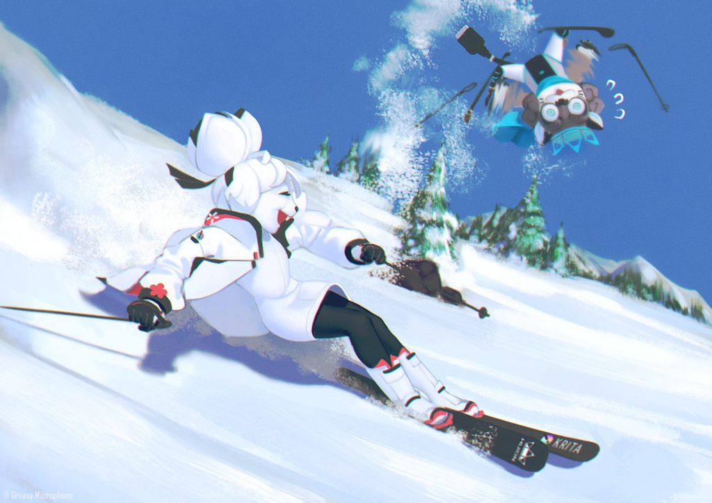](https://krita.org/wp-content/uploads/2021/05/competition_1-scaled.jpg) Watch out Leon!\[/caption\]

In the second place, winning a Kamvas 16, is  "[Autumn River](https://krita-artists.org/t/autumn-river/22274)" by Sad Tea:

\[caption id="attachment\_12050" align="aligncenter" width="1024"\][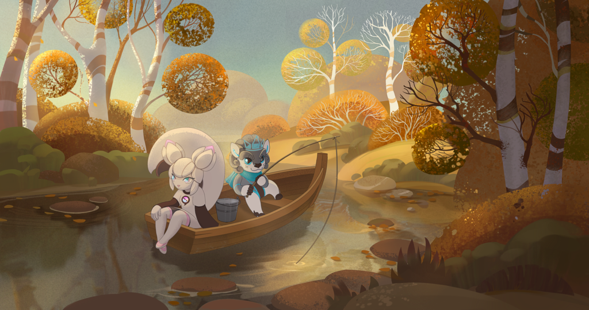](https://krita.org/wp-content/uploads/2021/05/competition_2.png) Autumn River\[/caption\]

Also second place, winning a Kamvas 16 is "[Cooking in the Wild](https://krita-artists.org/t/cooking-in-the-wild/22264)" by Lyunne:

\[caption id="attachment\_12049" align="aligncenter" width="1024"\][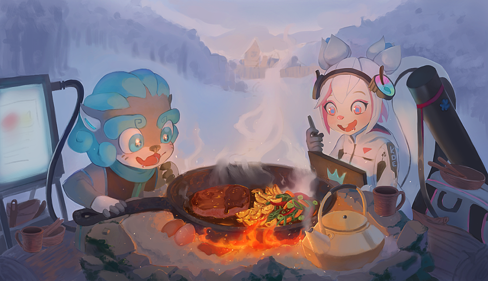](https://krita.org/wp-content/uploads/2021/05/competion_3.png) Cooking in the wild\[/caption\]

Third place, winning a Kamvas 12 is "[Surfing Wavez](https://krita-artists.org/t/surfing-wavez/21518)" by Rimajin8:

\[caption id="attachment\_12052" align="aligncenter" width="1024"\][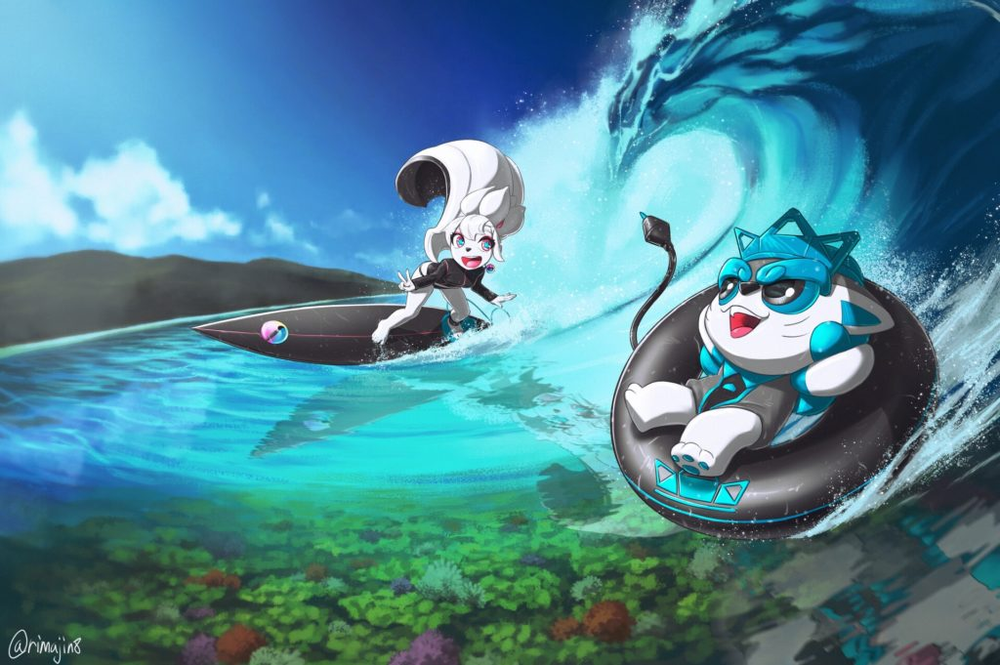](https://krita.org/wp-content/uploads/2021/05/competition_4.jpg) Surfiing Wavez\[/caption\]

Also third place, winning a Kamvas 12 is "[Winter Plein Air](https://krita-artists.org/t/winter-plein-air/19622)", by Ericob

\[caption id="attachment\_12047" align="aligncenter" width="1024"\][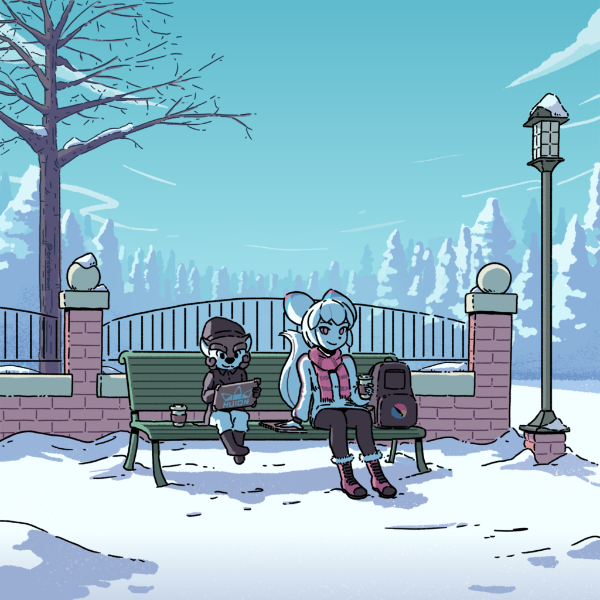](https://krita.org/wp-content/uploads/2021/05/competition_5.png) Winter Plein Air\[/caption\]

Also third place, winning a Kamvas 12 is "[The Winterland's Golem](https://krita-artists.org/t/the-winter-lands-golem/21945)" by LundayMonday

\[caption id="attachment\_12046" align="aligncenter" width="1024"\][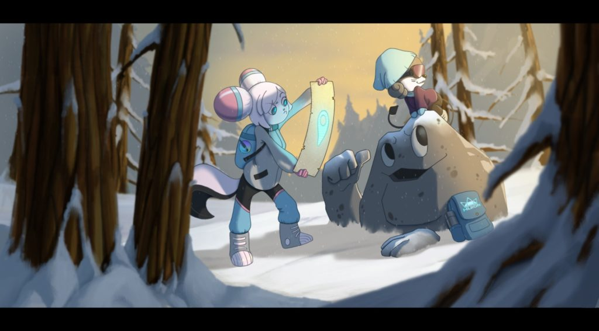](https://krita.org/wp-content/uploads/2021/05/competition_6.jpeg) The Winterland's Golem\[/caption\]

Finally, winning a Huion HS611 tablet, are the runners up:

"[Kiki and Leão on the beaches of Brazil in the summer](https://krita-artists.org/t/kiki-and-leao-on-the-beaches-of-brazil-in-the-summer/22176)" by PauloBrito

\[caption id="attachment\_12045" align="aligncenter" width="1024"\][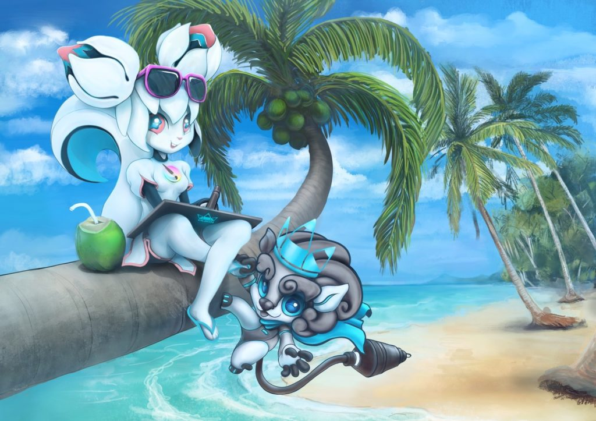](https://krita.org/wp-content/uploads/2021/05/competition_7.jpg) Kiki and Leão on the beaches of Brazil in the summer\[/caption\]

"[Do you remember summer? It was so cool!](https://krita-artists.org/t/do-you-remember-summer-it-was-so-cool/22258)" by mcouto19

\[caption id="attachment\_12044" align="aligncenter" width="1024"\][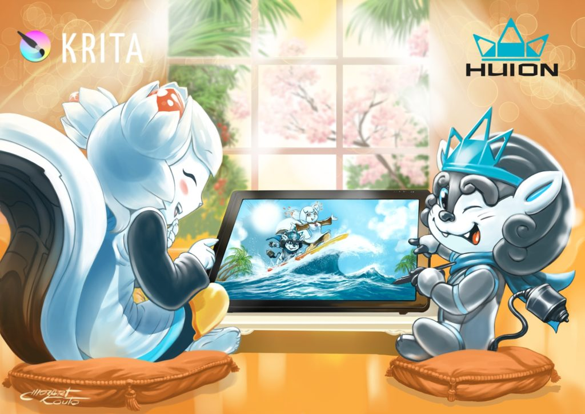](https://krita.org/wp-content/uploads/2021/05/compeitition_8-scaled.jpg) Do you remember summer? It was so cool!\[/caption\]

"[The Autumn Spirit](https://krita-artists.org/t/the-autumn-spirit/21638)" by FrostRaven.

\[caption id="attachment\_12043" align="aligncenter" width="1024"\][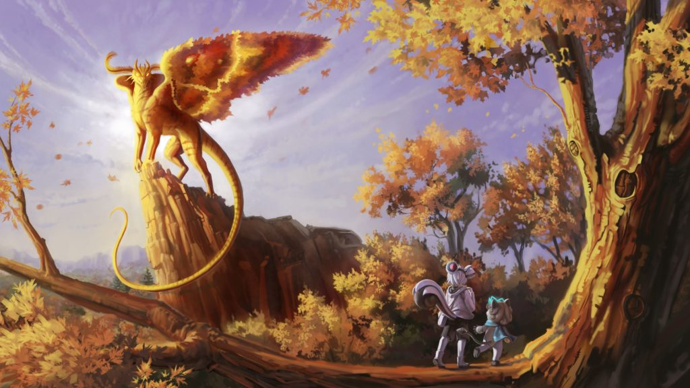](https://krita.org/wp-content/uploads/2021/05/competiiton_9-scaled.jpeg) The Autumn Spirit\[/caption\]

"[Summer Time](https://krita-artists.org/t/summer-time/21482)" by Tamika\_art

\[caption id="attachment\_12042" align="aligncenter" width="1024"\][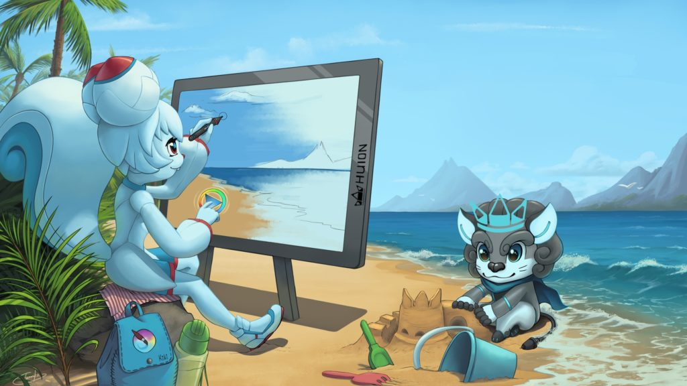](https://krita.org/wp-content/uploads/2021/05/competition_10-scaled.jpeg) Summer Time\[/caption\]

And "[Lets' go! It's this way!](https://krita-artists.org/t/lets-go-its-this-way/22267)" by Redemptionias

\[caption id="attachment\_12041" align="aligncenter" width="1024"\][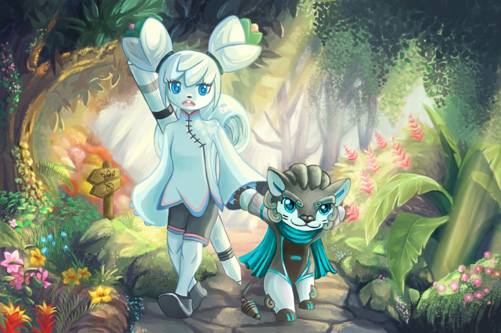](https://krita.org/wp-content/uploads/2021/05/competition_11-scaled.jpg) Let's go ! It's this way !\[/caption\]
