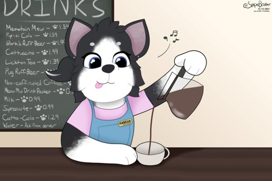
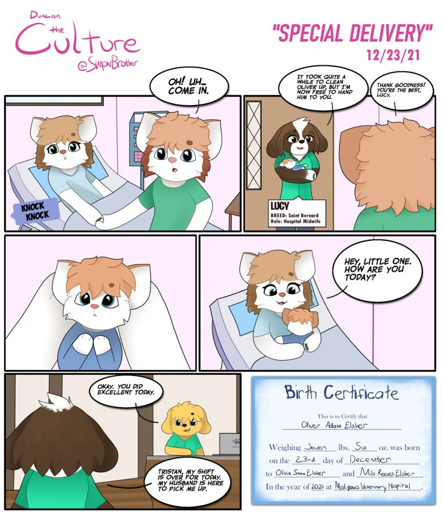
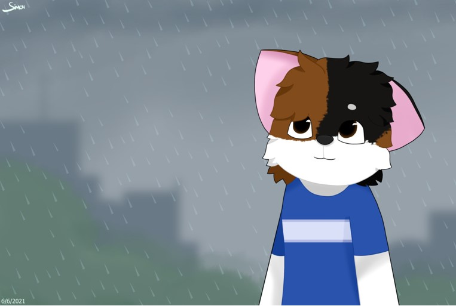
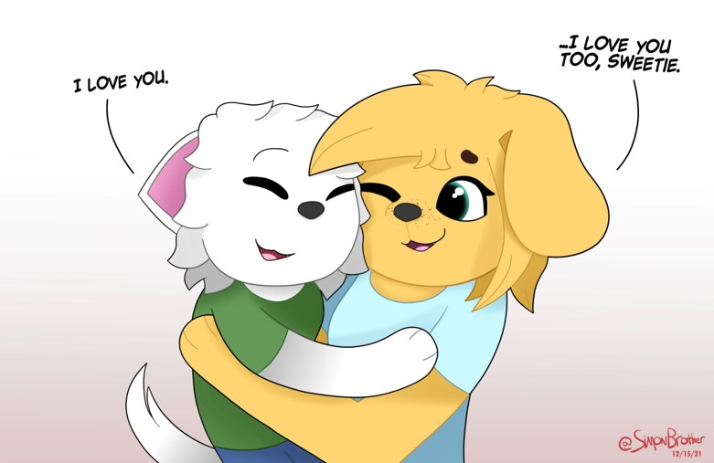

### Could you tell us something about yourself?

My full name is Simon Sterling Rollins. Most people call me Simon. I was born in July 2005 in the state of Georgia. I'm autistic. I'm still in high school, but during my free time I draw artworks to share with the world.

### Do you paint professionally, as a hobby artist, or both?

Right now, I am trying to improve my work. In 2019 I was gifted a Wacom tablet for Christmas, and I've gotten better with every sketch. So, I'm not exactly a pro, yet, but it never hurts to try every time.

### What genre(s) do you work in?

I draw family-friendly animal-like pictures, with lore behind every picture. I like to tell stories about my characters, and that's what makes "Duncan: The Culture" so interesting. The story is so rich.

### Whose work inspires you most -- who are your role models as an artist?

As a kid, I was inspired by two very popular artists named [Lincoln Peirce](https://lincolnpeirce.com/) and [Dav Pilkey](https://pilkey.com/).

Lincoln Peirce created the Big Nate series, a comic book I loved to read because of the story. It taught me about being friends to one another and learning through the harsh parts of being a student in school.

Dav Pilkey created the Dog Man series. It told the story of a police dog who was given a gift of human characteristics after losing his partner in an accident. It taught me how to be brave and to support people even if I didn't know them.

I wanted to merge those two stories into one, so that's what I did. It may not be the same, but it can teach us more than just being brave or a friend to strangers.

### How and when did you get to try digital painting for the first time?

I started my life as an artist on paper. Though it was hard doing that since I would get sweaty palms, scratch marks, and some unknown mechanical pencil lead stuck in the skin of my fingers.

So, when I got my computer a few years ago, the first thing I did was draw using Microsoft Paint. I didn't know about Krita at this time since I was very young and not good at complicated programming.

### What makes you choose digital over traditional painting?

I don't have to face the consequences of drawing. I don't have to buy a lot of paper packs and pencils, I don't have to leave special drawings lying around for them to be stepped on and crumpled up by accident, and I don't have to move everything around in a full space to store my drawings.

But with digital painting, you can save the drawing for later and store it with just a click. It was that easy!

### How did you find out about Krita?

When I got bored with Microsoft Paint and other third-party programs that ran through Adobe Flash (RIP) or HTML 5, I wanted to do something different. So, I went to my search provider and typed up the best drawing programs that you can find.

The list showed mostly pay-to-use programs such as Photoshop and Procreate. But then I found this one free program on the list called Krita. It was reviewed as easy to use, easy to navigate, and had a wonderful community. So, I chose Krita after reading the review, and I never said the choice was a mistake. It was a gift.

### What was your first impression?

At first, it wasn't easy. But since it let me customize everything to my will, I got used to it very quickly.

### What do you love about Krita?

It has vibrant colors to choose from and has a wonderful compatibility with third-party brushes and tools. The program even recognized my new Wacom tablet that I plugged in!

### What do you think needs improvement in Krita? Is there anything that really annoys you?

At the moment, the program runs perfectly. But there are a few crashes and bugs here and there. That's what bothers me. But with every release, the developers fix it in a jam. So delightful!

### What sets Krita apart from the other tools that you use?

I'm not sure. I guess I would just say it's better than Microsoft Paint.

### If you had to pick one favourite of all your work done in Krita so far, what would it be, and why?

I think my best bet would be "Duncan Loves Laina".  It shows how much Duncan loves his best friend Laina, even if she's an adult and much taller than him.

### What techniques and brushes did you use in it?

I sketched the picture first, then outlined it with ink brushes. Then I drew a layer underneath the outline and colored it in. Once that was done, I enabled "Preserve Opacity" and colored the outline to fit the layer beneath and shaded the layer beneath with a soft brush.

### Where can people see more of your work?

I'm glad you asked. You can check [my portfolio at Krita Artists](https://krita-artists.org/u/simonbrother/activity/portfolio), or go to my website at [https:// snowfallsproductions.wixsite.com/duncantheculture](https://snowfallsproductions.wixsite.com/duncantheculture).

### Anything else you'd like to share?

I would just want to thank everyone in the Krita community for making my dream a reality. You are all so gracious!
