Krita 3.0 is finally here! Releasing round version-number releases is always exciting for any kind of project. It's like the start of a new beginning! And 3.0 presents a lot of new beginnings to us as well: First, we have now our own repository, for our code, as well as our own wiki, for the manual! So we started this release with a Spring-cleaning: Porting to Qt 5 and KDE Frameworks 5, necessary to keep Krita easy to maintain in the future. But also cleaning out the code. We removed lines of dustbunny code and reorganized all the files. We also started work on making OSX a first-class platform for Krita, but though we've already done lots of work, that is still a work in progress.

And of course, rewriting the core rendering system, for what you have all been waiting for. If you haven't already, check out the [Krita 3.0 Video Review](https://www.youtube.com/watch?v=k51OK2PlTz4) from GDQuest...

### True Blue 2d Frame-By-Frame Animation

[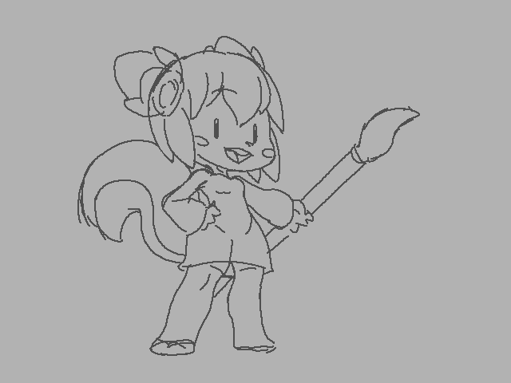](https://krita.org/wp-content/uploads/2016/01/Kiki_Krita_86.gif)

Image by [Achille](https://twitter.com/_achille_)

You can now do proper frame-by-frame animation in Krita. Multiple layers, all sorts of playback speeds, onion skinning, on top of all of Krita's existing paint tools: It's enough to make any animator's fingers itch!

- **Animatable raster layers** - Animated raster images with frames, and use the time-line docker to order them. Works in all color spaces and depths as well!
- **Onion skinning** - This allows you to have an overlay of the previous and next frames, an important assistant when going from rough animation to smooth animation!
- **Importing image sequence** - Import any set of images as an animated layer, automatically sorted by naming scheme.
- **Exporting image sequence** - Export the whole animation as an image sequence, for further processing in other programs.
- **New dockers** - timeline docker, animation docker, and animation workspace
- **CSV import and export** - for layered animation, for use with TV-paint, or Blender via a plugin, courtesy of Laszlo Fazekas
- **Spriter scml exporter** - Make the base image in Krita and then export it to this powerful cut-out animation tool for games.

### Faster, Stronger, Instant!

<iframe src="https://www.youtube.com/embed/lEXnpwIL45Y" width="100%" height="400" frameborder="0" allowfullscreen="allowfullscreen"></iframe>

It is easy to make a timeline docker, but it's not easy to have fast playback, and we know that animation in Krita would just be a gimmick without real-time playback. Therefore speeding up was paramount!

- **Caching for Animation playback** - Proper animation playback, in all sorts of frame-rates, relative speed-ups
- **Instant Preview for Big canvases!** - Utilizing the power of OpenGL 3.0 you can now draw smoothly with 1000 pixel width brushes!
- **Frame dropping** - For slower devices, we implemented frame-dropping, so that you can always see your animation at real-time speed!

### Faster Layer Workflow

<iframe style="box-shadow: 0px 0px 13px 5px #DDD; margin-left: 1em;" src="https://www.youtube.com/embed/uGiucAklXXc" width="100%" height="400" frameborder="0" allowfullscreen="allowfullscreen"></iframe>

**More Layer Actions**

- **Simplified merging** - One hotkey to rule them all!
- **Multi-Layer Mania** - Krita 2.9 had multi-layer selection and dragging and dropping. We spent this release expanding this functionality with moving, on canvas-selecting, merging, duplicating and more!
- **Quick select layers** - Select All/Visible/Locked layers, or select them on-canvas via Shift+R+Click
- **Mass editing layer properties** - Instantly rename multiple layers, or change their blending mode, or opacity, or any other property.
- **Group multiple layers** - Or create Clipping Groups or just ungrouping with hotkeys.

 **User Interface Improvements for Layer Management**

We spent a long time discussing the most important parts to managing layers and what needs to be seen. From this, we updated the entire layers docker. This new look comes with some additional functionality.

- **Clearer Layers** - Condensed layers means you can see more at a time
- **Color Coding** - Right-clicking a layer gives you the ability to color code a layer
- **Filter layers by color** - You can choose to only see all blue layers, or green layers, or only blue and green layers with layer filtering.

### Shortcut Improvements!

[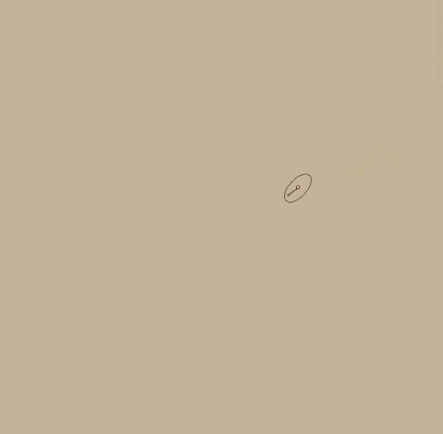](https://krita.org/wp-content/uploads/2016/02/rygb_hotkeys.gif)

- **Switch Shortcut Layout** - If you are familiar with Photoshop or Paint Tool SAI's shortcuts, you can switch the shortcut system. Accessed from the Settings → Configure Shortcuts.
- **Saving and loading shortcut schemes** - Share you shortcuts with friends and collegues!
- **A better shortcut layout** - Short cuts are now grouped!
- **Selection shortcuts switch** - There is a new setting in the preferences that allow you to switch the Alt and Control modifiers for the selection shortcuts
- **Luminance based hotkeys** - The Lighter and Darker actions are now color managed and use true luminance where ever possible.
- **Redder/Greener/Bluer/Yellower/Hue/Saturation Hotkeys** - New configurable actions for modifying a color's hue, saturation, making it redder, greener, bluer and yellower.

### Grids, Guides and Snapping:

[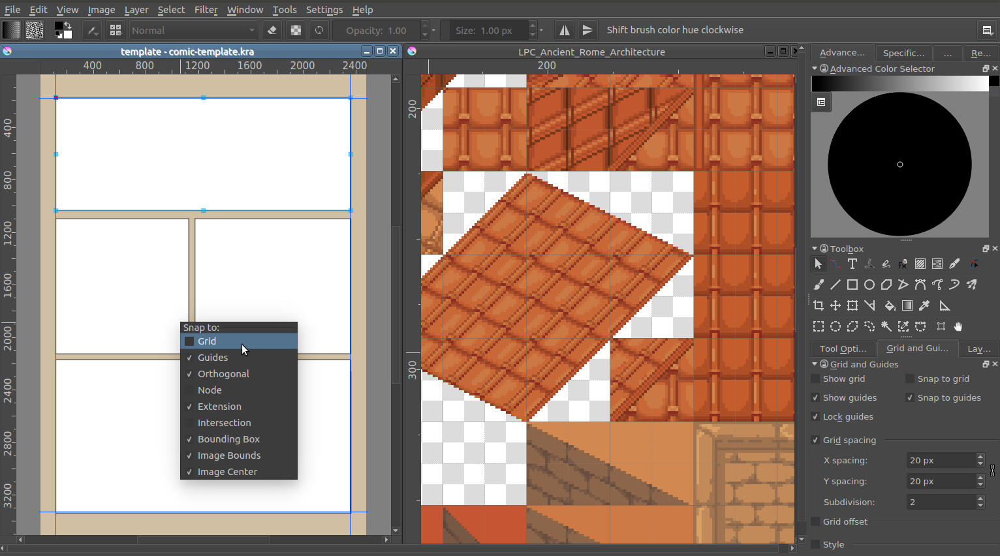](https://krita.org/wp-content/uploads/2016/03/gridsguidessnapping.png)

- **Grids and Guides docker** - A Unified docker for grids and guides!
- **Customize the look of Grids and Guides** - Toggle Grid and Guide visibility separate and edit their look!
- **Grids and Guides saved per document** - None of this global grid nonsense, and you can now set-up templates.
- **Snapping** - The vast majority of tools now support snapping to grids and guides.
- **Fast access to snap-settings!** - snap-settings pop up on Shift+S.

### User Interface

[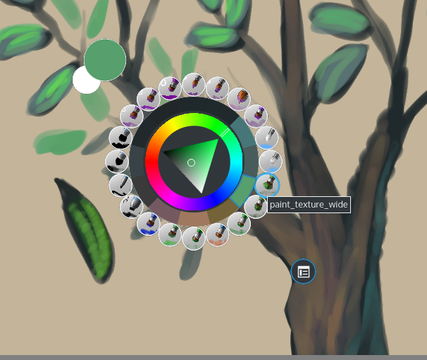](https://krita.org/wp-content/uploads/2016/02/krita-new-popuppalette.png)

- **Improved popup palette** - for easier reading of the preset-icons
- **Compacter New Document Screen** - The new document menu has been modified to fit on tiny laptop screens.
- **The color space browser heavily improved** - you can now get feedback about color lookup table profiles like those of the CMYK space as well as their Tone Response/Reproduction/Transfer curve.
- **Loading screen** - Krita now shows you what it is loading on the start-up screen!
- **Improved GUI** - The Crop tool, Assistant editing tool and the Straight line tool got an improved user interface, and the Straight line tool’s on-canvas preview has been improved as well.

### Filters

[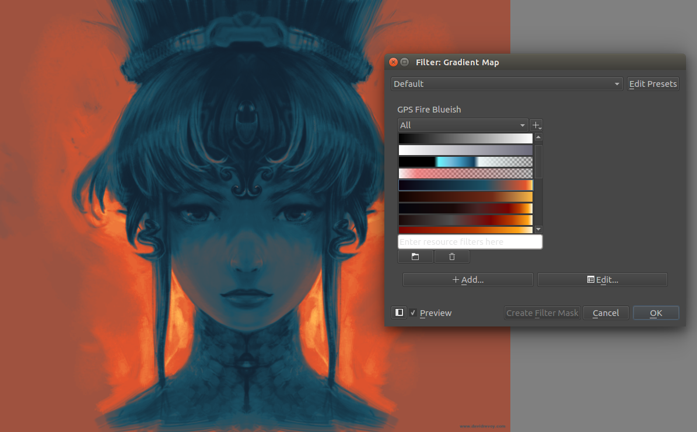](https://krita.org/wp-content/uploads/2016/03/gradientmapfilter.png)

- **Gradient map filter** - It wasn't planned, but Spencer Brown surprised us all and added it! It is still in progress, so temporarily disabled for the filterlayers.
- **More Models for the HSV adjustment filter** - HSV adjustment now supports HSI, HSY and YCrCb for the model
- **Multi-threading with G'MIC** - Make use of all your processor cores for all those fancy G'MIC filters. G'MIC is also a lot more stable now.

### Other changes

- **Added "Greater" blending mode** - change the way you paint on transparent layers (example shown to the side)! Made by Nicolas Guttenberg's dedicated tinkering!
- **GBR and GIH import/export** - Gimp's brush format can now be saved and opened directly by Krita. You don't have to rely on the make-brush menu in the predefined brush-tab.
- **Move Tool Improvements** - Move layer content with arrow keys, and configure the increments in all important unit-sizes!
- **True luminance in the advanced selector** - The HSY space color pickers are now linearised before their luma is crunched. The Gamma can be manually configured, making this picker possible to give true luminosity!
- **Smoother Color Smudge** - Improved the smoothness of the color smudge strokes in dulling mode.
- **New pixel art presets** - No need to create your own now.
- **New cursor options** - Added a single pixel black and white. For those who REALLY need precision.
- **Removed the grids tool and the perspective grid tool.** You can use the perspective grid assistant for the latter, and even get more features. For the grid tool we have replaced it with the grids and guides docker!
- **Added zoom and pan tools!** - These tools revived themselves during the port, and we let them be for those preferring these tools separately

### Improved Learning and Education

[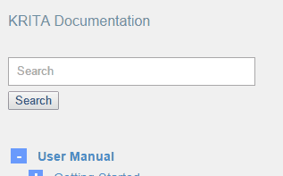](https://krita.org/wp-content/uploads/2016/02/live-search.gif)

**New manual website!** - Pressing F1 now takes you to the new learning area on [Krita.org](https://docs.krita.org/Main_Page). This has more information and should be a better resource for answering your issues. It includes a type-ahead search as well as a static navigation on the left.

### Technology Upgrade

\[caption id="attachment\_3301" align="aligncenter" width="239"\] Konqui, the KDE mascot by Tyson Tan\[/caption\]

For 3.0, we had the QT5 and KF5 port, but that is not the only thing we changed:

- **Renewed Tablet Handling** - We rewrote the entire tablet and input system, supporting a wide variety of drawing tablets using Qt5 now.
- **Linux AppImages** - Now different Linux users can have the latest version without waiting on their distribution repository updates.
- **Changing Compilers for Windows** - We are building and cross-compiling with MinGW instead of MSVC now. This will allow us to use [VC 1.2](https://github.com/VcDevel/Vc/) (a math library for speed) in the future, but more importantly, make a stable, multi-threaded version of [G'MIC](http://gmic.eu/), and the ability to import and export PDFs with the poppler library. With this change, we aren't able to use MSVC any longer.
- **Faster startup time** - More resources are loaded and managed internally. This means faster start times.
- **Building Instructions** - Improved building instructions for developers and technology enthusiasts.
- **Build Krita on Windows and OSX** - Building Krita from the source code is easier than ever. It was significantly more difficult in Krita 2.9. The instructions are in the 3rd party folder in the source code for how to do it. We even have artists building on Windows!

##  **Special Thank You**

The Kickstarter campaign has helped tremendously with adding some of these features. If we go behind the scenes, there are a lot of talented individuals that made this release so great. Most of these people donated their time and energy to fix bugs, test, add features, or otherwise make Krita a better application. These people are at the heart of Krita. Thank you all!

- **Boudewijn Rempt** (Netherlands) - The maintainer of Krita. Boud does marketing, programming, and everything in between. Once upon a time, he started working on Krita to make a fantasy map, now, he has learned how to code, to do community management, to write release posts, press releases, to bug triage, and to design file-formats, yet he still hasn’t drawn that fantasy map.
- **Dmitry Kazakov** (Russia) - The main coder of the core rendering components. Dmitry seems to find a mystical black magic solution for every problem. Thanks to his work on the canvas and the rendering engine, we now enjoy instant preview and fast playback.
- **Wolthera van Hövell tot Westerflier** (Netherlands) - Community manager and educator. In addition to being a developer and our color science expert, Wolthera searches the interwebs and collects feedback to share with the development team. She is also plays a pivotal role in the educational resources that are provided.
- **Michael Abrahams**  (USA) - Michael contributed much of the code for the rewritten tablet handling and shortcuts. This became a big project when we did our technology upgrade. Through his contributions we have better tablet support than ever.
- **Stefano Bonicatti** (Italy) - Numerous bug fixes as well as improving and stabilizing the Windows build.
- **Friedrich Kossebau** (Germany) - Cleanup on the Krita code base after we moved to our own GIT repository. He has also helped fix a number of crashes and bugs.
- **Scott Petrovic** (USA) - User interface designer and developer. Scott has coordinated design discussions and provided mockups for all of the new features. He maintains krita.org and developed the new docs.krita.org learning area.
- **Timothee Giet** (France) - Improved the user interface by providing a number icons. Timothee also is the maintainer of updating the brush presets.
- **Thorsten Zachmann** (Germany) - Improved Krita’s canvas speed with an upgrade to the Vc library
- **Jouni Pentikainen** (Finland) - Worked with Dmitry to develop the new animation system.
- **Nataly Novak** (Russia) - Added some usability fixes to the Advanced Color Selector
- **Julian Thijssen** (The Netherlands) - Improved OpenGL support
- **Guruguru and Tokiedian** (Japan) - Maintained the jp.krita.org and have assisted in spotting localization issues with non-latin languages.
- **Fazekas Laszlo** - Did the CSV animation exporter and made several animation bugfixes.
- **Nicolas Guttenberg** Provided us with the Greater Blending mode.
- **David Revoy** (France) - Resident artist that helps steer the design direction of Krita as well as testing early builds.
- **Tyson Tan** (China) - Designer of Kiki. Produces the splash screen image for us each release! Also finds all AMD specific bugs.
- **Spencer Brown** (USA) - Added gradient map filter.
- **Alvin Wong** (Hong Kong) - Developed the shell extension that allows thumbnails to be see on the desktop for Windows.
- **Sven Langkamp** (Germany) - Improved the popup palette as did bug fixing.
- **Raghukamath** (India) - Resident artist that helps steer the design direction of Krita as well as testing early builds.
- **Moritz Molch** (Germany) - User interface improvements.
- **Beelzy** (Germany) - Tested and made improvements to our OSX build
- **Probono** \- Helped tremendously in getting the linux appimages working. This wouldn’t have been possible without this individual.

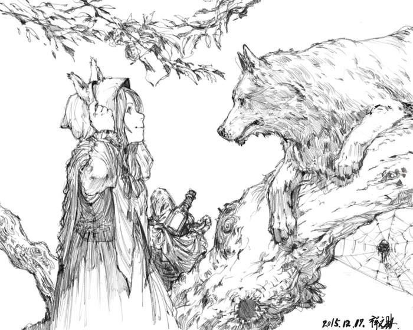

Little Red Riding Hood - [Rakugaki300](http://rakugaki300page.jimdo.com/)

[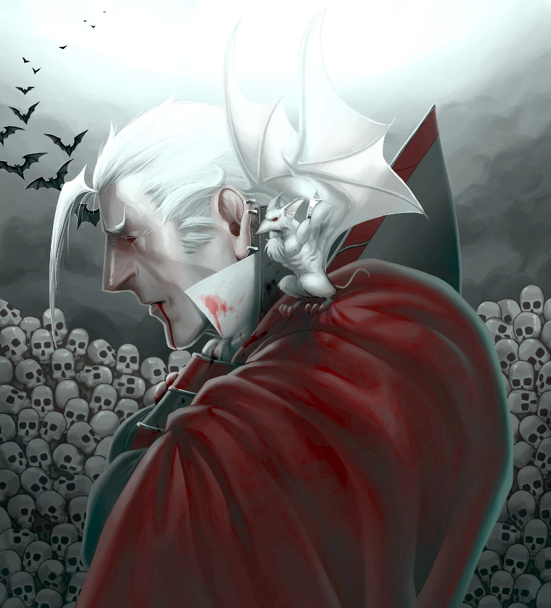](https://krita.org/wp-content/uploads/2016/01/hoellentat_800.jpg)

Beelzy

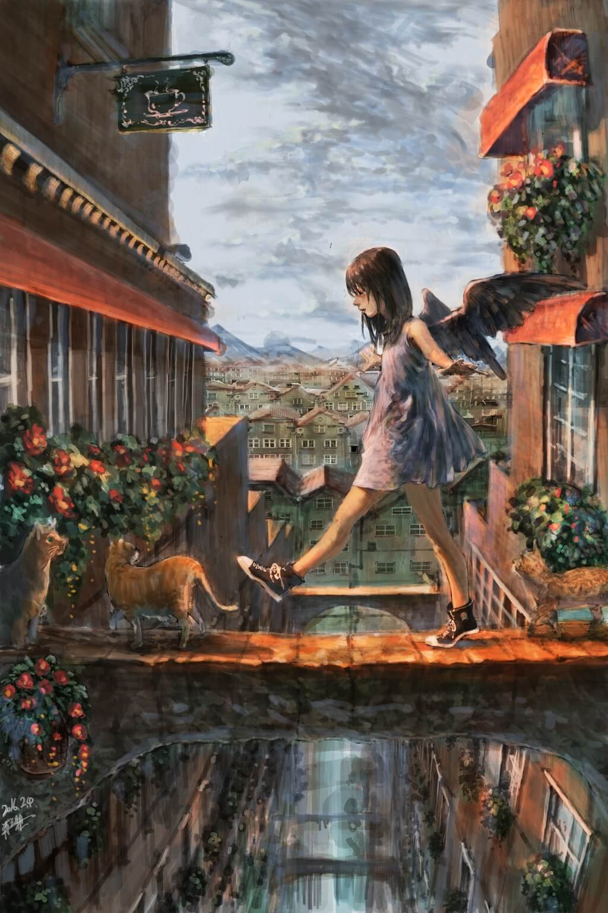

Walk - [Rakugaki300](http://rakugaki300page.jimdo.com/)

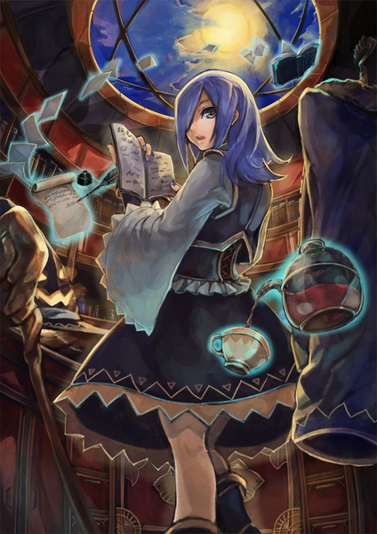

魔女の書斎 (Studying Witch) - [Mizukeiii](https://twitter.com/mizukeiiii)

[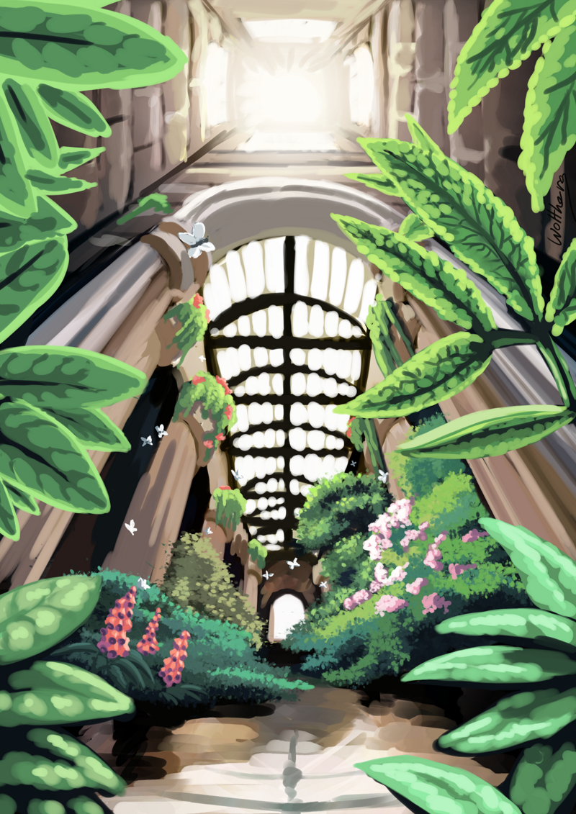](https://krita.org/wp-content/uploads/2016/05/lyingingarden.png)

Wolthera

[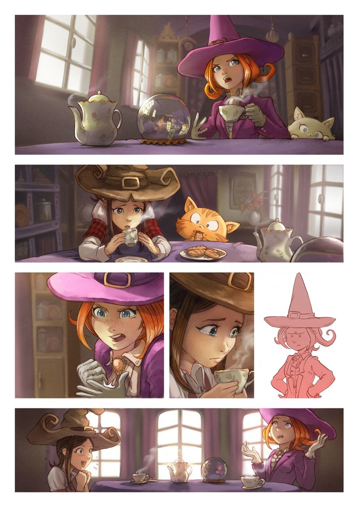](https://krita.org/wp-content/uploads/2016/05/gfx_Pepper-and-Carrot_by-David-Revoy_E16P02.jpg)[Pepper and Carrot by David Revoy](http://www.peppercarrot.com/en/article369/episode-16-the-sage-of-the-mountain)

Animations:

[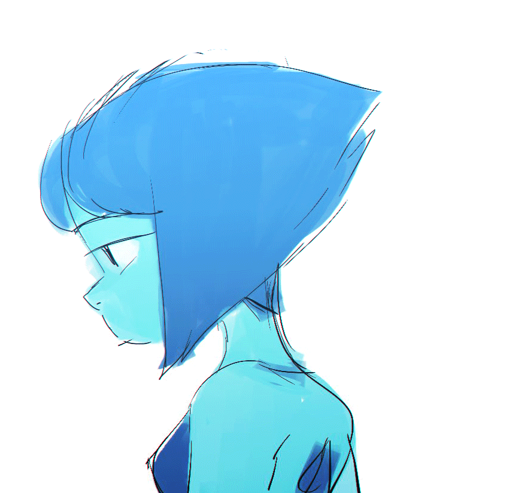](https://krita.org/wp-content/uploads/2016/05/undyne_krita_animation_01.gif)

[Undyne](http://gullshriek.tumblr.com/)

[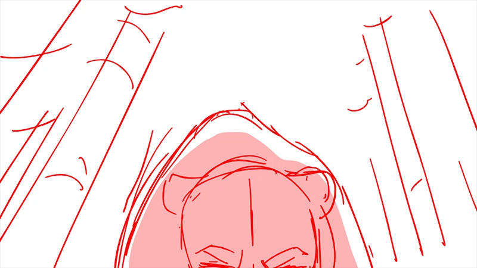](https://krita.org/wp-content/uploads/2016/05/undyne_krita_animation_02.gif)

[Undyne](http://gullshriek.tumblr.com/)

[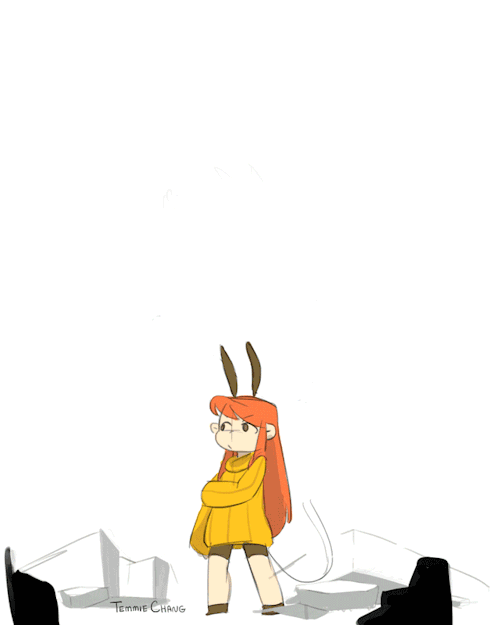](https://krita.org/wp-content/uploads/2016/05/temmiechang_krita_01.gif)

[@tuyoki (twitter)]( https://twitter.com/tuyoki/status/681037508201844736)

[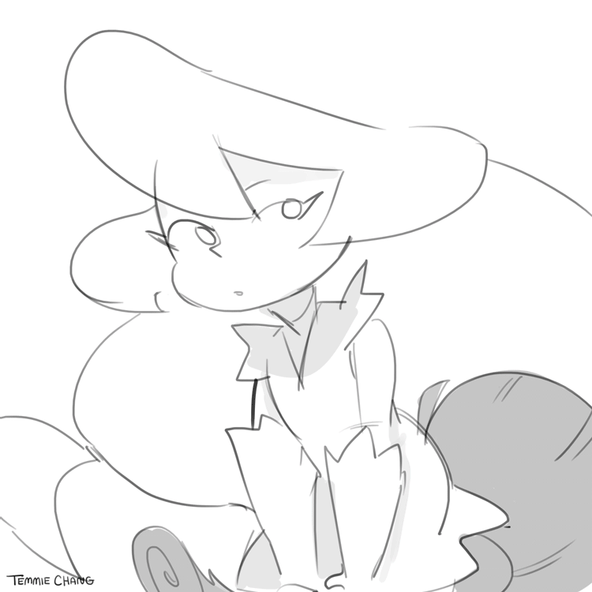](https://krita.org/wp-content/uploads/2016/05/temmiechang_krita_02.gif)

[@tuyoki (twitter)](https://twitter.com/tuyoki/status/676280424604311552)
