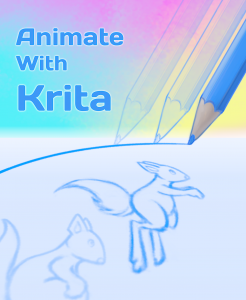

# Animate with Krita

One of the biggest additions to Krita 3.0 was the animation feature! Now you can use Krita to create hand-drawn animations, too!

And with a new feature, comes a new training DVD. Timothee Giet, who has been animating for longer than Krita has existed, has created "Animate With Krita"! The first part explains the user interface and tools, the second part explains the principles of animation. The third part showcases creating an animation from start to finish.

https://youtu.be/Cp0gN0aADUE

### Part 1 - Animation Tools in Krita

- 01-Basic Setup
- 02-The Timeline
- 03-The Animation Docker
- 04-Animation Curves
- 05-Shortcuts
- 06-Export
- 07-Import

### Part 2 - Animation Basics

- 01-Timing
- 02-Slow-in And Slow-out
- 03-Squash And Stretch
- 04-Overlapping Actions
- 05-Secondary Actions
- 06-Anticipation
- 07-Exaggeration
- 08-Arcs
- 09-Straight-ahead And Pose-to-pose
- 10-Appeal

### Part 3 - A Full Workflow Example

- Sketching
- Inking
- Coloring
- Exporting

Animate with Krita is available as a digital download and costs just **€14,95** (excluding VAT in the European Union) English and French subtitles are included, as well as all project files.

[Get Animate with Krita](https://gum.co/TIso?wanted=true)
