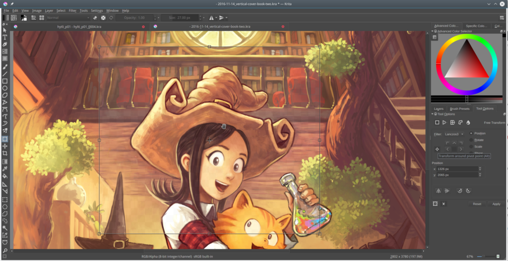

# Release Notes for 3.1.3

Krita 3.1.3 is mainly a bug fix release with some new features. Every user is strongly recommended to update.

\[caption id="attachment\_5226" align="alignnone" width="1024"\] Transform around Pivot (Image by [David Revoy](https://peppercarrot.com)\[/caption\]

### New Features

- implement context menu actions for default tool (cut, copy, paste, object ordering)
- added option to allow multiple instances of krita (BUG 377199)
- scale around pivot point added

### Changes/Fixes

- Fix eraser switching back to the brush after flipping the stylus (BUG 375878)
- Fix the OpenGL crash detection and show Intel warning earlier
- Fix the High DPI switch
- Improve how you select brush spacing so it is easier to slide to a value
- Fix right-button popup menus in tools when using Tablet Stylus (BUG 344878)
- Added layer thumbnail on the animation timeline while hovering
- Improvements to undo and the swap operation save memory
- Fix when sometimes layer says "group not editable" (BUG 376214)
- Fix slow down when changing of the smoothing options (BUG 375882)
- Fix crash when closing an image right during the transformation operation
- Fix a crash when switching tools while running the color picker (BUG 373883)
- Update to Spriter plugin
- Fix resetting the paint device cache (BUG 374142)
- Upgrade the layer to an animated one when the first frame is added (BUG 377176)
- Warn the artist when saving a read-only file (BUG 376098)
- All file layers to be merged (BUG376613)
- Add user feedback when locking for drag and drop between images (BUG 376382)
- Fix potential crash when dragging and dragging large layers between images (BUG 376382)
- Don't crash if there is no proofing color space (BUG 376311)
- Fix a crash when the layer gets changed to quickly during moving animation (BUG 377614)
- Fix loading of some animation files
- Port animation frames to use strokes (BUG 37696)
- Update calligraphy tool icon
- Fix removing color labels from multiple frames (BUG 374746)
- Add a warning dialog when a person is potentially saving a corrupted image (BUG 361883 BUG 378681)
- Fix updates to assistants when the brush outline is disabled (BUG 377952)
- Fix for loading the display settings
- Fixed a potential crash when merging layers with pass-through mode
- Fixed flattening and merging of pass-through lode layers
- Fix crash when double clicking on a polyline object (BUG 376497)
- Fix frame offset when dragging and dropping between layers
- Updated default settings for liquify tool (thanks David Revoy)
- Fix issues with saving layer styles and vector layers.
- Fix rending a sequence of one animation frame
- Show the on-canvas message by default since mirror view needs it (BUG 346014)
- Fix for converting floating point channel depth to 8 bit integers with PNG format (BUG 375217)
- Fix crash when a file layer is deleted (BUG 376993)
- Make lens blur work when using Krita in another language than English (BUG 376262)
- Fix memory leak in PNG converter (BUG 378134)
- Update tooltips for play and stop in animation docker
- Convert the pasted clip color space when the option is set (T5367)
- Fixes for loading ORA file types
- Fix for updating title of document when changing document title (BUG 374389)
- Fix activating next/previous layer shortcut for layer groups which are invisible
- New icon for transform from pivot point
- Show layer color labels in timeline docker
- Use the name of the filter when creating a filter mask from the filter dialog instead of “effect”
- Don’t cover startup dialogs (for instance, for the pdf import filter) with the splash screen
- Fix a race condition that made the a transform mask with a liquify transformation unreliable
- Fix canvas blackouts when using the liquify tool at a high zoom level
- Fix loading the playback cache
- fix with dragging when shift is selected (BUG 373067)
- Use the native color selector on OSX: Krita’s custom color selector cannot pick screen colors on OSX
- Set the default PNG compression to 3 instead of 9: this makes saving png’s much faster and the resulting size is the same.
- Fix a crash when pressing the V shortcut to draw straight lines
- Fix a warning when the installation is incomplete that still mentioned Calligra
- Make dragging the guides with a tablet work correctly
- Pressing and releasing a modifier key now updates the cursor instantly
