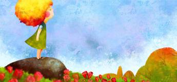
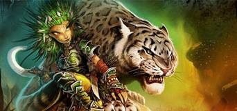
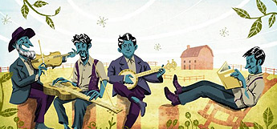
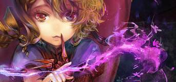
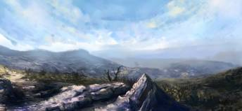
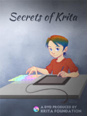
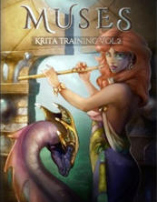
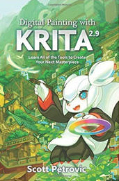

The first thing to remember is that Krita is a 2D paint application while other programs such as Photoshop are designed for image manipulation. This means that the other programs may have more features than Krita in general– but Krita has tools that are relevant to digital painting. The tools are designed for concept art, creating comics, and textures. If you use a feature that isn’t listed, make a quick video tutorial and let us know. We’ll put it up to share with everyone!

[

## Documentation

](/learn/documentation/)

Discover Krita's features through an online manual. Guides to help you transition from other applications.

[

## Tutorials

](/learn/tutorials/)

Learn through developer and user generated tutorials to see Krita in action.

[

## FAQ

](/about/faq/)

Find answers to the most common questions about Krita and what it offers.

[

## Resources

](/learn/resources/)

Textures and Brush packs to help add variety to your artwork.

[

## Speed Paintings

](/learn/speed-paintings/)

Learn tips and tricks from other artists while watching them paint.

Featured Training

