## Kiki the Cyber Squirrel

**Kiki the Cyber Squirel**, or just **Kiki,** is Krita's mascot. We chose a squirrel because the word "krita" means "squirrel" in Albanian. Kiki first appeared in 2013 on the cover of the Krita 2.6 tour booklet. She has been featured in Krita's splash picture since version 2.8.

Just like Krita itself, Kiki has been evolving through time. Every major Krita release came with a new splash, featuring a different Kiki design. As such, we do not keep a so-called "official" reference sheet for Kiki. On top of that, we believe every artist should have the creative freedom to interpret Kiki's design. Nevertheless, below are the closest thing that resembles Kiki's reference sheets, and her core design concepts.

\[caption id="attachment\_12800" align="aligncenter" width="1024"\][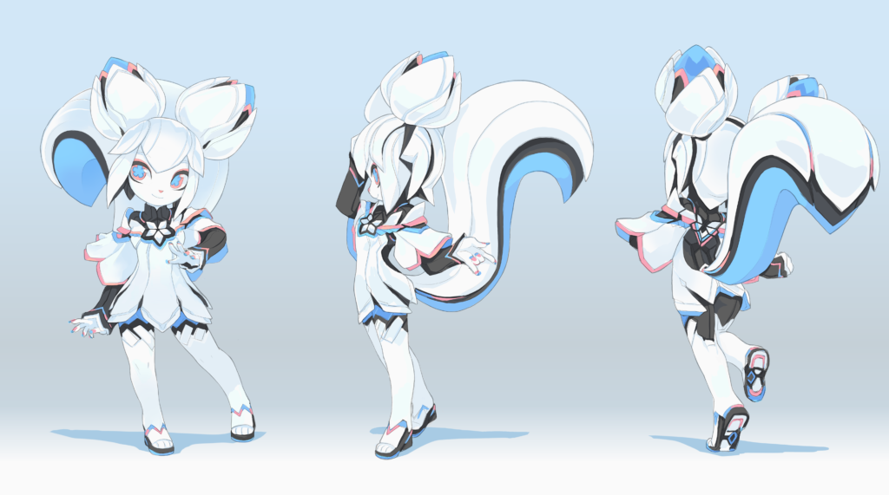](https://krita.org/wp-content/uploads/2021/12/electrichearts_20160903_kiki3D_03.png) **Kiki's "not-really-official" Reference Sheet (2016)  
**\[/caption\]

**Kiki's core design concepts:**

- Mostly humanoid, with the features of a squirrel
- White represents the color of paper, and also Krita's empty canvas view
- Pink represents the passion of a budding artist
- Skyblue represents creative freedom
- Black represents Krita's default UI color, and reflects Kiki's robotic nature
- A robotic body with organic shapes, represents tech with humanity
- Flower-like pupils, represent the eyes that can discover beauty in life
- Flower-bud-shaped ears, coming out from the back of her head, at diagonal angles, represents a budding artist
- Left-handed by choice, ambidextrous if needed
- Playful, independent, confident and care-free
- (You don't have to follow any of these)

Kiki has been designed by [Tyson Tan](https://tysontan.com/). He provides mascot design for free and open source software projects, free of charge, under free licenses.

### Kiki's Lore

Kiki is a budding artist robot made by [the dragons of KDE Valley](https://community.kde.org/Konqi). She travels through time/space/universes to study the works of the masters, and to enrich her life experiences for her creative endeavor. She meets all sorts of person/characters in her journey, and even other incarnations of herself!

### Kiki Splash Art Gallery

In this section we showcase Krita's splash arts featuring Kiki, with artist's comments from Tyson Tan to give an insight of the conception behind each picture.

Kiki and the splash pictures are dual-licensed under [GNU GPL](https://www.gnu.org/licenses/gpl-3.0.en.html) and [Creative Commons BY-SA](https://creativecommons.org/licenses/by-sa/4.0/).

\[caption id="attachment\_12791" align="aligncenter" width="1024"\] **Krita 5.0 - Kiki with a Parasol (2021)**\[/caption\]

**Artist comment:** This splash was initially a color study of Monet's Woman with a Parasol. At the end of 2020, I learned that Krita would display a bigger version of the splash on Hi-DPI screens. The previous splash lacked the detail under such high resolution. Upon this point I had been using a minimalist approach to focus on the basics. But to privide a nice-looking Hi-DPI splash, I had to introduce more sophisticated techniques back to my works. The new approach allowed me to explore designs that wasn't possible before. To live up to Kiki's "Cyber Squirrel" name sake, I gave Kiki a more convincing robotic body with lots of exposed mechanical frames and joints. Translucent parts were applied to her hair, ears and tail. Her costume is the marriage of traditional maid attire and futuristic flashy materials.

\[caption id="attachment\_12792" align="aligncenter" width="1024"\][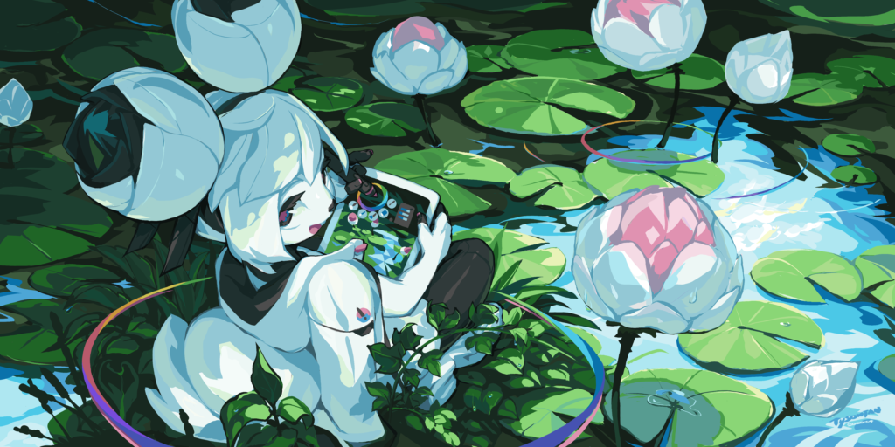](https://krita.org/wp-content/uploads/2021/12/electrichearts_20200221A_kiki_b.png) **Krita 4.3 to 4.4 - Kiki and the Waterlilies (2020)**\[/caption\]

**Artist comment:** This splash was inspired by Monet's Waterlily paintings. Waterlily/Lotus in Chinese tradition represents incorruptible personality, which in this case reflects Krita's GPL free software license. The rainbow-colored ripples represnt the hue ring of Krita's color selector. I gave Kiki a new hair style, and a more fashionable techwear based costume. The whole picture was done using only Krita's default basic-5 size brush. A side note: I was born as a left hand user (just like Kiki), but was forced to use my right hand since I was 6. 30 years later in 2020, I decided to go back to use my left hand. The relearning process was difficult, but it gave me much insight that I did not pay attention to before, which greatly helped me to grow as an artist.

\[caption id="attachment\_12793" align="aligncenter" width="1024"\][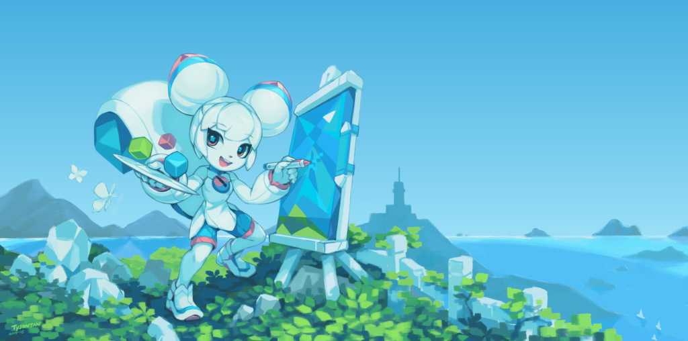](https://krita.org/wp-content/uploads/2021/12/electrichearts_20190316_kiki_a.png) **Krita 4.2 - Kiki at the Seaside Hills (2019)**\[/caption\]

**Artist comment:** Since version 4.2, Krita has a new, wider splash size. Krita's official website also uses the splash as its header picture. To make a picture for this new format, I choose the safest route -- using a horizontal camera angle, pointing deadly to the horizon. I also intentionally used bright colors dominated by skylight to make everything look more refreshing.

\[caption id="attachment\_12794" align="aligncenter" width="1024"\][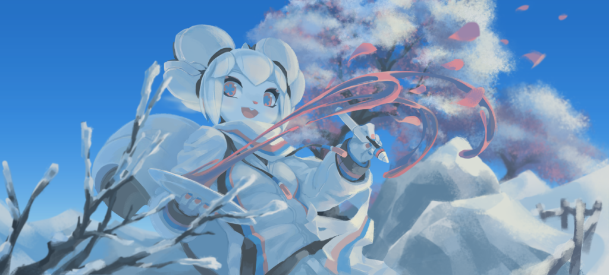](https://krita.org/wp-content/uploads/2021/12/electrichearts_20171205_kiki_c.png) **Krita 4.0 to 4.1 - Kiki and the Winter Plum Tree (2018)**\[/caption\]

**Artist comment:** This splash was done at the end of a particularly difficult year for Krita project and its maintainer. I based the concept on a Chinese idiom -- just like the plum trees blossom at the coldest time of winter, Krita has a similar quality of resilience, surviving through years of tribulation and grew stronger each time.

\[caption id="attachment\_12795" align="aligncenter" width="1024"\][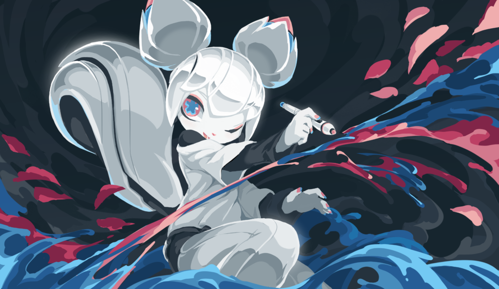](https://krita.org/wp-content/uploads/2021/12/electrichearts_20160517_20160820_kiki_02.png) **Krita 3.0.1 to 3.3 - Kiki is Directing the Paint (2017)**\[/caption\]

**Artist comment:** This splash was done during a period when I was studying composition and color contrast. As a result, those aspects were the focus here. I contrasted Kiki's cleanly defined, reflective white shapes against the vague dark background; I also contrasted the vivid paint colors against the monochromatic character and the background, in attempt to produce a strong visual impact.

\[caption id="attachment\_12796" align="aligncenter" width="1024"\][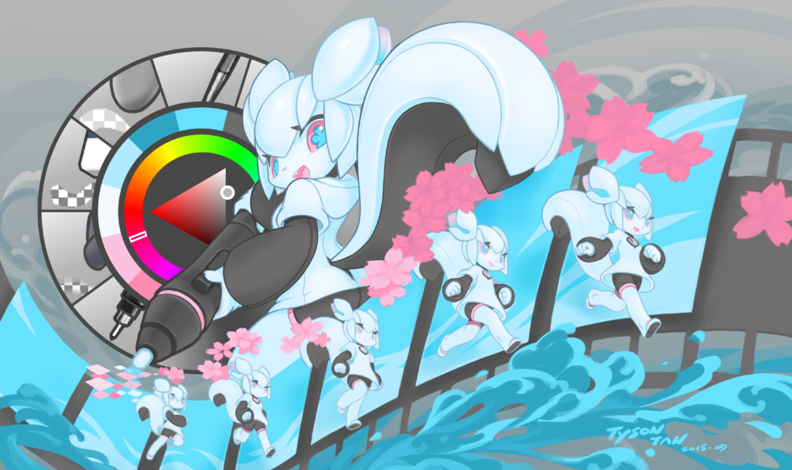](https://krita.org/wp-content/uploads/2021/12/mascot_20150905_kiki_postcard_a.png) **Krita 3.0 - Kiki's Running Cycle (2016)**\[/caption\]

**Artist comment:** One of the main feature to be added in Krita 3.0 was animation, so the splash was designed to reflect that. At the time, I realized that as a self-taught artist, the lack of basic training really began to limit what I can draw. So I went back to study the basics, and tried to limit the complicated details and flashy effects so that I could focus on the basic shapes and color relationships. The study of anatomy helped me to come up with the "different frames" in Kiki's running cycle, although in reality I had zero experience in animation, so those frames might not work.

\[caption id="attachment\_12797" align="aligncenter" width="1024"\][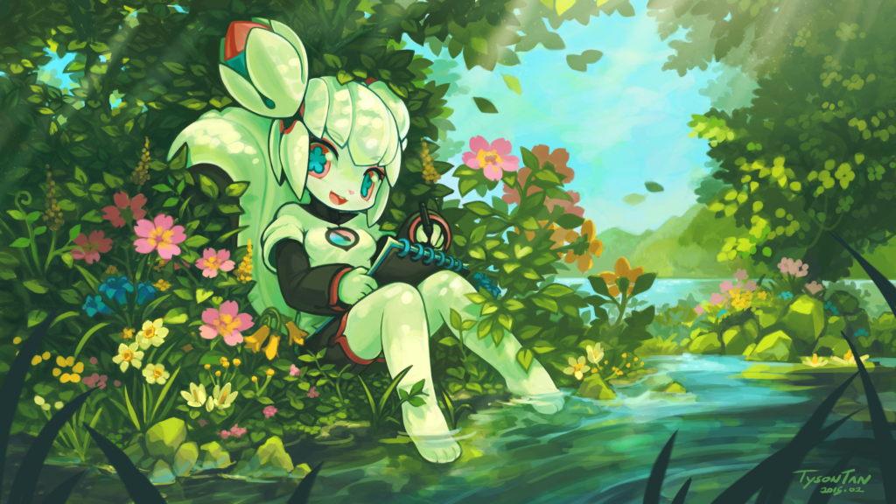](https://krita.org/wp-content/uploads/2021/12/mascot_20150204_kiki_e.png) **Krita 2.9 - Kiki at the Lakeside (2015)**\[/caption\]

**Artist comment:** In this splash, I attempted to draw a proper background for Kiki to sit in. I was unsatisfied with the 2.8 design being too generic, which did not live up to Kiki's "cyber" name sake, so I decided to bring some mech detail back to her design. Although at a glance her design did not change that much, you can observe the base of her ears where they connect her head, her hair locks, her sleeves all look more mech-like in this version.

\[caption id="attachment\_12798" align="aligncenter" width="1024"\][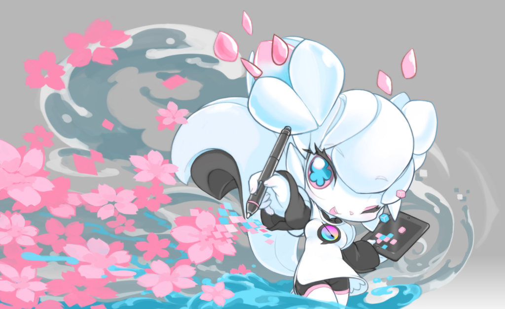](https://krita.org/wp-content/uploads/2021/12/mascot_20131006_kiki_splash_b.png) **Krita 2.8 - Kiki's Creative Flow (2014)**\[/caption\]

**Artist comment:** Kiki's first appearance in Krita's splash. Her design was drastically modified to look cuter, more casual with less mech. The chibi proportion was an attempt to make her look more "mascot-like". Her color scheme was changed to loosely reflect Krita's new icon's Cyan-Magenta-Yellow colors, although yellow was left out to make the visual elements look more organized. Cyan and Magenta were shifted to Sky-Blue and Pink for a more girly impression. This version of Kiki has the most generic anime look of all, and my intention back then was to make this her final design (which from hindsight, did not last for very long).

\[caption id="attachment\_12799" align="aligncenter" width="745"\][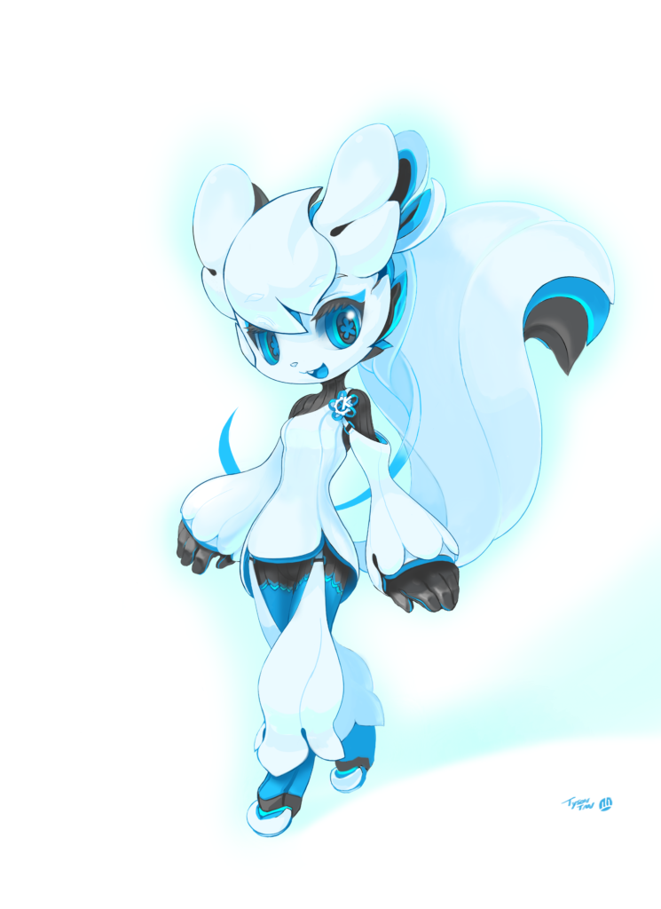](https://krita.org/wp-content/uploads/2021/12/mascot_20120519_krita3.png) **Krita 2.6 Booklet - Kiki's Initial Design**\[/caption\]

**Artist comment:** Kiki's debut. Not yet featured in a splash, this Kiki was on the cover of Krita 2.6's feature tour booklet. Her design was inspired by KDE 4's Oxygen application style, resulted in a white/black/blue color scheme. The squirrel concept came from a thread on KDE's forum, and the design was based on a mock icon from the discussion.

### Alternative Kiki Designs

Outside of the splashes, Tyson Tan also experimented some alternative designs for Kiki. Some of these concept arts are later adopted in actual Krita slashes. They might become your inspiration when designing your own Kiki!

\[caption id="attachment\_12810" align="aligncenter" width="737"\][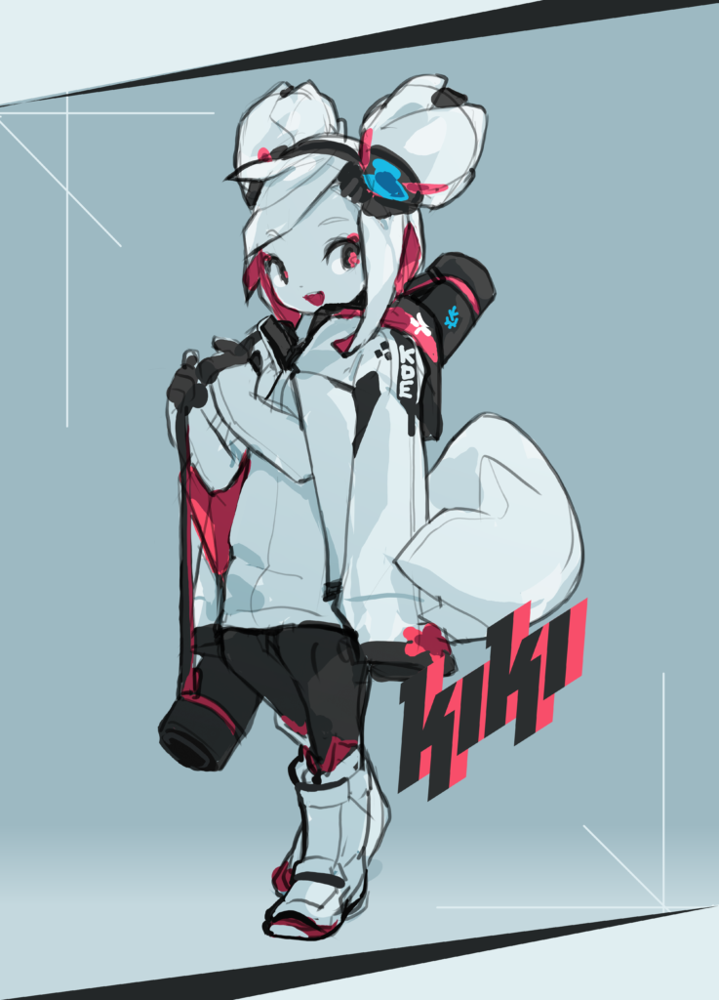](https://krita.org/wp-content/uploads/2021/12/electrichearts_20190926A_kiki_a.png) **Techwear Kiki (2019)**\[/caption\]

**Artist comment:** In this design I attempted to give Kiki a more fashionable design that follows the techwear trend which was popular among the artist circle between 2018 and 2019. There were hints of a more striking costume design direction, more pronounced mech details, a more teen-like proportion, and a new twisty fore-hair style. These ideas were later used in the 2020 splash.

\[caption id="attachment\_12924" align="aligncenter" width="1024"\][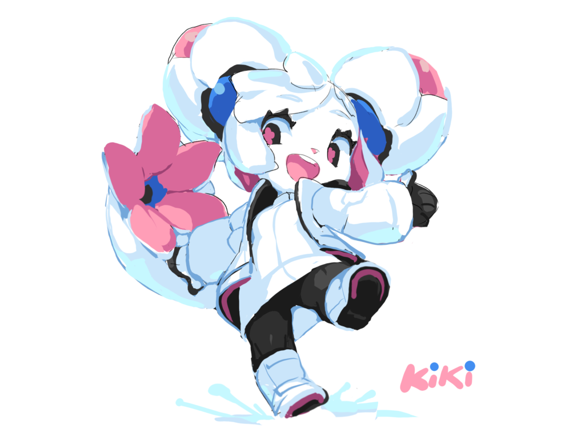](https://krita.org/wp-content/uploads/2021/12/electrichearts_20200928A_kiki-1.png) **Chibi Kiki II (2019)**\[/caption\]

**Artist comment:** I tried to convert the Techwear Kiki above into a more mascot-like proportion, while still keeping her mech details.

\[caption id="attachment\_12925" align="aligncenter" width="956"\][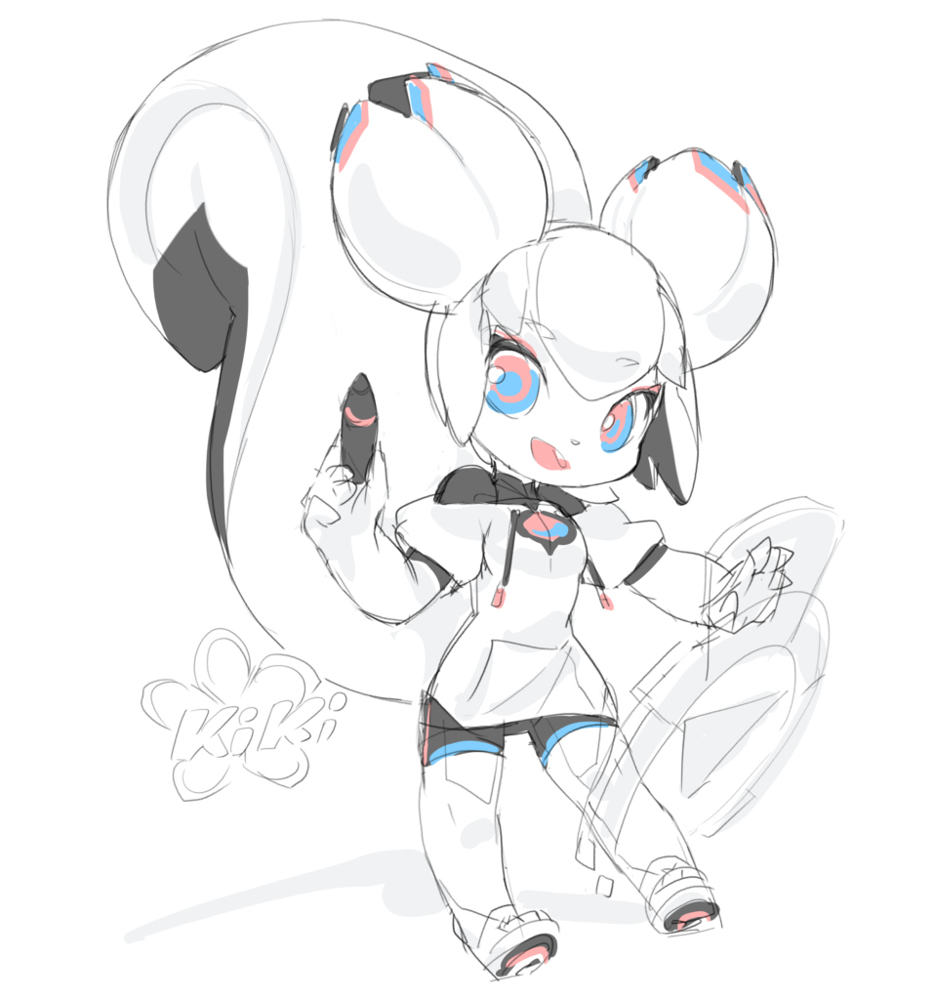](https://krita.org/wp-content/uploads/2021/12/electrichearts_20190208_kiki.png) **Old Kiki Revisited (2019)**\[/caption\]

**Artist comment:** I noticed that the previous version of Kiki was still popular among other artists, perhaps due to her design being easy to understand and execute. This was an attempt to revamp her old design to emphasize Kiki's robotic body details in a subtle way, while as the same time giving her a casual costume, so she is easier for other artists to handle.

\[caption id="attachment\_12921" align="aligncenter" width="619"\][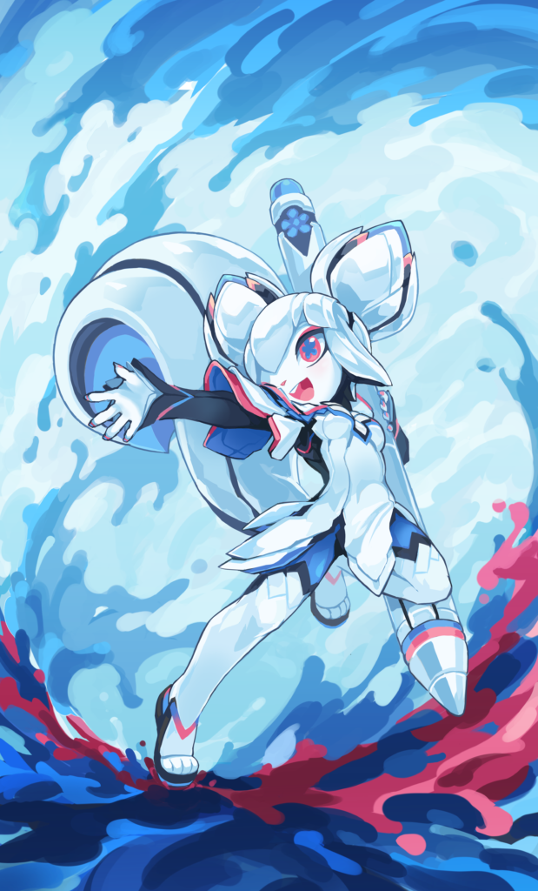](https://krita.org/wp-content/uploads/2021/12/electrichearts_20170106_20160817_kiki_f.png) **Kiki Plastic Model Design (2017)**\[/caption\]

**Artist comment:** I designed this version of Kiki for the Japanese modeler Ito Ryou-Ichi to make into a [Kiki plastic model kit](https://krita.org/en/item/interview-with-ito-ryou-ichi/). More mech detail was added to give the model a proper level of visual density. Since Ryou needed more comprehensive reference when making the model, thus [the reference sheet](https://krita.org/wp-content/uploads/2021/12/electrichearts_20160903_kiki3D_03.png) in the beginning of this article was created.

\[caption id="attachment\_12811" align="aligncenter" width="822"\][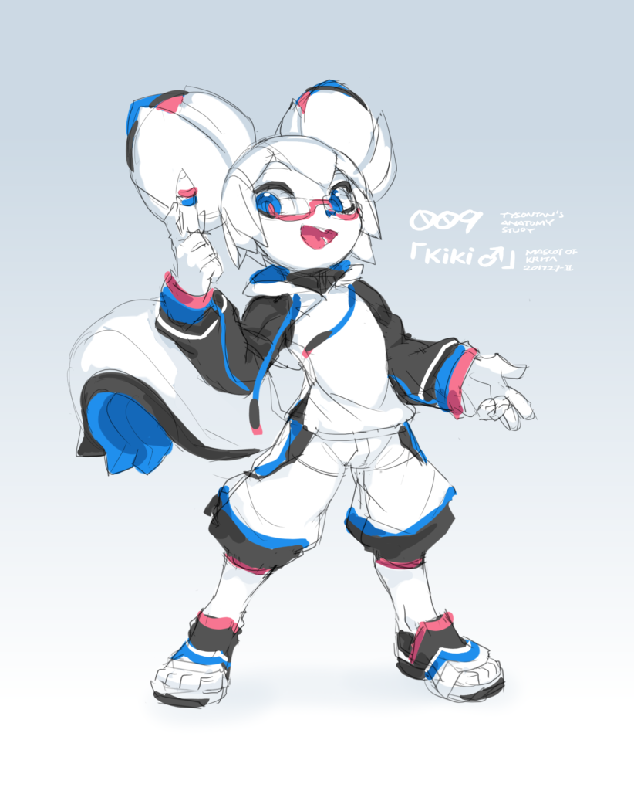](https://krita.org/wp-content/uploads/2021/12/electrichearts_20171027_kiki_2.png) **Boy Kiki (2017)**\[/caption\]

**Artist comment:** Kiki doesn't have to be a girl! This was an early attempt to design a gender-swapped version of Kiki from another dimension. Compared to the girl version, the boy version of Kiki is right-handed, wear glasses, slightly nerdy, easily distracted, not as good as an artist (yet), more easy-going and less assertive and less confident about himself. Unlike her girl counterpart who has a linear growing curve, he has a slow, exponential growing curve. Basically, this boy Kiki is your typical shonen manga protagonist.

\[caption id="attachment\_12812" align="aligncenter" width="1024"\][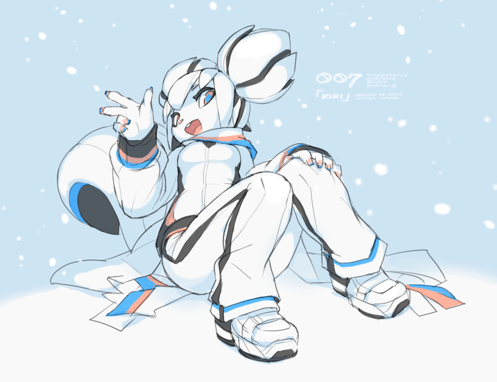](https://krita.org/wp-content/uploads/2021/12/electrichearts_20171020_kiki.png) **Winter Costume Kiki (2017)**\[/caption\]

**Artist comment:** This was an attempt to design a winter costume for Kiki, as so far (2017) she has been using the same summer costume. This concept was later used in the 2018 splash.

\[caption id="attachment\_12922" align="aligncenter" width="1024"\][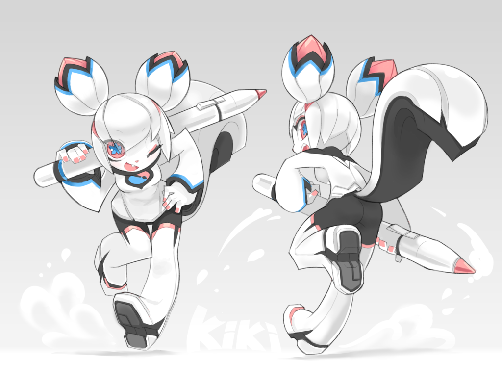](https://krita.org/wp-content/uploads/2021/12/electrichearts_20160125_kiki_02.png) **Kiki after PSG style (2016)  
**\[/caption\]

**Artist comment:** This was an attempt to mimic Panty & Stocking with Garterbelt's style.

\[caption id="attachment\_12815" align="aligncenter" width="853"\][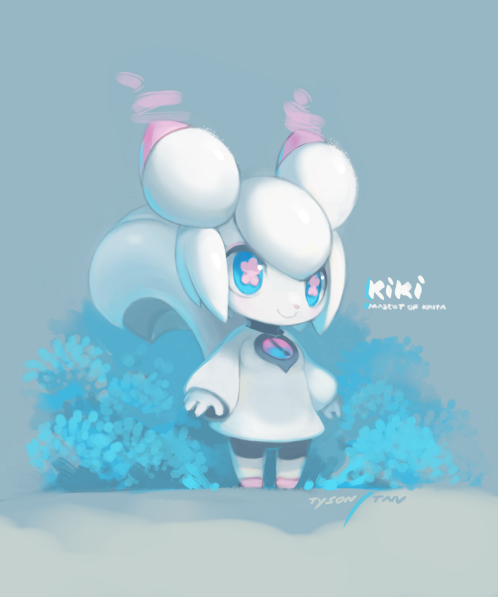](https://krita.org/wp-content/uploads/2021/12/mascot_20151122_kiki_reshape_25.png) **Chibi Kiki (2015)**\[/caption\]

**Artist comment:** This is the most "mascot-oriented" design I ever attempted for Kiki. The art style also followed a generic art book style for children. However, I don't think she looks very inspiring in this form. As a result, I took a more teen cartoon oriented direction ever since.

\[caption id="attachment\_12928" align="aligncenter" width="1024"\][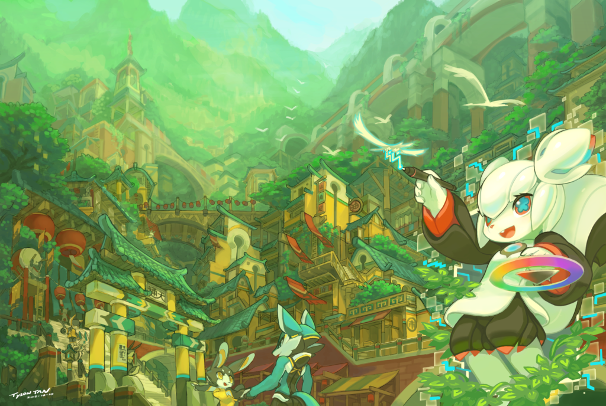](https://krita.org/wp-content/uploads/2021/12/mascot_20150812_kiki_scott_cover_f.png) **Cover for Digital Painting with KRITA 2.9 (2015)**\[/caption\]

**Artist comment:** This is the cover I created for Scott Petrovic's book: [Digital Painting with KRITA 2.9](https://www.amazon.com/Digital-Painting-KRITA-2-9-Masterpiece/dp/0996851704). After the major design change in 2014, I tried to introduce some mech details back to Kiki's then over-simplified character design. Still not very "cyber" though. The focus of this picture was the attempt to draw the background.

\[caption id="attachment\_12929" align="aligncenter" width="1024"\][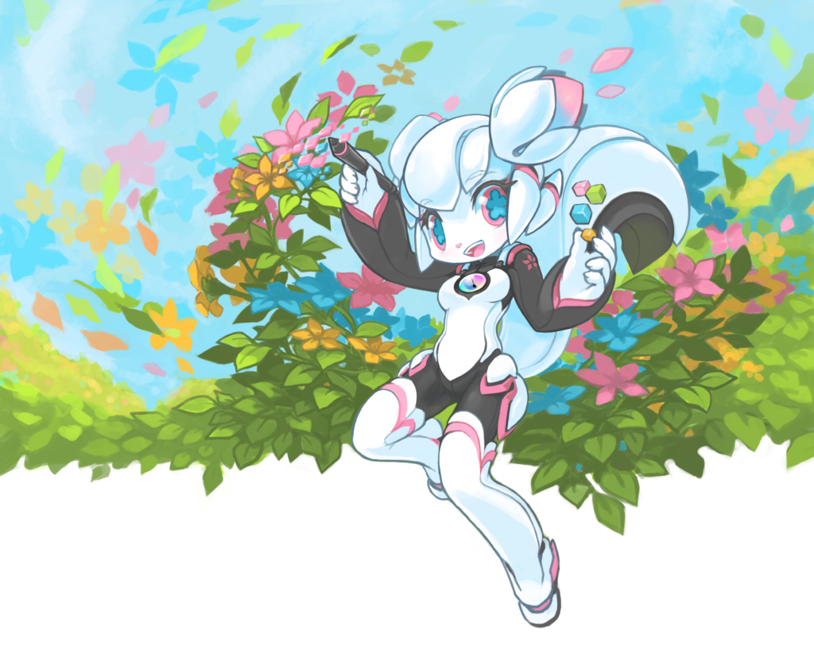](https://krita.org/wp-content/uploads/2021/12/mascot_20140623_kiki_bS.png) **Kiki with more mech (2014)**\[/caption\]

**Artist comment:** This picture was created for [a quick Krita tutorial](https://www.deviantart.com/tysontan/art/Krita-Free-Painting-App-Tutorial-466497166). I attempted to introduce some mech details to the 2014 Kiki's design.

### Fan Art

Please feel free to draw fan arts of Kiki and share with us on social media! Since there is no such thing as "a definitive version" of Kiki's design, you are welcomed to draw Kiki with your own interpretation.

The [Four Seasons of Leon and Kiki](https://krita.org/en/item/huion-and-krita-competition-winners/) art contest sponsored by Huion also features many lovely Kiki artworks.

\[caption id="attachment\_2061" align="alignnone" width="768"\][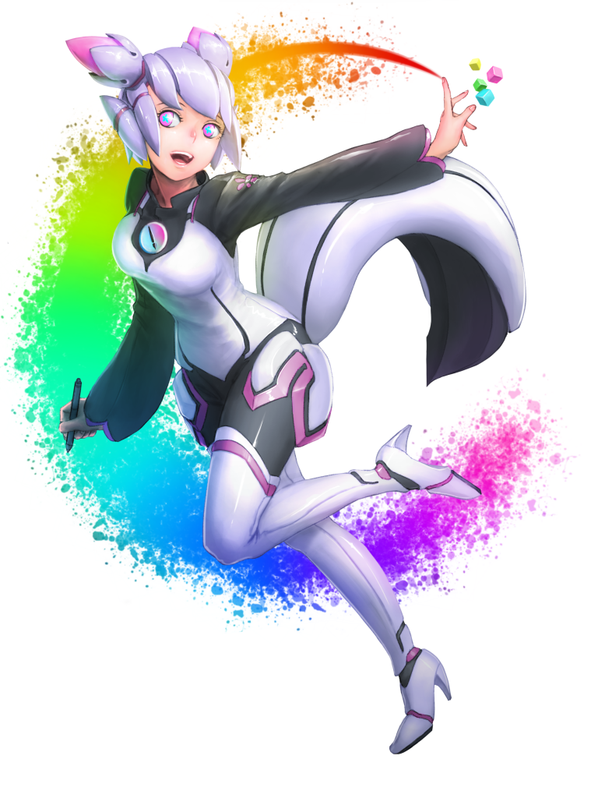](https://krita.org/wp-content/uploads/2015/06/kiki-banajune.png) By Banajune\[/caption\]

\[caption id="attachment\_5068" align="alignnone" width="1024"\][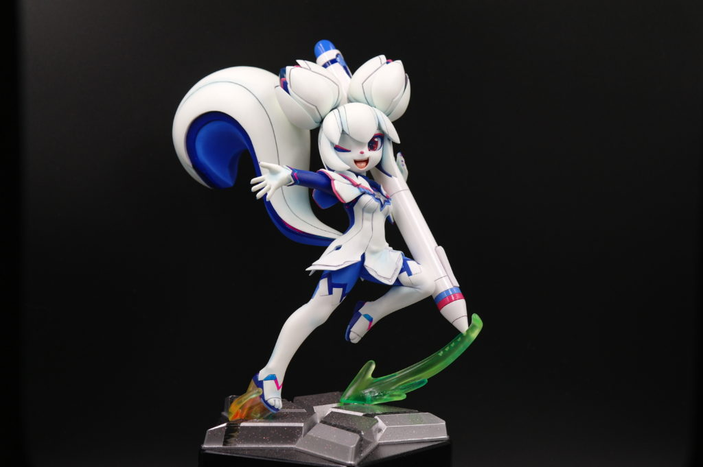](https://krita.org/wp-content/uploads/2017/03/photo_20170322_kiki_set01_angle01.jpg) [Model by Ito Ryou-ichi](https://krita.org/en/item/interview-with-ito-ryou-ichi/)\[/caption\]

 

\[caption id="attachment\_5474" align="aligncenter" width="1227"\]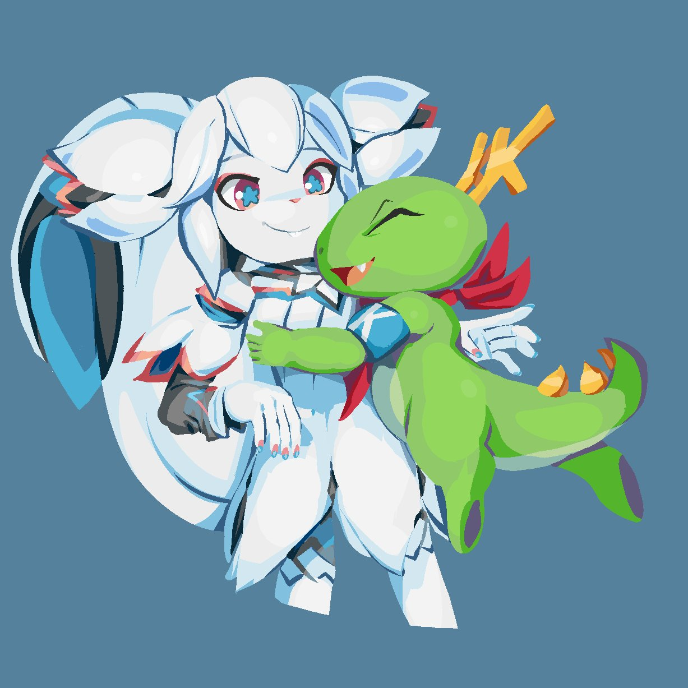 Kiki and Konqi by goshaag\[/caption\]
