

# Krita 4.0 Información general

 

Ésta versión es una de las mas significantes e importantes en el desarrollo de Krita, contiene cambios importantes en su estructura y nuevas funciones que se han creado desde cero, ademas de que la Fundación Krita paso por problemas fiscales durante el 2017. A continuación se presenta un resumen general de todas las novedades.

**Lo siguiente es una nota importante, por favor lee cuidadosamente: Krita 4 tiene un nuevo formato de vectores y texto, esta versión tratará de importar adecuadamente documentos creados con vectores y texto en Krita 3, sin embargo dado a que los formatos de cada version no son 100% compatibles, el resultado de las imágenes puede cambiar, por lo que se recomienda:**

- Hacer una copia de los documentos hechos en Krita 3 para ponerlos a prueba al abrirlos en Krita 4 sin temor de perder el original.
- En algunos casos, la transición es simplemente imposible, si se desea seguir trabajando en cierto documento hecho en Krita 3, se pude (en una copia del mismo) transformar las capas de vectores a capas de dibujo y luego abrirse en Krita 4.

En todos los sistemas operativos se pueden usar las dos versiones de Krita, 3 y 4 sin necesidad de desinstalar una por la otra. Para prevenir conflictos (ya que usan los mismos directorios se recomienda que se use: En Windows el archivo zip, en Linux las appimages y en OSX las "disk images", descargadas en diferentes directorios al de las aplicaciones.

**El set de pinceles de Krita se ha renovado, es posible que en algunos casos algunos pinceles creados o modificados por el usuario en Krita3 pierdan su punta ya que éstas también fueron renovadas, aun que es poco posible, se recomienda verificar su funcionamiento antes de usar Krita4 completamente.**

La nueva imagen "splash" de Krita 4.0, creada por Tyson Tan tiene un profundo significado, representa el florecer del árbol de ciruela chino, imagen que tradicionalmente significa el superar las penas y problemas de la vida, imagen que es bastante apropiada para el lanzamiento de ésta versión.

https://youtu.be/OXvHHJUyBDg

Video creado por Owly Owlet

## Formato SVG en las herramientas de vectores

Krita 3.x uso el formato del "OpenDocument Graphics" ODG, para los vectores, éste formato es originario de los documentos de escritura los cuales no son practicos para el uso en diseño gráfico, ademas éste formato no funciona adecuadamente en programas tales como  [Inkscape](https://www.inkscape.org). En Krita 4.x se han reconstruido completamente las herramientas de vectores usando el formato SVG, el cual está estandarizado por W3C, mismo que es compatible con muchos programas, ésto abre las posibilidades de una intercomunicación operacional entre Krita y otros programas. Krita usa la versión SVG 1.2, pero eventualmente la versión SVG 2 sera implementada.

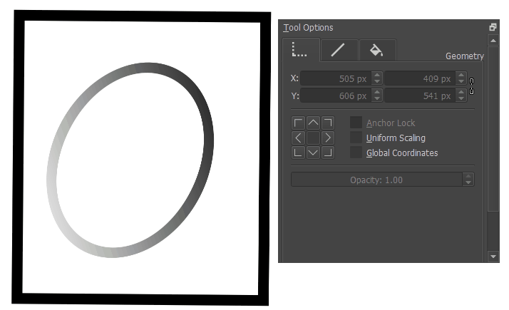

Ademas de el formato, se han incorporado nuevas funciones:

- La herramienta de gradientes se ha juntado al resto de las de vectores para una mejor manipulación de los mismos.
- Se pueden importar y guardar los vectores dentro de los documentos KRA, cuando se descomprime (unzip), se puede apreciar cada capa de vectores como documentos SVG.
- Ahora se pude copiar y pegar figuras de Inkscape a Krita y viceversa.
- Nuevas funciones "boolean" para combinar y cortar figuras, éstas se encuentran en el menú contextual.
- Varios de los errores de código reportados anteriormente dado el uso de vectores se han corregido con el cambio de ODG a SVG.

## Mejoras en las herramientas de vectores

Ademas de haber renovado la tecnología detrás del uso de vectores, también se trabajo arduamente en la manera en que las herramientas se muestran y funcionan basado en la manera en que las usan muchos artistas. Scott Petrovic llevó acabo éste dialogo con los artistas para determinar la forma y el funcionamiento final.

Una de las funciones que no se logró terminar para la version 4.0 es el llenado con patrones y filtros, lo cual aun está bajo desarrollo. Para mas información sobre los cambios ver el manual (en ingles): [Shape Selection Tool Documentation](https://docs.krita.org/Shape_Selection_Tool) y [Edit Shapes Tool Documentation](https://docs.krita.org/Edit_Shapes_Tool).

- De manera mas organizada, ahora es mas fácil el cambiar entre el tipo de relleno, trazo y modo de transformación.
- Ahora se pude ver permanentemente el editor de figuras en el panel de herramientas.
- El editor de figuras se ha renovado con funciones paramétricas mostradas en el panel de opciones de herramientas.
- Los nodos en los vectores tienen una mejor visibilidad e interacción.
- Todas las herramientas para los vectores poseen el color, el tamaño y la opacidad del pincel activo.
- Las capas de vectores se pueden exportar directamente a documentos SVG.
- El clic a la derecha en una capa de vectores produce un menú mas apropiado y con mas funcionamiento dedicado a los vectores.

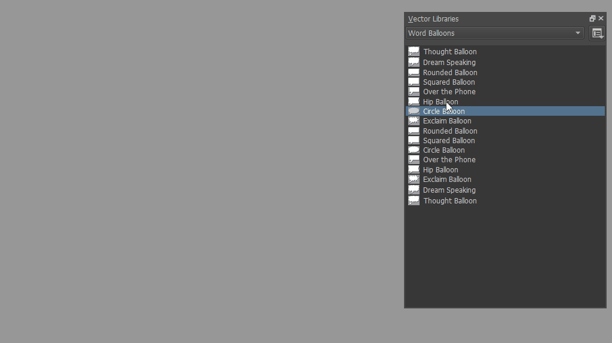

## Nueva Herramienta de Texto

Durante el Kickstarter del 2016 se costeo la tarea de hacer una nueva herramienta de texto. La meta es el que Krita disponga de una forma simple, dependiente y estable la edición texto. Dado los problemas fiscales de la Fundación Krita, no se ha logrado terminar tal proyecto, y aun que la primera versión básica de esta herramienta ya esta disponible, se seguirá trabajando en el implemento de mas funciones conforme la serie 4.x siga avanzando, tales como "delineador de párrafos" (wrapping), mayor control tipográfico, formato vertical para los lenguajes asiáticos entre otros.

Para mayor información de como funciona ésta nueva herramienta, visita el manual (en ingles): [The text tool](https://docs.krita.org/Text_Tool).

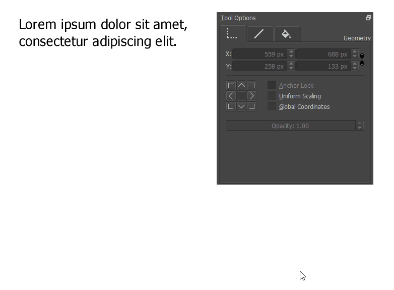

Some of the changes and things you can do with the new text tools

- Uses SVG internally
- supports 90% of all SVG 1.1 text features except glyphs and rotation
- edit font size, line height, color, font weight, italics, and more
- The text editor popup supports entering bidirectional text
- The text editor popup has both a rich text editor panel as well as an SVG source editor panel where you can enter any SVG that is valid inside a text element.

## Scripts de Python

Ésto fue una de las metas mas deseadas del ultimo Kickstarter, ahora se pueden crear scripts (pequeños programas) que pueden controlar y elaborar aspectos y funciones de Krita. Dado que ésta es la primer versión que contiene éste funcionamiento, hay aun muchas mejoras y cambios que se pueden establecer. Se espera que con la ayuda de los usuarios se colecte mayor información sobre el como se puede usar mas ampliamente así como cuales partes no funcionan bien tanto en el controlador mismo así como en el API que se ha diseñado para su uso en Krita.

Documentos sobre [el controlador de Python](https://docs.krita.org/Introduction_to_Python_Scripting) y el [API de Krita](https://api.kde.org/extragear-api/graphics-apidocs/krita/libs/libkis/html/index.html). (en ingles)

### Gestor del controlador Python

Se pude seleccionar cuales scripts estarán activados, el gestor es parte de la ventana principal de configuración de Krita.

Al usar este controlador, se pueden añadir muchas de las funciones que la comunidad a pedido, Krita viene con una serie de scripts los cuales sirven como ejemplo de lo que se puede realizar al usar Python. Al crear esta serie, se estableció también un API propio de Krita.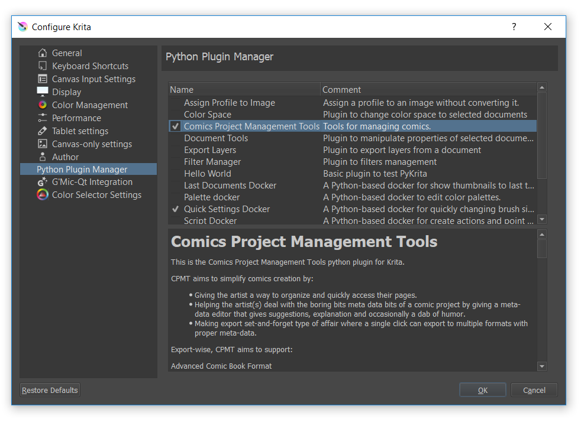

### Nuevas funciones con el uso de Python

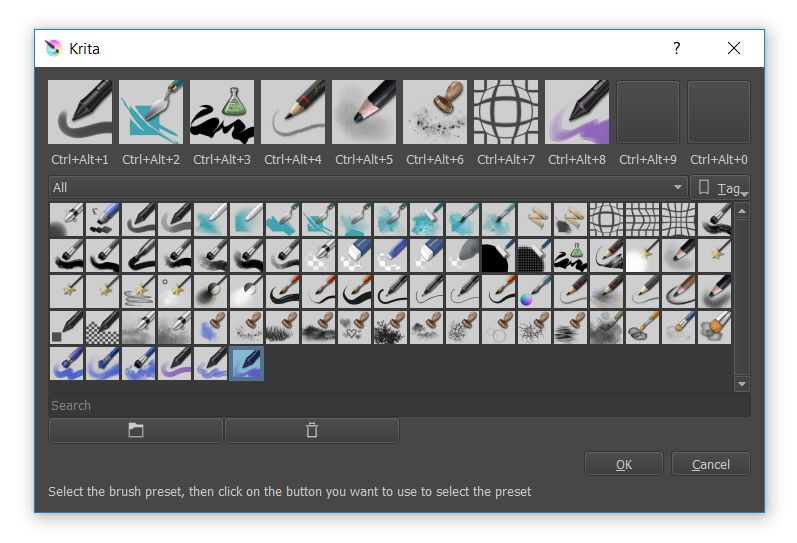**Diez pinceles** - Se pude asignar diez atajos de teclado a diez pinceles en especifico, simplemente se hace un clic en el pincel deseado o el mismo se puede arrastrar a uno de los espacios disponibles. Y por supuesto, el script se pude abrir directamente y modificar al gusto propio. (se requiere conocimiento en programación de Python para ésto)

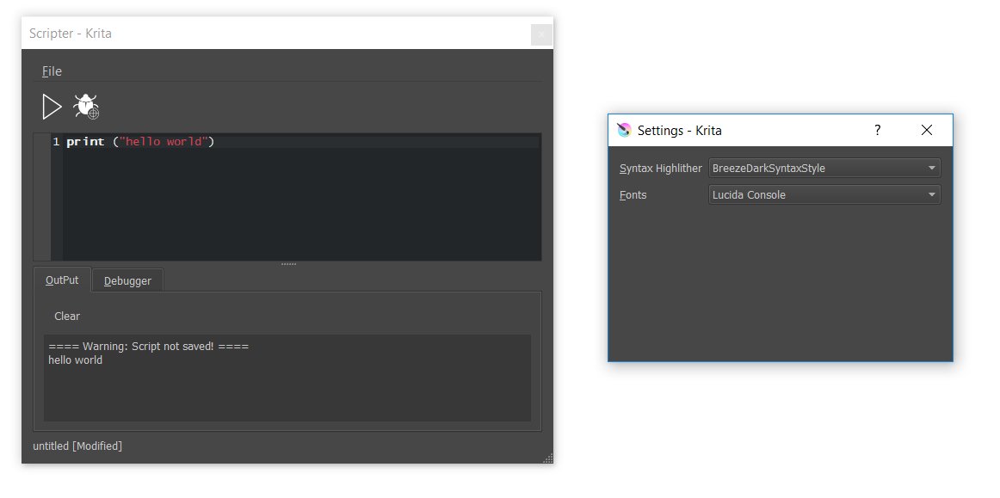**La terminal de comando para los scripts** - Los scripts se pueden poner a prueba mientras se usa Kritac. El editor de Python está equipado con un enfoque de sintaxis y un pequeño probador de errores (debugger). Creación de Eliakin Almeida durante su proyecto en el "Google Summer fo Code 2017".

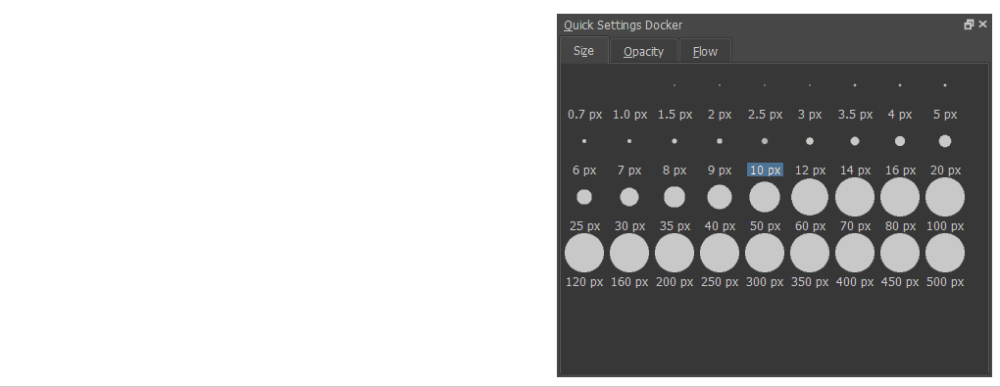**Panel de ajustes rápidos** - Con éste panel se puede cambiar de manera rapida el tamaño, la opacidad y el flujo de los pinceles, con una serie de valores predefinidos. Elaborador por Wolthera.

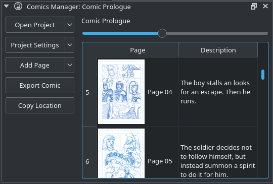**Administrador de historietas** - Este controlador posee una gran cantidad de opciones para administrar y organizar los proyectos para la creación de historietas. Creado por Wolthera, nos muestra de manera ejemplar como se puede usar Python en scripts en linea, tal como abrir, guardar, cortar, modificar y procesar en conjunto. Inclusive incluye formatos tales como CBZ, EPUB y ACBF. Los documentos mismos de Python usados en este script contienen bastantes explicaciones para ayudar a los principiantes en ellos a aprender su estructura básica.

## Herramienta mascara de colorear

Con ésta nueva herramienta, se crea una nueva capa tipo mascara donde con unos cuantos trazos se puede colorear todo un dibujo. Los colores se predisponen en areas especificas y Krita hace el resto del trabajo. Puedes encontrar las instrucciones en el manual (en ingles): [Colorize Mask](https://docs.krita.org/Colorize_Mask).

\[embed width="500" \]http://www.youtube.com/watch?v=fIOhd3xXv-A&\[/embed\]

## Guardado discreto

Ya no se tiene que esperar a que krita guarde un documento a cada momento para volver a pintar. Para evitar éstas interrupciones ahora se usa in sistema discreto que guarda los documentos en el fondo, al igual que con las animaciones, por lo que se puede seguir trabajando en un proyecto mientras Krita continua exportando, todo ésto ademas es ayudado con el uso de procesadores múltiples, lo cual incrementa la rapidez del guardado.

## Nuevo formato de paletas de colores y nuevo panel de las mismas

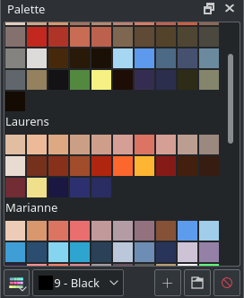

El panel de paletas de colores en krita 3 solo podía mostrar sRGB de 8bit, ya que fue diseñado mucho tiempo atras cuando algo mayor era demasiado ambicioso. En Krita 4 se ha creado un nuevo formato: KPL, el cual puede mostrar y guardar todos los colores que Krita misma puda usar. Éste formato te permite ademas el agrupar colores. El documento es hecho de un formato ZIP combinado con un documento XML.

El panel se ha inovado con las siguientes funciones:

- Los colores see puede arrastrar y dejar (drag and drop).
- Se puede renombrar un color existente.
- Se pude agrupar colores.
- Se puede cargar paletas Swatchbooker (SBZ), (función compuesta por L.E. Segovia)
- Se puede cargar paletas de Scribus XML (función compuesta por L.E. Segovia)

## El editor de pinceles se ha actualizado

Se ha rediseñado la ventana del editor de pinceles, ésto lo hace mucho mejor y mas fácil de usar. Se ha incorporado un espacio donde se pude ver una vista previa de el trazo del pincel de acuerdo a los cambios de los parámetros, esto facilita en gran manera la creación y modificación de los pinceles. Nota: los motores de pinceles figuras (shapes) y rápido (quick) no poseen vista previa dado limitaciones técnicas.

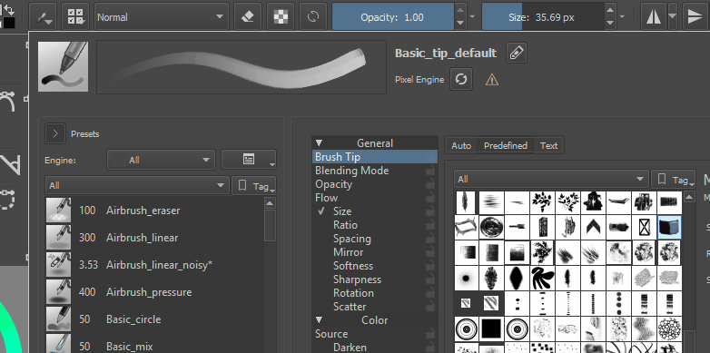

- Los pinceles se pueden renombrar fácilmente.
- Al cambiar y guardar un pincel, su icono original permanece por defecto.
- Al crear un pincel nuevo, un nuevo dialogo se abre donde se puede elegir el icono del mismo, con imágenes predefinidas o creadas.
- En éste nuevo dialogo, se pueden elegir iconos de pinceles y otros elementos directamente de un juego de imágenes que ha sido integrado en los archivos internos.
- Las áreas de la lista de pinceles y del bloc de dibujo se pueden colapsar, ésto permite un mejor espacio en pantallas pequeñas.
- Ahora existen nuevas curvas predefinidas que se pueden seleccionar de acuerdo a las funciones deseadas.
- Los efectos que cada curva tiene en relación a otras usa un nuevo algoritmo.

## Desempeño de los pinceles mejorado

Siempre se ha estado buscando el como mejorar el desempeño de Krita en general, uno de los proyectos mas importantes del año pasado fue el hacer que el motor de pinceles tipo pixel use todos los procesadores de las computadoras, se puede ademas decidir cuantos procesadores Krita debe usar en la ventana de configuraciones, aun cundo solo un motor tiene esta función, se espera que se pueda expandir al resto de los motores tales como el de "manchado".

Ademas, también se ha incluido la propiedad de umbral de la vista previa instantánea ("Instant Preview threshold"). Esto permite mayor rapidez en pinceles pequeños donde la "vista previa instantánea" no presentaba ningún efecto. La vista previa instantánea se activara automáticamente cuando el pincel se cambia a un mayor tamaño.

## Nueva capacidad del tamaño del pincel

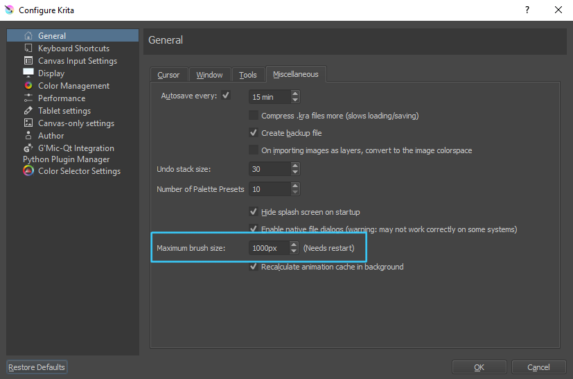

En Krita 3, el limite del tamaño del pincel es de 1,000px, En Krita 4, se puede incrementar el limite hasta 10,000px. Es necesario tomar en cuenta que éste tamaño es bastante "pesado" de procesar, se requiere una computadora bastante potente para tal ejecución.

## Mascara de pincel

Se ha implementado la capacidad de añadir mas de una punta a cada pincel, la idea comenzó como "pinceles apilados" y fue una de las funciones extras logradas gracias al Kickstarter, con ésta función se puede incrementar la cantidad de efectos del pincel, no solo con una punta encimada, si no ademas con otros parámetros tales como "modos de mezclado". Éste ejemplo muestra un modo de mezclado tipo "screen" para la creación de un efecto de acuarela. Para mayor información ver el manual (en ingles): [manual](https://docs.krita.org/Masked_Brush).

## Nuevo juego de pinceles de Krita

Se han actualizado los pinceles que vienen por defecto con Krita. Se ha puesto un arduo trabajo en mejorar el rendimiento así como el crear una nueva selección mas variada. Algunos de los nuevos pinceles muestran por ejemplo lo que la nueva función de "mascara de pincel" puede hacer tal como los pinceles de acuarela. Se agradece el trabajo y la experiencia puesta en esta obra a David Revoy, Ramon Miranda, Wolthera, Pablo Cazorla, Rad, Scott Petrovic, and Razvan, ademas de todos los usuarios que amablemente realizaron la encuesta la cual brindo una idea mas clara del uso de los pinceles. El juego completo sera finalizado por David Revoy cuyo [juego porpio](http://davidrevoy.com/article319/krita-brushkit-v8) es el mas popular entre los usuarios de Krita.

El set completo original de Krita 3 se puede descargar en [share.krita.org](https://share.krita.org/p/1206895/).

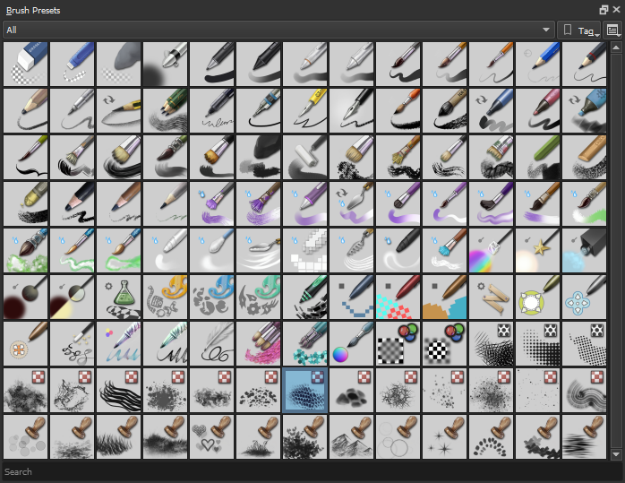

## Cuadriculado de Pixel

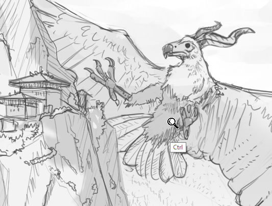

Andrew Kamakin ah añadido esta nueva función, que al aumentar el lienzo a mas de 800%, se muestra un cuadriculado que ayuda a percibir cada pixel. Tanto el color del cuadriculado como el porcentaje de aumento pueden ser configurados en la ventana de configuración de Krita.

The zoom percentage and color can be conigured in the Settings area.

## Cuadriculado isométrico

Ahora se puede especificar el angulo y espacio de cada eje para su uso de manera isométrica. El cuadriculado tiene la opción para cambiar de isométrico a rectangular y viceversa, ademas de la habilidad de cambiar el color y estilo del mismo, 'estos controles se encuentran en el panel de cuadriculado y guías.

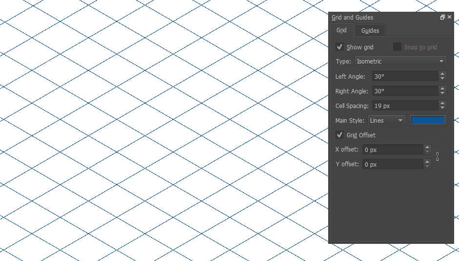

## Mejoras en la paleta emergente

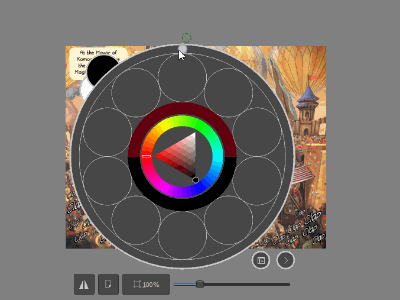

- Nuevo control para enfocar (agrandar y disminuir el lienzo.
- Nuevo control para rotar el lienzo.
- Botones para el control de modo de espejo, para ocultar los paneles y barras de herramientas y un control para agrandar el lienzo al 100%.

## Mejoras en los asistentes de dibujo

- Se ha mejorado el modo en que se muestran los puntos de control, lo cual facilita su uso en tabletas digitales.
- Ahora se puede cambiar el color y la opacidad de los asistentes.
- El guardar y abrir asistentes funciona mucho mejor.

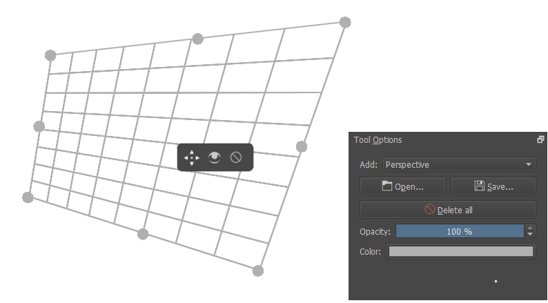

## Mejoras en los filtros

- Se ha añadido un nuevo filtro de "detección de borde", el cual usa procesos multiples, lo cual lo hace mucho mas rapido, ademas de tener varias opciones a escojer, para mas información ver el manual (en ingles): [Edge-detection](https://docs.krita.org/Edge_Detection)
- Ademas un filtro para la ayuda de texturas en 3D, que convierte "height map" en un "normal map".
- Las curvas de control para la detección de borde, brillo y contraste se han eliminado.
- El filtro de gradientes se ha mejorado, ahora es capaz de crearlas al instante y guarda la información en el documento KRA en el que se usa.

## Habilidad del cambio de tamaño de los iconos en el panel de pinceles

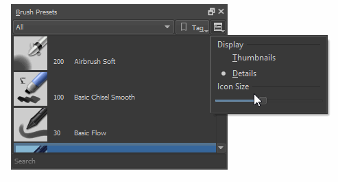

Ahora es posible cambiar el tamaño de los iconos de los pinceles directamente desde su panel. Ademas ahora puedes apreciar el tamaño del pincel cuando se activa la "vista detallada".

## Mejores advertencias en el guardado de documentos

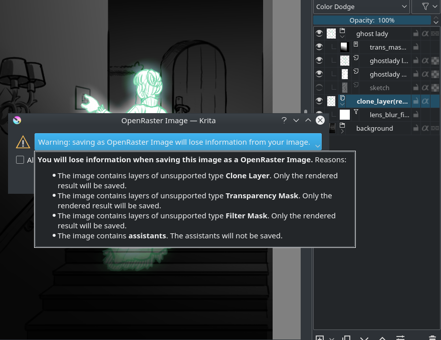

En muchas ocasiones, los usuarios tratan de guardar los documentos en formatos incorrectos, lo cual resulta en la perdida de información tal como capas o la profundidad de los canales de color, (por ejemplo el guardar el documento en ves de exportar en PNG o JPG). En Krita 4.0 se ha implementado una advertencia la cual informara al usuario al momento de guardar documentos cuales características se perderán en el formato elegido, como medida de seguridad, el dialogo ofrece la oportunidad de guardar de manera paralela, en el formato KRA, el cual guarda todos los aspectos del documento.

## Nuevo color disponible para la interfaz

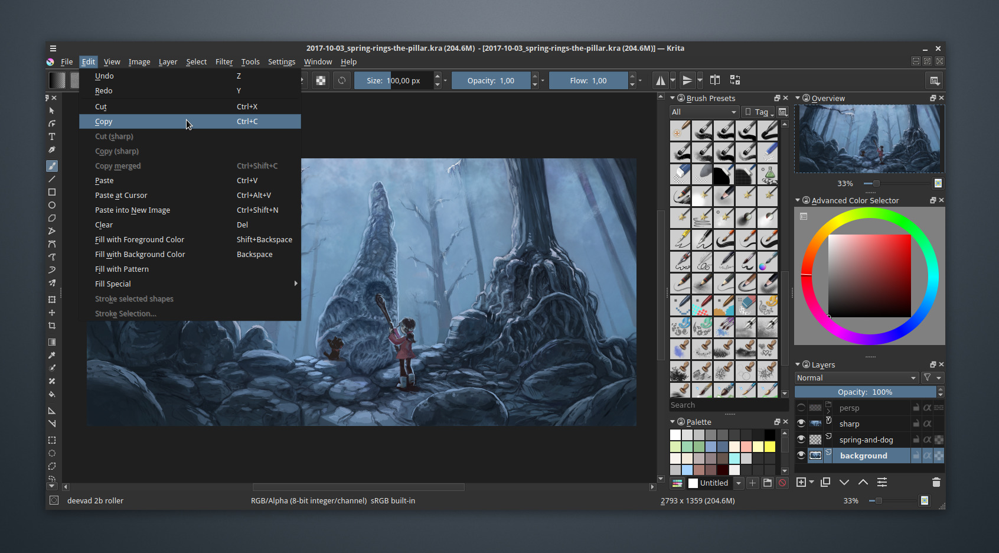

Para los que gustan de colores mas obscuros.

## Correcciones del código y nuevos cambios

- Capas

- Ahora se puede cambiar la localidad de las capas tipo archivo.
- Se ha añadido la posibilidad de transformar una capa regular a una tipo archivo, lo cual guarda las capas dentro de la capa archivo y crea su localización.
- Se pude activar el "mostrar in cronograma" en una selección de capas múltiple. (BUG 377730)
- Se ha corregido el cerrado inesperado del programa al arrastrar una capa tipo mascara con la tecla Ctrl. (BUG 389037)
- Ahora se muestra una advertencia cuando se trata de pintar en una capa clonada. (BUG 389570)
- Las capas recientemente importadas ya no se muestran en la sección "documentos recientes". (BUG 389879)
- Se hace una copia exacta si el parámetro de color "umbral" (threshold) se coloca en el número 1. (BUG 385160)
- Se ha corregido el seleccionar accidentalmente el color de estampa de las capas cuando el cursor se pasa encima de las mismas sin hacer clic. (BUG 389560)
- Se ha reorganizado el menú correspondiente a las capas tanto en su panel como en la barra de herramientas para un mejor contexto.
- Ahora se registran todos los cambios de las capas en los pasos de "deshacer y rehacer" (undo, redo). (BUG 389876)
- Mejoras al copiar selecciones. (BUG 389174)
- Corrección del cerrado inesperado cuando al seleccionar varias capas tipo mascara, se presiona el botón de propiedades.
- Corrección al reajustar el cache de la "muestra instantánea" (instant preview) cuando se cambia la visibilidad de las capas. (BUG T6652)

- Pinceles
- Monitor de desempeño de pinceles, éste se puede activar en la ventana de configuraciones.
- Las tarjetas de video de Intel usaran por defecto Angle, ya que OpenGL causa muchos problemas con las mismas.
- Se ha implementado movimiento cinético en las ventanas de recursos tales como el panel de pinceles.
- Ahora se puede ver el tamaño de los pinceles en la descripción de los mismos en su propio panel.
- Ahora se notifica visualmente cuando un pincel se ha cambiado con los atajos del teclado "previo, siguiente".
- Se ha corregido el conteo en los pinceles de texto.
- Se ha corregido el guardar documentos GBR. (382068)
- Se ha corregido el cambio en el panel de pinceles al seleccionar entre lista detallada e iconos.
- Se ha corregido el modo de borrador que quedaba seleccionado aun cuando se trataba de retornar al modo normal del pincel. (380340)
- Los atajos del teclado correspondientes al tamaño del pincel son propiamente desactivados cuando el control en la barra de herramientas no está disponible. (379958)
- Los pinceles con nombres que contengan una subraya, ésta se mostrara como un espacio en el programa.
- Se han corregido los valores NaN en los pinceles tipo "cerdas" (344457)
- Mejoras en la visibilidad y etiquetas de los parámetros de "suavidad", "magnetismo" y "asistentes" en las opciones de herramientas.
- Ahora se escala el "fuzzy dab/trazo" con las propiedades de "fuerza" y con las opciones HSV. (387507)
- Nuevo paso para validar y nombrar los pinceles al copiarlos. (388570)
- Se ha añadido la opción de presión y angulo en el motor de pinceles de sombreado "hatching".
- Se ha eliminado el motor de pinceles tipo gis ya que existen otros motores con las misma propiedades.
- Se han corregido algunos errores presentes al pintar en el modo de envoltura "wrap around" . (367943)

- Documentos

- Los controles visuales para la animación se han mejorado para una mejor facilidad y entendimiento de su uso.
- Ahora al reproducir una animación, se pueden exportar diferentes tamaños de altura y ancho, así como imagenes por segundo.
- En los documentos PSD, se ha implementado el poder abrir y guardar capas dentro de grupos. (387708)
- Se ha corregido el abrir y guardar los nodos activos en los documentos kra. (T6542)
- Se ha corregido el el auto guardado.
- Se ha mejorado la información que se muestra durante el auto guardado. (T6542)
- Se ha corregido el poder guardar información de transparencia en los formatos PNG y JPG.
- Se ha corregido el cierre inesperado del programa al usar guardado incrementado y en el guardado de reserva. (388927)
- Se ha eliminado uso del formato ODG. (345312)
- Se ha corregido el retardo del trazo al usar una textura con un tamaño grande. (386642)
- Se ha corregido el congelamiento del programa al cancelar el exporte de una imagen PNG. (T7194)

- Filtros y modos de mezclado

- Se ha añadido el modo "hard mix" tipo Photoshop.
- Se ha añadido el control de escala logarítmica el el filtro de ajuste del color.
- Se ha añadidos un botón de inverso en el filtro de niveles.
- Se ha corregido el uso de "color a alfa" cuando se crea una capa tipo mascara. (362626)
- Ahora el valor mínimo para el radio del difuminado es 1. (389313)
- Ahora solo se puede repetir la aplicación de un filtro si la acción es realmente posible. (389253)
- Se ha corregido el cierre inesperado del programa al exportar con un filtro que no posee ninguna configuración. (383456)
- Se ha añadido un botón de reinicio en los controles de HSV, así como el los filtros de los canales de color.
- Se ha mejorado el determinar el formato del color de acuerdo a los generadores de las capas. (390033)

- Interfaz

- Se ha condensado la ventana de configuraciones para un mejor uso en pantallas pequeñas.
- Ahora se pueden mover y reorganizar las pestañas de cada documento. (388268)
- Ahora las pestañas poseen el estado de modificación junto al titulo de cada documento.
- El área del "nombre del documento" se ha colocado en la pestaña de "contenido" en la ventana para crear nuevos documentos.
- Se ha corregido el cierre inesperado del programa al cerrar uno de dos ventanas que muestran el mismo documento.
- Se ha corregido la posición del titulo en la ventana principal.
- Ahora se cambia la subdivisión de las reglas métricas respecto al enfoque del lienzo.
- Correcciones visuales al intercambiar lienzos.
- Ahora se muestra el selector de colores deshabilitado si no hay ningún documento abierto.
- Se ha mejorado la manera en que se muestra el panel de herramientas al moverse o deslizarse.
- En la ventana de guardado y exportado, se muestra el tipo MIME correspondiente. (388738)
- La selección de colores en general se ha mejorado con un mejor algoritmo que revisa la identidad de cada color.
- La imagen de comienzo del programa se ha actualizado.
- Se han organizado las opciones en las opciones de la capa de relleno de color.
- Se ha corregido el problema al intercambiar la vista de documentos abiertos en el modo de pestañas que hacía que un documento se acomodara siempre sobre el resto.
- Se ha corregido el uso de iconos al cambiar las vistas "themes" del programa.
- El icono de Krita se ha actualizado.
- Se han añadido las variables "vh" y "vw" en las entradas numéricas las cuales representan altura y ancho respectivamente.
- Se ha corregido la división en los algoritmos de álgebra. (399034)
- Se ha corregido el añadir una capa tipo grupo en un lienzo vació. (388841)
- Se ha corregido el uso del documento "swap" en la configuración del programa. (389410)
- Iconos mejorados en la ventana para crear nuevos documentos.
- Se ha corregido el cierre inesperado del programa al borrar un atajo de teclado que no existe. (385662)
- Se han añadido los iconos de los pinceles al catálogo de imágenes de vectores.
- Ahora se trata de restaurar el uso de OpenGL 2.1 en otros sistemas aparte de OSX. (282281, 363770)
- Se ha corregido el actualizar el "shader" cuando OCIO se activa después de haber sido desactivado manualmente.
- Se han corregido varios problemas con OCIO. (373481)
- Se ha mejorado la velocidad de división con los circuitos SSE. (8dc92f7dee7dc4e32e22724843669a25f444fa39)
- Ahora se previene el usar un directorio vació cuando el usuario cancela el guardado de la localidad del documento "swap".
- Ahora el perfil de autor por defecto es "anónimo". (T6627)
- Ahora se inserta el "widget" de autor en la posición cero. (389877)
- Ahora se toma en cuenta la multiplicación cuando se traduce el DPI en los valores internos de Krita. (390337)
- Se ha mejorado la posición en la herramienta de cortado de imágenes. (390382)
- Se ha corregido el problema con las herramientas de selección manual. (382690)
- Se ha corregido la rotación de la pantalla al comenzar Krita dado el uso de QPA en OpenGL. (390651)
- Se ha añadido un identificador para las tabletas digitales UC-LOGIC en Linux. (363443)
- En Windows, al reportar un error de código, se selecciona automáticamente la versión y arquitectura del sistema operativo.

## Los 10 Desarrolladores mas activos

Ésta es una lista de las personas mas ocupadas con Krita desde el 2016, con ella le puedes dar una vista a parte del equipo detrás del proyecto.

 

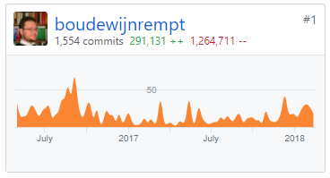 **#1 Boudewjin Rempt** (IRC: boud)

- Director del proyecto
- Programador principal de Krita
- Desarrollador de la "versión diaria" de Windows y de las Appimages
- Creador de la herramienta de texto, del uso de Python en Krita y del API
- Creador del script de los "diez pinceles"

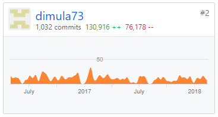 **#2 Dmitry Kazakov** (IRC: dmitryK)

- Programador principal de Krita
- Desarrollador de las herramientas de vectores, texto y mascaras de pinceles
- Desarrollador de el uso de procesadores múltiples en Krita
- Desarrollador del "guardado discreto" y de la mascara de colorear

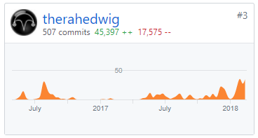 **#3 Wolthera van Hövell tot Westerflier ** (IRC: wolthera) ★ Voluntaria

- Programadora y creadora de los scripts: Administrador de historietas, Paleta de colores y Ajustes rapidos
- Desarrolladora del creador del creador de puntas, del editor de texto, Python API y del filtro de detección de bordes
- Contribuyente principal del manual
- Consultado en los foros

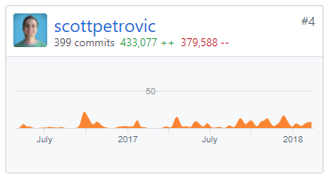 **#4 Scott Petrovic** (IRC: scottyp2) ★ Voluntario

- Diseño visual de las herramientas de vectores, de texto, y editor de pinceles
- Desarrollador del editor de pinceles, de los asistentes de dibujo, del dialogo de documentos y de la ventana de configuraciones
- Administrador y diseñador de la pagina oficial de Krita: krita.org

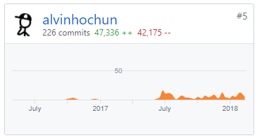 **#5 Alvin Wong** (IRC: windragon) ★ Voluntario

- Desarrollador del uso de tabletas digitales en Windows tales como Surface Pro
- Desarrollador de la compatibilidad con ANGLE para un mejor desempeño Windows
- Colaborador con la versión de Windows incluyendo la "version diaria"

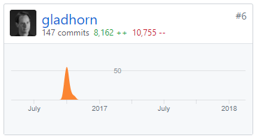 **#6 Frederic Gladhorn** (IRC: fregl) ★ Voluntario

- Desarrollador en la mejora del rendimiento en el uso de la memoria

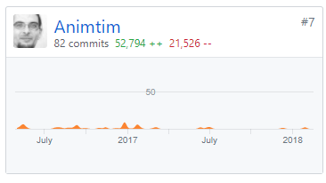 **#7 Timothee Giet** (IRC: animtim) ★ Voluntario

- Desarrollador y creador de iconos para los diálogos, motores de pincel y herramientas
- Organizador de elementos SVG usados por Krita

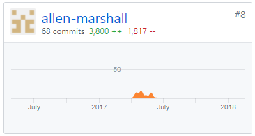 **#8 Allen Marshall** (IRC: animtim) ★ Voluntario

- Contribuidor de un nuevo algoritmo para un mejor pincel de aire

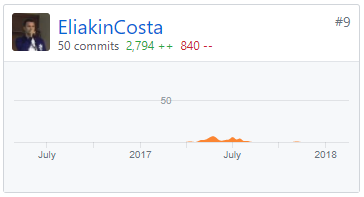 **#9 Eliakin Costa** (IRC: eliakincosta) ★ Voluntario

- Estudiante del Google Summer of Code
- Programador y desarrollador de varios scripts de Python
- Desarrollador del API

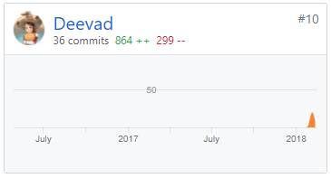 **#10 David Revoy** (IRC: deevad)

- Creador y administrador del nuevo juego de pinceles

## Arte hecho con Krita

 MarrHero

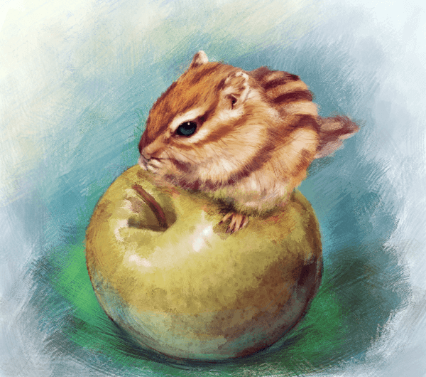 Elena Pollastri

 graffted1

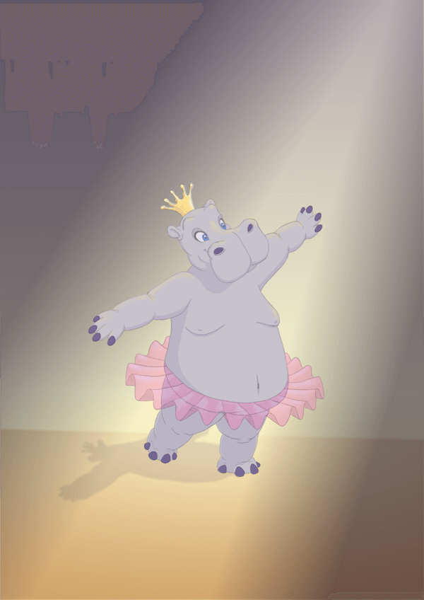 Jeremy Fries

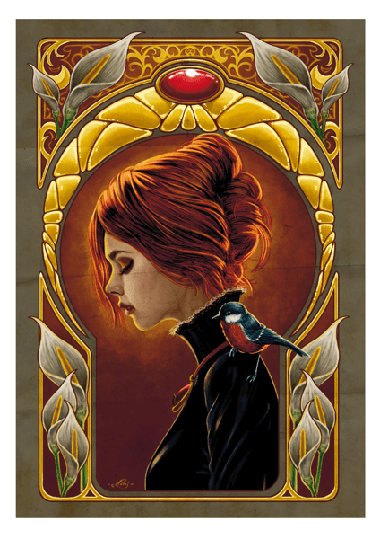 johan jaccob

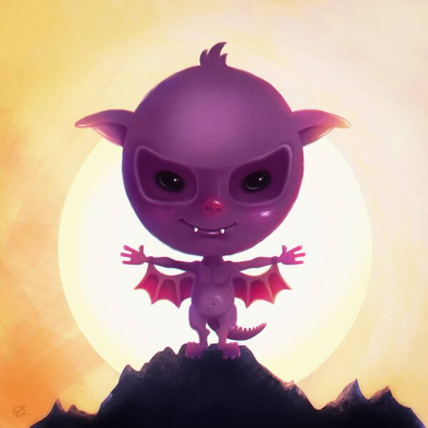 Dorota Krzyżosiak

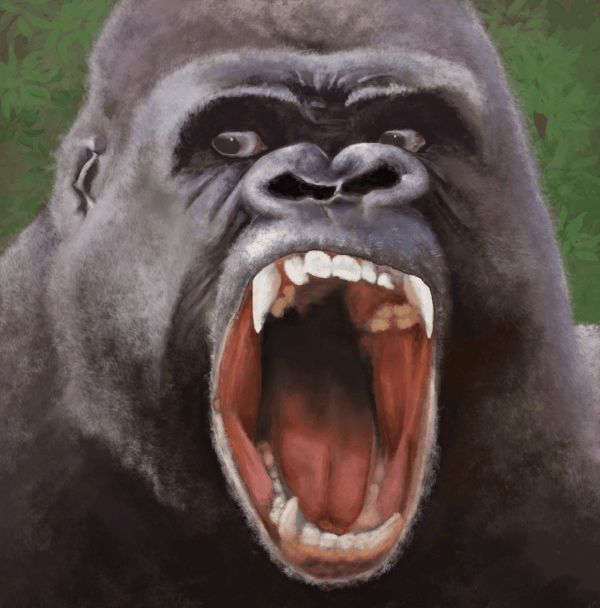 kitsune09

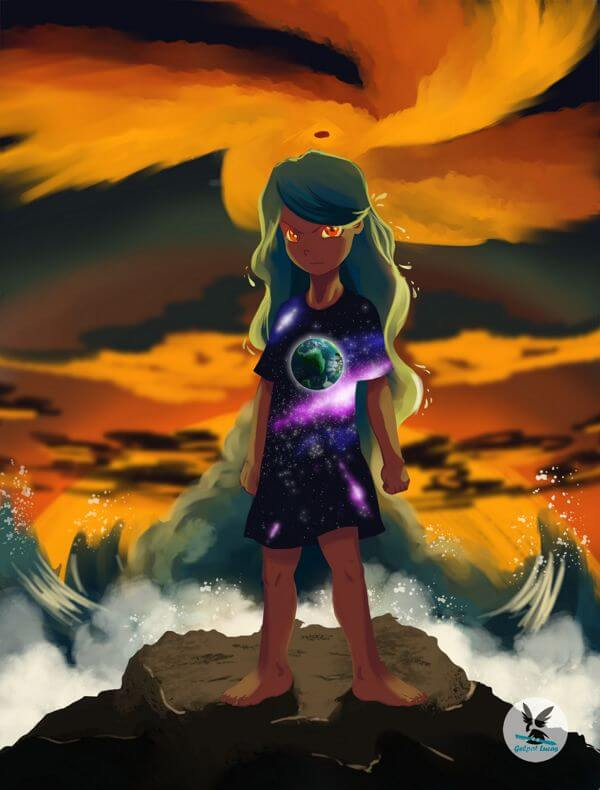 Gelpat Lucas

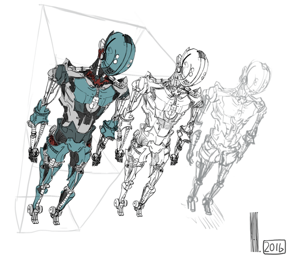 Tomas Marek

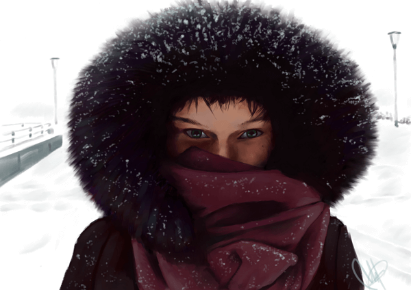 Matteo Pescarin

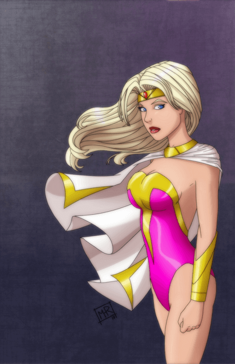 Mauricio Hunt

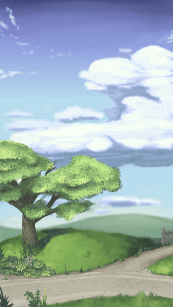 Noitibmar Tibbs

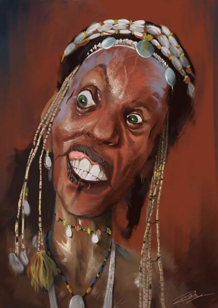 Rakesh Chakraborty

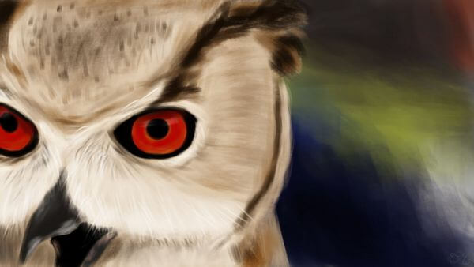 Shannen McMorrighan

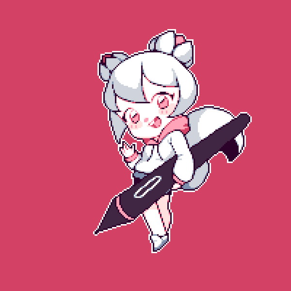 Ramskulls Art

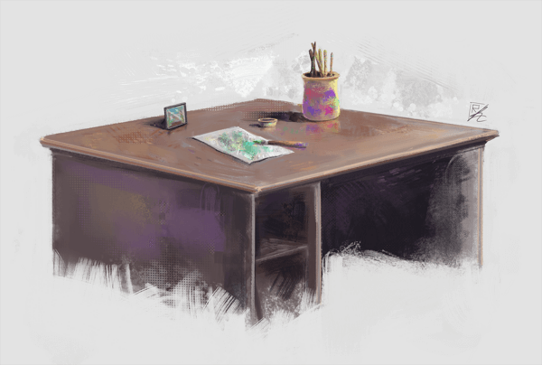 Răzvan Rădulescu

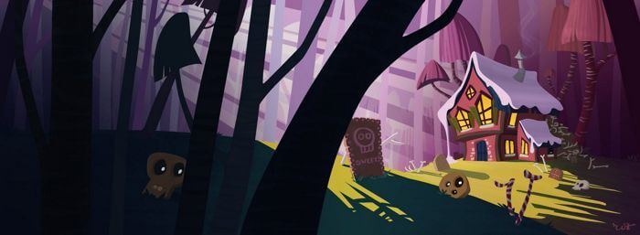 Rositsa 'roz' Zaharieva

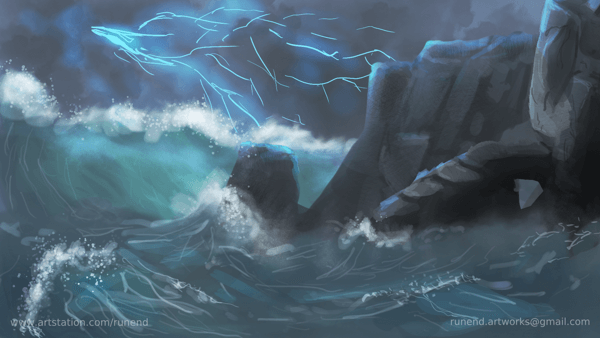 runend artworks

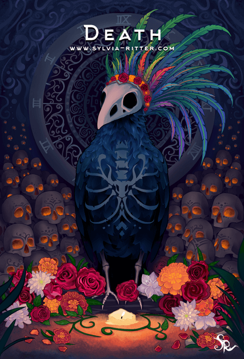 Sylvia Ritter

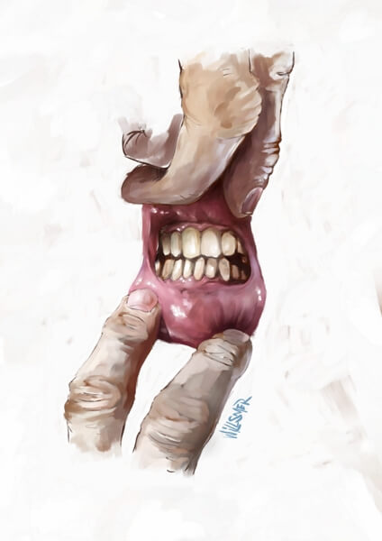 Toby Willsmer

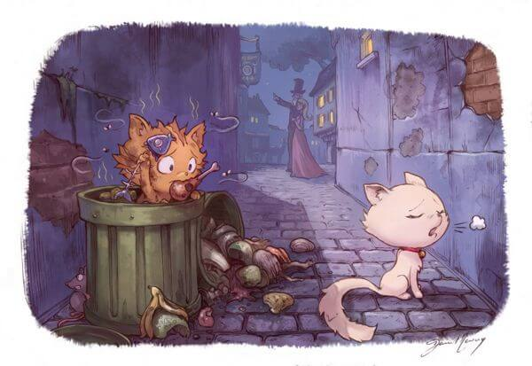 David Revoy

## También puedes apoyarnos

Krita es un programa no solo de código libre si no ademas está a disposición de manera gratuita, éste proyecto solo es posible gracias a las donaciones hechas por nuestros usuarios, por favor considera la posibilidad de ayudarnos con una [donación](https://krita.org/en/support-us/donations/) o comprando [videos instructivos o nuestro libro de arte Made With Krita](https://krita.org/es/item/krita-3-2-0/%22https://krita.org/en/support-us/shop), solo con tu ayuda podremos mantener a nuestro pequeño grupo desarrollando Krita en tiempo completo, ¡Gracias!
