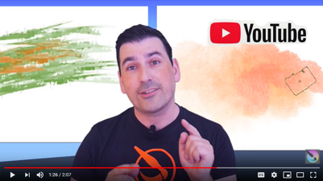

### Connect with the Community

See the new [Krita YouTube channel](https://www.youtube.com/channel/UCkIccKaHDGA8lYVmUerLhag/videos) to learn about new brushes and techniques.

Share artwork and ask questions on the [Krita artists](https://krita-artists.org/) forum.

* * *

### Free Learning Resources

There are plenty of things to learn about from our documentation and training.

[Getting Started](https://docs.krita.org/en/user_manual/getting_started.html)

[User Interface](https://docs.krita.org/en/user_manual/getting_started/navigation.html)

[Basic Concepts](https://docs.krita.org/en/user_manual/getting_started/basic_concepts.html)

[Drawing Assistants](https://docs.krita.org/en/user_manual/painting_with_assistants.html)

[Animations](https://docs.krita.org/en/user_manual/animation.html)

[Tutorials](https://docs.krita.org/en/tutorials.html)

[User Manual](https://docs.krita.org/en/user_manual.html)

[Layers and Masks](https://docs.krita.org/en/user_manual/layers_and_masks.html)

* * *
