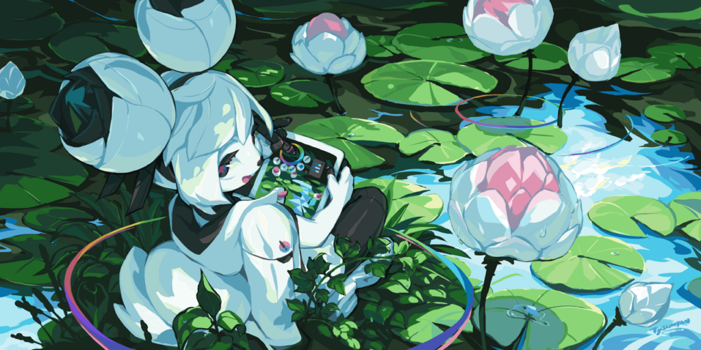

# Krita 4.3 Release Notes

Krita 4.3.0, coming a year after the release of Krita 4.2.0, is packed with new features but mostly many, many bug fixes. We want this to be the most stable Krita release ever! We spent more than a year fully focused on improving Krita's stability and performance -- but there are still a bunch of new features, too. Thanks to the generous support of our community, more and more people are working on Krita these days and with great results: there are over 2000 changes in Krita 4.3.0 compared to Krita 4.2.9!

This release also contains the work of the 2019 Google Summer of Code projects. Sharaf Zaman has worked on porting Krita to Android, and the first beta (based on Krita 4.2.9) has entered the Google Play Store for Chrome OS and Android tablets. Krita 4.3.0 will be there as the second beta: until we're happy with the state of Krita on Android it will remain in the beta channel. Tusooa Zhu has rewritten Krita's undo system, and _that_ made it possible to add a snapshot docker. And Kuntal Majumder has added a brand new magnetic selection tool.

https://youtu.be/VTlh2KhkOM4

## Android

https://twitter.com/AMedonosova/status/1250513989760700418

On Android, Samsung's Air actions are now supported. Anna Medonosova added the stylus gestures supported by Samsumg Tab S6, Note 9 (partially) and Note 10. You can configure the actions in the Configure Krita dialog.

## Animation

Since the start of March, Emmet and Eoin have been working on a whole bunch of fixes, optimizations and improvements to our animation tools.

While many of these changes won't hit until the next major release, a few items made it into Krita 4.3.0:

- New feature: The "Render Animation" dialog has a new option for exporting only the unique frames of an animation.
- New feature: We've made new hotkey bind-able actions for selecting the previous/next sibling layer, for working within a single group of layers.
- Fix: General animation caching improvements should lead to smoother and more consistent playback and scrubbing.
- Fix: Hidden layers can now be properly edited and scrubbed in active isolation mode.
- Fix: Timeline now correctly highlights the current frame when loading a new document.
- Fix: Onion skins no longer become misaligned after cropping.
- Fix: Presence of transform masks on the layer tree no longer glitch animation playback.
- Fix: The "Render Animation" dialog's image settings are now independent and no longer conflict with the image "Export" dialog's settings.
- Fix: The "Render Animation" dialog now correctly synchronizes HDR settings between the video and image sequence options.
- Fix: Added small headers to multiple animation context menus to mitigate accidental selections.
- Fix: The error message that's shown when Krita can't find FFMPEG now provides helpful information and a link to the official documentation.
- Change: The "Isolate Layer" feature is now called "Isolate Active Layer" to better reflect how it works.
- Check out [the project page](https://phabricator.kde.org/T12769) for all the details!

Along with many of these changes, our future plans for Krita's animation workflow have been informed by feedback and critiques from our community.

As such, we'd like to thank everybody who has taken time to file detailed bug reports, reach out with suggestions, help test patches and fill out our recent Animation Feedback Survey. Thanks!

## Resources

- Ramon Miranda created a new set of watercolor effect brush presets.

\[video width="816" height="736" webm="https://krita.org/wp-content/uploads/2020/04/crocus\_water\_colorpreview.webm"\]\[/video\]

- Bundles now properly handle timezones and show dates in the user's preferred format.
- There are a couple of new patterns by David Gowers that are good for usage with the new Palettize filter.

## Filters

### Gradient Map Color Mode Option

For the pixelart afficionado, there are two filter changes this release, both implemented by Carl Olsson.

The first is the Color Mode in the [Gradient Map filter](https://docs.krita.org/en/reference_manual/filters/map.html#gradient-map). This allows setting the intermediate colors to use a dithering pattern or to restrict the colors to the nearest stop color.

### Palettize Filter

The second feature Carl Olsson created is the new [Palettize filter](https://docs.krita.org/en/reference_manual/filters/map.html#palettize) which works similar to the Gradient Map filter, but uses a palette to determine the colors. The Palettize filter also supports dithering:

### High Pass Filter

The [high pass filter](https://docs.krita.org/en/reference_manual/filters/edge_detection.html#gaussian-high-pass), contributed by Miguel Lopez is, among other things, good for making images sharper. It is best applied as a filter layer set to overlay. This filter is especially useful as a final step for images uploaded to social media; the extra sharpness offsets the terrible scaling algorithms used by image hosting sites that make images blurry.

\[caption id="attachment\_10231" align="aligncenter" width="377"\] Top left: original, top right: high pass, bottom left sharpening with high pass by using the overlay filter, bottom right: a subtler sharpening.\[/caption\]

### Other Filter Improvements

- Memory leaks in the gradient map filter were fixed
- The edge detection and height to normal map filters no longer show staircase-like artifacts
- All convolution filters (like sharpen, blur) now work correctly on images with an opaque background
- The HSV filter now works more correctly on grayscale images
- The blur filter now calculates the aspect ratio correctly
- The motion blur filter now produces fewer artifacts

## Layers

- The performance of layer styles has been improved
- The separate channels function works again
- The split image dialog now supports splitting along guides dragged out of the rulers and has a nice preview as well
- Clone layers now perform much better and are much more stable
- Dialog to change the source of clone layers: another contribution by Tusooa, you can now change the source of a clone layer, and have it point at a different layer. Clone layers act like an instance of the source layer, for use in a variety of interesting effects, but it was not until now that they could be pointed at a different source layer.

## Python

- ManagedColor now can also be initialized with a QColor
- Added a setDocument method to the View class
- Actions creating in Python extensions are loaded before the menus and toolbars are constructed

## Painting

- RGBA brushes:  Krita now allows setting the opacity and lightness on [colored brush tips](https://docs.krita.org/en/reference_manual/brushes/brush_settings/brush_tips.html#brush-mode) separately. This allows for a number of new posibilities, amongst which the ability to get a texture remniscent of oil or acrylic impasto.

https://www.youtube.com/watch?v=BMQzJ5n6LPE

- The pixel brush engine is about 20% faster

### Multi-dimension export for GIH

The [GIMP  image hose format (gih)](https://docs.krita.org/en/general_concepts/file_formats/file_gih.html) supports multiple dimensions, so one can have several rows of brushes that can be set to randomness horizontally, and maybe increment vertically. And now Krita's exporter supports this too, thanks to the work by Ivan Yossi!

\[caption id="attachment\_9446" align="aligncenter" width="500"\] Image showing a multidimension image hose brush. The stamped image alternated between left and right hand, and rotates according to angle.\[/caption\]

## Window Handling

It's now possible to take the central canvas area out of the window and put it in its own window: the detached canvas mode is handy when you, for instance, have a big and a small screen, you can then put the image on the big screen and all the tools and dockers on the small screen.

## Color Handling

- Rendering the Lab channels is now done correctly both in the channels docker and on the canvas, thanks to L.E. Segovia.
- The color chooser no longer loses contrast when adjusting the saturation of the the HSL slider, while changing the lightness compensates better for keeping the saturation correct.
- Krita now tries to recognize the broken ICC profiles that Photoshop installs and doesn't try to load them.
- Palettes with more than 4096 columns are now loaded and shown correctly.
- The color selectors not only perform much better but are also more correct and easier to use thanks to Mattias Wein's work:

## Snapshot docker

Part of Tusooa's work rewriting Krita's undo system, the [snap shot docker](https://docs.krita.org/en/reference_manual/dockers/snapshot_docker.html) allows you to save certain states of progress into this docker and toggle between them.

\[caption id="attachment\_10235" align="aligncenter" width="809"\] The snapshot docker in action, switching between the different stages of a drawing.\[/caption\]

## Tools

- Some tools come with "actions" -- like increasing/decreasing the brush tip size. These actions are now created before an image is loaded, so they can be put on the toolbar.

### Magnetic Selection Tool

Kuntal Majumder's GSoC for 2019, the [Magnetic Selection Tool](https://docs.krita.org/en/reference_manual/tools/magnetic_select.html), makes a free hand selection, but with a twist: it tries to align the selection to the edges it can find inside the image, simplifying the process tremendously.

### New Modes for the Gradient Tool

Spiral, Reverse Spiral and Bilinear mode have been added by Miguel Lopez.

### Fill Tool and Contiguous Selection Tool ("Magic Wand")

The [Fill Tool](https://docs.krita.org/en/reference_manual/tools/fill.html) and [Contiguous Selection Tool ("magic wand")](https://docs.krita.org/en/reference_manual/tools/contiguous_select.html) have been extended: you can choose between _All Layers_, _Current Layer_ and _Color Labeled Layers_ to indicate what area the tool needs to fill or select. This is particularly useful with complex multi-layer line art.

## Other

- Creating selections is now much faster.
- Krita now tries much, much harder to make sure a file really is saved correctly: we check the size, the date, open the file, check the contents right after saving.
- A really nasty bug was fixed by Wolthera: selections that are entirely outside the image could be saved and on loading would make it seemingly impossible to paint.
- Saurabh Kumar added an option to open an image as a file layer in an already loaded image
- There is a new option to save images to .kra with all layers trimmed to the image size. This is off by default; enable it if you tend to move things outside the image boundaries and don't want to keep that image data around between sessions.
