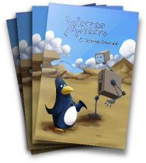

Today, with the help of the Krita and FOSS digital art communities, and many hours of hard work by digital artist Animtim, pre-orders for the first ever, official Krita training DVD are open! Drawing Comics with Krita, helps you learn how to draw, color assemble and publish comics yourself using Krita, the free and open source digital painting suite. The DVD, comic book combo shows you, step-by-step how to use the most important of Krita's flexible painting tools. These are skills that can be used in any drawing or painting project. Better yet, each purchase helps fund getting creative commons training out there to help get more digital artists into Krita, free culture and free software in general.

{source}

!-- If you can see this, you're probably in an RSS reader.  
View this story on Krita.org to see the Video Player with the trailer,  
or click the WebM version link below if you're on a decent browser! -->

  
iframe width="700" height="424" src="http://www.youtube.com/embed/p5cxPLS9q5c" frameborder="0" allowfullscreen\>/iframe\>  
{/source}  
[Click Here to see the Uber-133t HTML5-ish WebM Version Trailer!](http://blip.tv/file/get/Krita-DrawingComicsWithKritaTrainingDVDTheTrailer252.webm)

The "Comics With Krita" is a combined package that comes with two parts:

## 1\. "Comics With Krita" Training DVD

The first ever Krita training DVD includes 6 Hours of HD video focused on creating comics from scratch, including:

- Explanation of Krita's user interface
- Around an hour of HD video tutorials
- See 3 pages of comics created in Krita, all in timelapse (compressed down 400% from 20 hours of video!)
- Step-by-step instructions on sketching, inking, painting and exporting your pages
- An introduction to Scribus to build professional PDF files ready for print or web.
- All of the files used to create the printed comic book that comes with the DVD.

All video and tutorials, show a workflow being used for real production work with Krita, today.

**Format:**  
1920x1080p Webm video files (playable in VLC, Firefox 4+, Chromium and other players)  
All commentary overlaid onscreen in simple English

## 2\. "Wasted Mutants / Wisdom Mountain" Comic Book

<table><tbody><tr><td valign="top"></td><td style="padding-left: 10px;" valign="top">A printed (yes, actual paper!) 20 page comic-book, featuring two short comics in both black &amp; white and full color, all made in Krita:
&nbsp;
<ul><li><em>"Wasted Mutants"</em> - The surreal, post-apocalypse comic featured in the Krita.org showcase, created this year to test Krita's comics workflow.</li><li><em>"Wisdom Mountain"</em> - A never-before-seen, full color, all new story created especially for the "Comics With Krita" pack.</li></ul></td></tr></tbody></table>

## 100% Happy, Guaranteed.

Ok, we're not going to go into some corny line about how mind bogglingly ecstatic you're going to be or we'll _insist_ on cheerfully refunding you your every cent. Here's how it works though: You like it, or return it to us in it's original condition within 60 days and get your purchase price (but not shipping) back. Pretty simple, right?
