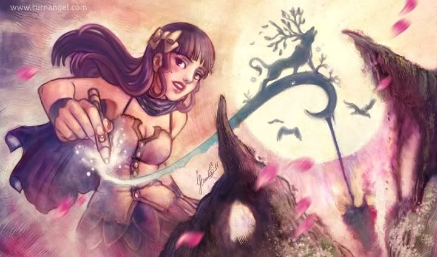
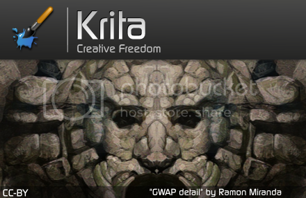
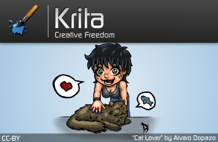

We just finished our [splash screen](http://forum.kde.org/viewtopic.php?f=137&t=96909) selection meeting and can give you the results!

In the first place comes Enrico Guarnieri with his "Genesis". From all the entries, Genesis was most clearly about Krita itself. He will receive a DVD and Comic pack.

In the second place, Ramon Miranda, who entered six proposals. The one that came closest to winning was "Gwap":

Third place goes to Alvaro Dopazo, for his whimsical and funny "Cat Lover":

We had so much fun and pleasure with all the entries for the splash screens that we dediced to give all the entrants a Krita DVD!
