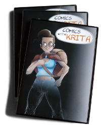
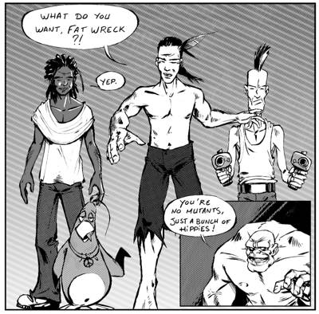

By comic-book artist Timothée Giet, is a combined package that comes with two parts:

### 

The first ever Krita training DVD includes 6 Hours of HD video focused on creating comics from scratch, including:

- Explanation of Krita's user interface
- Around an hour of HD video tutorials
- See 3 pages of comics created in Krita, all in timelapse (compressed down 400% from 20 hours of video!)
- Step-by-step instructions on sketching, inking, painting and exporting your pages
- An introduction to Scribus to build professional PDF files ready for print or web.
- All of the files used to create the printed comic book that comes with the DVD.

All video and tutorials, show a workflow being used for real production work with Krita, today.

**Format:** 1920x1080p Webm video files (playable in VLC, Firefox 4+, Chromium and other players) All commentary overlaid onscreen in simple English

### "Wasted Mutants / Wisdom Mountain" Comic Book

A printed (yes, actual paper!) 20 page comic-book, featuring two short comics in both black & white and full color, all made in Krita:

- _"Wasted Mutants"_ - The surreal, post-apocalypse comic featured in the Krita.org showcase, created this year to test Krita's comics workflow.
- _"Wisdom Mountain"_ - A never-before-seen, full color, all new story created especially for the "Comics With Krita" pack.

with the following extents:All the content of this DVD is under Creative-Commons license,

\*BY : for the preset files \*BY-SA : for the tutorial videos and soundtrack \*BY-NC-SA : for the .kra files \*BY-NC-ND : for the timelapse videos and the PDF comics files.

_The Krita Team_
