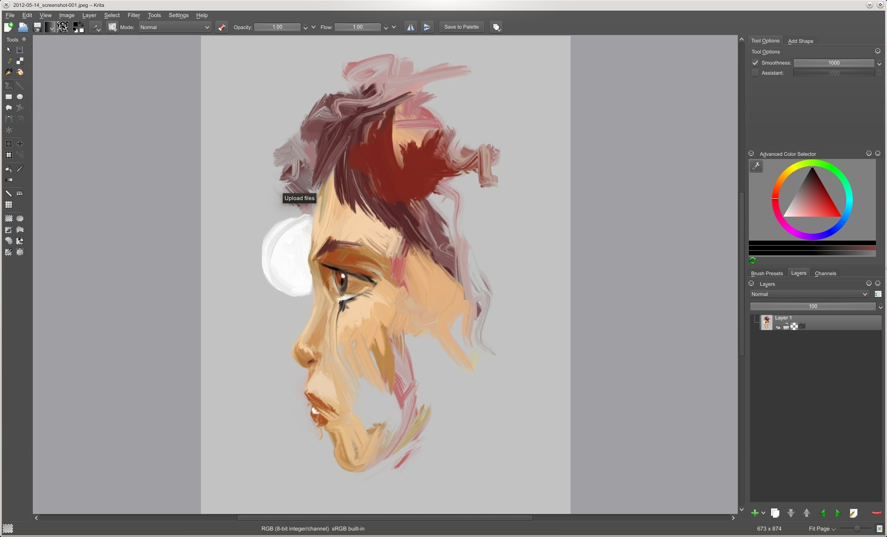
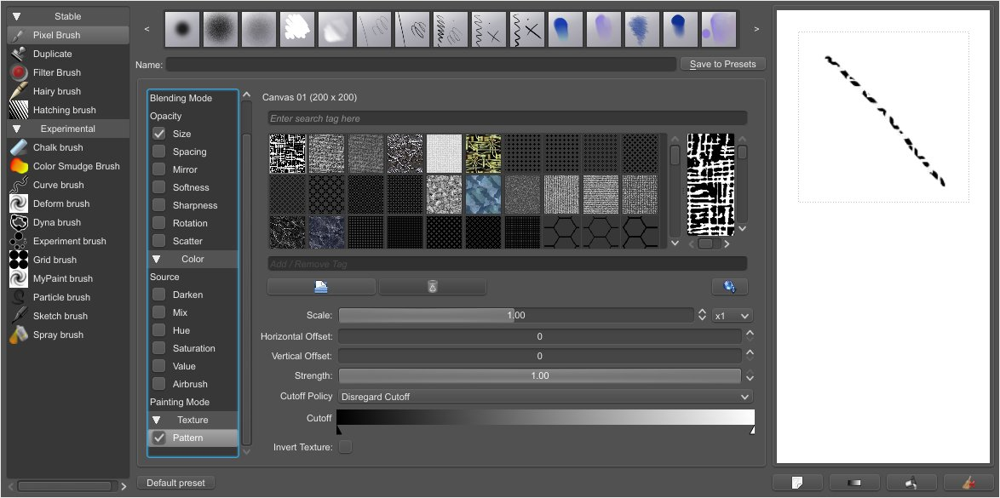
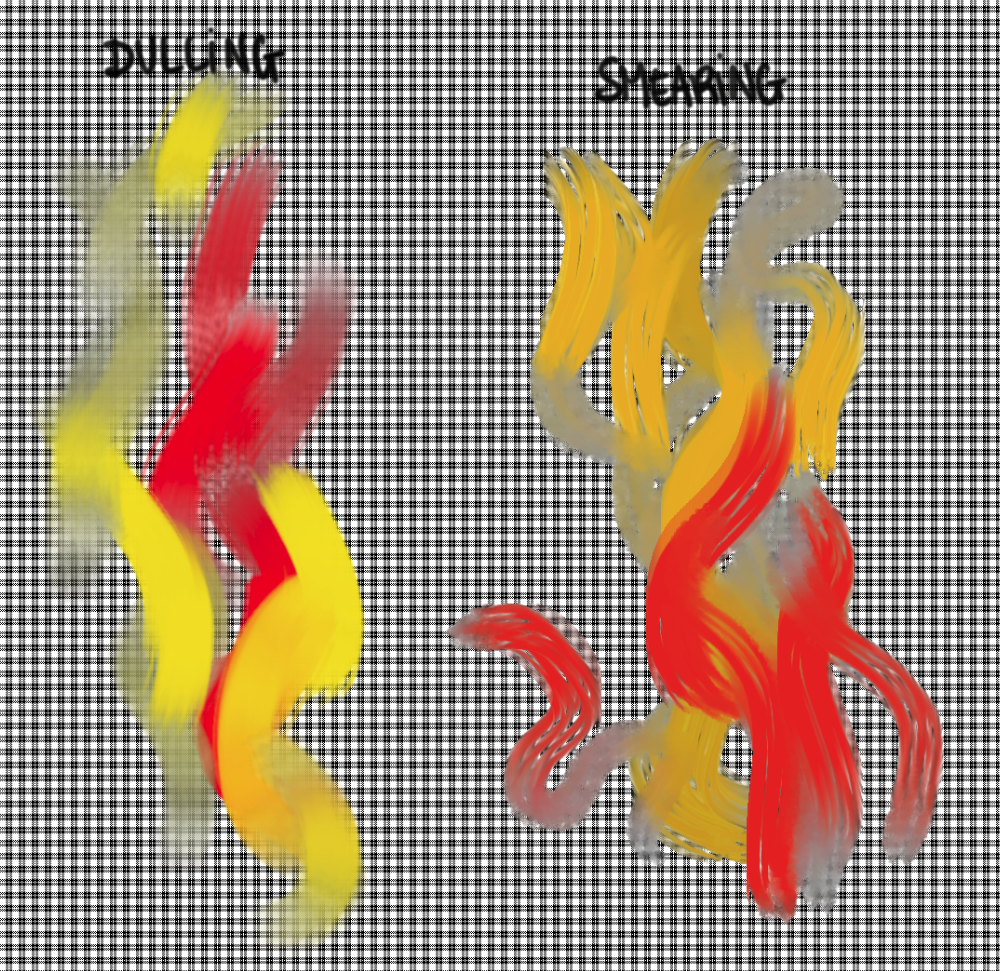
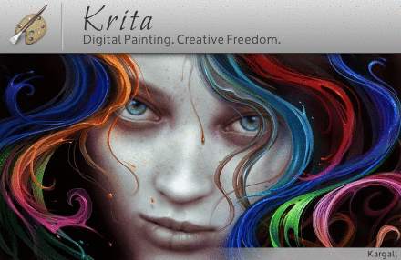

Krita, the full-featured painting application for digital artists, is now better than ever. Krita 2.5 offers many compelling new features for the professional artist, such as textured painting, layer compositions management and smoother smudging.

Still in progress, the first results of the textured brush feature are now available. Artists can create livelier, more organic brush strokes by blending the effect of a pattern in with their brush stroke. Of course, it's also still possible to use a patter as the colors source for your brush stroke. The textured brush option is available for the pixel brush. To make it easier to select patterns, the pattern selector now has a scrollable preview.

The color smudge brush has been expanded with a "dulling" mode next to the "smearing" mode. Krita 2.5 ships with several presets that make use of this new feature to achieve soft and smooth effects that were hard to achieve before. In dulling mode, the brush will mix the color on the canvas with the base color of the stroke, while in smearing mode the the stroke is smudged to mix it with color on canvas.

Artist David Revoy (http://www.davidrevoy.com) has provided six out-of the box color themes for Krita, from light to dark, making it easy to let Krita blend in with the background and allow you to focus on your work. You can also use any color themes you can download for the KDE desktop environment.

The layer compositions docker makes it easy to create particular combinations of visible and invisible layers in the same image and switch between them. [Check out how David Revoy demonstrates this feature, which is especially interesting when creating storyboards or alternative compositions.](http://www.youtube.com/watch?v=Ngov6Xh8Zew)

Improving the artist's productivity is always important to the Krita team, and we have added several new shortcuts to increase/decrease opacity and lightness, duplicate layers, as well as inserting new layers. Check the shortcuts configuration menu for all shortcuts, and customize Krita to fit your hands. Shortcuts are now saved and will be kept between upgrades.

Krita 2.5 has smoother canvas interaction in many ways, too: color picking, canvas rotation, zoom and pan now work always the same way, no matter which tool is selected.

Interoperability with MyPaint and GIMP has improved through extending the OpenRaster file format: layer locks and the currently active layer are now stored in ORA (and KRA) files. On the topic of files, you can feel safe about your work. No longer will the autosave file be clobbered when you run two instances of Krita at the same time, and besides, you can now visually select which autosave file to restore when Krita was killed by a power cut or a toddler with an affinity for pressing reset buttons.

There are also many bug fixes, for instance in the PDF importer, where resolution and anti-aliasing is now correctly handled, the pressure curve settings page has been improved, brush rotation now works seamlessly together with canvas rotation, the color selectors are much improved and compatibility issues with metadata saved by some camera manufacturers were resolved.

The inspiring new splash screen for Krita 2.5 was painted by Kargall Lefou (http://www.kargall-lefou.com/). See [his "making of" on the Krita forums](http://forum.kde.org/viewtopic.php?f=138&t=102792)!

Most Linux distributions will update their experimental/testing repositories to contain Krita 2.5 packages. We will update the [Download page](download) as news of packages arrives. A windows installer is being created.
