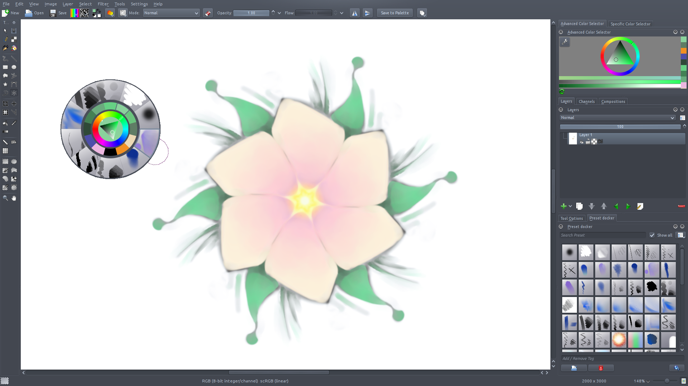
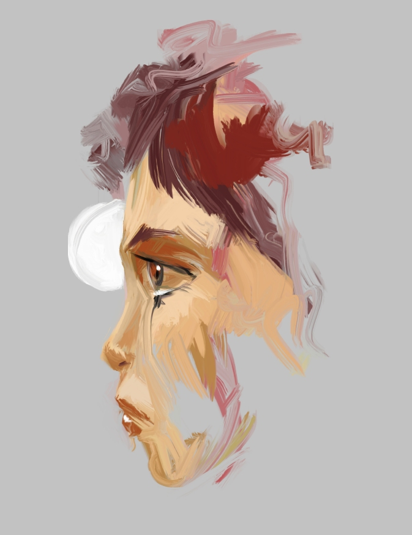

With Krita 2.4 happily released, the Krita team is working hard on what will become Krita 2.5. Krita 2.5 should be released some time in July already, but that doesn't mean that it will be a boring release! Here's a short overview to whet your appetite:

### Windows

Krita on Windows is getting more and more stable. The installer you can download from the [KO GmbH download page](http://www.kogmbh.com/download.html) still warns you that it is extremely experimental, and that's true! I regularly build it from git master, and as any artist can confirm who uses Kubuntiac's script, that's dangerous living. But on the other hand, at first we got many reports from people who couldn't run Krita for one reason or another, and we seem to have fixed most of those problems. And then -- Oscar Baechler used a beta of Krita on Windows for his workshop at LinuxFest Northwest with few problems.

### Smudging

Last week, we got a new smudging option for the colorsmudge brush: dulling. This works a bit like smudging in Mypaint currently works. In git master, we already have a few presets that use this mode! Check [Animtim's blog for more information](http://timotheegiet.com/blog/floss/new-brush-engine-mode-in-krita-blend-like-in-mypaint.html) -- this screenshot is from his blog.

David Revoy also quickly produced a [very painterly sketch](https://twitter.com/#!/davidrevoy/status/202123206126088192):

### Composition docker

The compositions docker allows you to save sets of layer configurations. So, if you have a complex layer structure, you might want to hide or show sets layers and switch between those configurations, say your sketch structure and your paint structure. Sven's [blog has all the details](http://slangkamp.wordpress.com/2012/05/09/krita-compositions-docker/)! And David Revoy made a video showing why it's a really handy feature:

\[embed\]https://www.youtube.com/watch?v=Ngov6Xh8Zew\[/embed\]

###  Paper sizes

We used to have a set of old templates for the various color models Krita supports in various sizes. This actually isn't what the templates were intended for, so we added a selection box to the custom image window that allows you to select predefined size/dpi combinations. The templates section is thinned out a bit and need filling up again. See the how-to-create-a-template tutorial on the forum.

### Textured painting

As [requested by David Revoy](http://www.davidrevoy.com/article107/textured-brush-in-floss-digital-painting), Krita now allows you to use a texture to modify your brush while painting. The feature isn't finished yet, but will be ready for 2.5.

### Theming

On Linux (on Windows there are some technical problems that we hope to be able to solve), you can now select a color theme for just Krita. We borrowed code from Digikam for that -- thanks Gilles et al! No longer do you need to make your entire desktop dark to have a dark look for Krita. As seen in the screenshot above.

### Improved OpenRaster support

OpenRaster got extended thanks to the efforts from MyPaint's Andrew Chadwick, and Krita has followed suit: OpenRaster (and .kra) now saves and loads the lock status of layers as well as which layer was active.

### Preview in Pattern Selector

The pattern selector got a large-size preview pane and was also turned into a docker.

And there'll be lots and lots more to look forward to!

David Revoy
