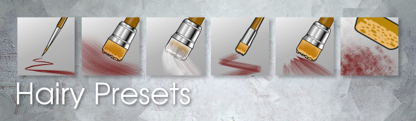
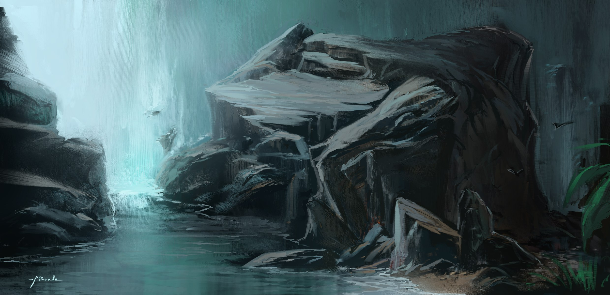
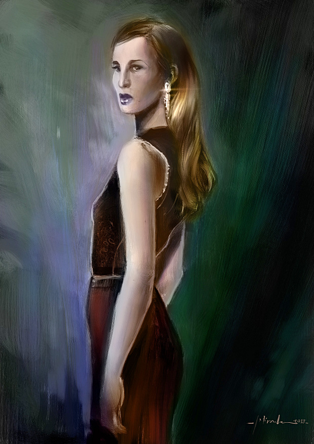

Hi!

Ramon Miranda here! Let's talk about Krita brush sets. The default set is big, not huge... But certainly big enough so you can get lost easily if you don't spend a lot of time investigating. But if you dig deep enough, and explore the huge number of options, you'll find some real gems. So lets see what i have discovered about one type of brushes: the hairy brushes.

\[embed\]https://www.youtube.com/watch?v=ZevAzJK\_IU4\[/embed\]

## **The Default Hairy Brush Set:**

After a some thorough and productive testing time, I got to a point where I managed to get a predictable and stable performance out of the hairy brushes. the hairy brushes can be very fast when you tweak some values, and that makes them more interesting.

The current set is a very good starting point but I felt I could improve on it. Read on for what I did – and a sneak preview of the Muses Painting with Krita DVD (which is getting very close now!)

## **The Muses Hairy Brush Set:**

For starters: Let's change the painting mode from Wash to Build-up and link the opacity to the pressure curve sensor. Now we've got something that quite useful for expressive painting, but not for a realistic style. Let's also improve the icons we use a bit. Check out [http://community.kde.org/Krita/Brushes\_Preset\_Preview](http://community.kde.org/Krita/Brushes_Preset_Preview) for ongoing to work to coordinate the icons for Krita preset packs!

Next: advanced options:

- Anti-aliasing: I haven´t seen a significant negative impact on performance and the quality improves a bit at 100% zoom level, so I've turned this on for all brushes.
    
- Most of them use Bristle options/Mouse Pressure. This parameter uses the speed of the brushtroke to increase the size. I found it interesting, because we can make more detailed things as we paint slower.
    
- All of them use a bit of Shear parameter to avoid the “superstraight” effect on bristles
    
- Also some of these new presets use the Ascension with a not common ramp. This ramp is useful to constrain the amount of degrees you can rotate your hand before the brush start to rotate and covers the Left and Right rotation. You only have to modify the corners points to make this behavior more sensitive.
    

****

## **Contents of the Hairy Brush Pack**

Contents:There are 6 presets that can be clearly identified. I designed them to be usable not just with a tablet, but also with a mouse – and still keep most of the appearance of a brushtroke. The description is for generic use, don't limit yourself!

Hairy\_Details: An easy to use detailing brush. You can see how the size changes if you go faster. Combined with different pressures and speed you get a lot of variety in your brushtrokes. Great to create edges and little details with slow speed.

Hairy\_Large: To make backgrounds and cover large areas. It uses “ascension” to make it more versatile.

Hairy\_Special\_Blender: Not a common blender! It “paints”, but only with the color that is below the direct contact point of the stylus: it smears that color around using the opacity controlled by pressure. Sounds weird? Just give it a try! The hairy special blender uses the “ascension” feature to make it more random and versatile. As you change the wrist angle we change the “grainy” direction so we can create “rare” patterns if we want. You'll need a tablet that support tilt to experience the feature, of course. If you apply low pressure, you'll achieve a really nice kind of blending with a nice, soft grainy effect.

Hairy\_Squared: This is a Squared Type brush. It can be use as a generic brush for mid size areas. And with not too much effects on parameters to make it controllable with a good predictable result like a classical bristle brush.

Hairy\_Tapered: Creates a tapered brushtroke. You'll get the best results if you combine pressure with a fast, “gestured” stroke. Moving slowly makes it usable for details, like edges. Low pressure but fast movement is useful to cover mid size areas like a glazing with semi translucent brushtrokes.

Hairy\_Texture: Creates a textured look – a bit like a sponge. The user can control this effect with bristle options/random offset. Be careful with this value. Bigger values can decrease performance – but still fun to experiment with. You can modify the Density parameter on the Brush nib to make the “spider-web” look less visible. The “density” controls the amount of the brush visible parts. Another tweak: you can vary the “density” bar on the bristle options/density

# How to install:

## Download

The brushkit ZIP can be downloaded [here](https://www.dropbox.com/s/xoa7gaeiys4ddmh/Hairy_Pack.zip). The brush set is compatible with Krita 2.7 and the current 2.8 development branch.

License :  the brushkit itself and thumbnails is released under the [WTFPL 2.0](http://en.wikipedia.org/wiki/WTFPL#Version_2)  ( compatible Public Domain and CC-0 ).

## Install

Unzip the downloaded zip , and paste the files into your Krita user preference directory. On Linux, the Krita preferences are located here :  /home//.kde/share/apps/krita/paintoppresets

