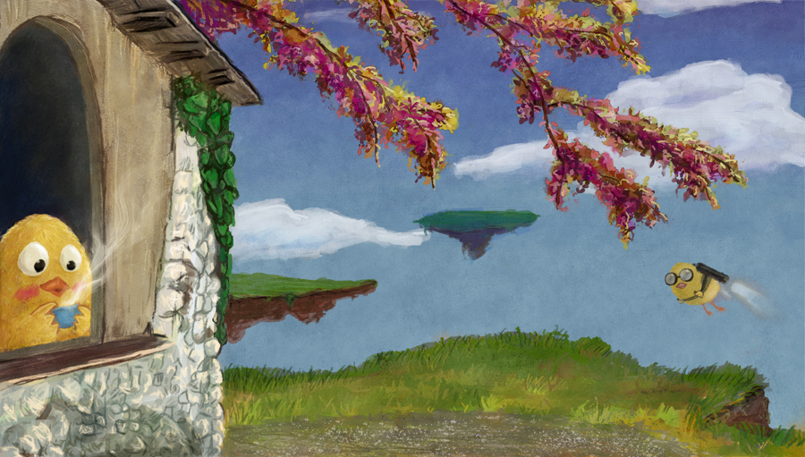

Hello readers, today we are sharing a short interview with Elena, from Italy, who is a Computer Engineer by profession and a painter by hobby. She is learning anatomy at present and she is loaded with an amazing spirit to learn more. She is also collaborating with us for the Krita Shop on zazzle. Click on "read more" to read the entire conversation with this amazing budding artist!

Hi Elena, Would you like to tell us something about yourself?

I'm not very good at painting, I'm learning anatomy but I prefer to publish only simple things since half good/half bad anatomy falls easily in the uncanny valley ^^'

That sounds great. We look forward to you sharing those works!

Now, how would you define the importance of painting in your daily life?

Painting is a big part of my life but is only a hobby, a "serious" hobby in the last 2 years.

When and how did you end up trying digital painting for the first time?

I was a preschooler and my father was kind enough to let me use his computer, a commodore 64 if I remember correctly.

What is it that makes you choose digital over traditional painting?

It's cheaper and less time consuming.

Short yet very precise! So, how did you first find out about open source communities? What is your opinion about them?

During the first year of university we used FreeBSD, the next year I began to use Ubuntu and frequent the Italian forum. My opinion about them is generally positive.

Have you worked for any FOSS project or contributed in some way?

I only did this brush set for MyPaint. [http://browse.deviantart.com/art/Brushes-for-mypaint-281981370](http://browse.deviantart.com/art/Brushes-for-mypaint-281981370)

How did you find out about Krita?

I watched this video: [http://www.youtube.com/watch?v=lyLPZDVdQiQ](http://www.youtube.com/watch?v=lyLPZDVdQiQ) .

What was your first take on it?

After buying a new graphic tablet I decided to try it, unfortunately working with Krita was too much for my old laptop.

What do you love about Krita?

It's the right tool for what I want to do; the interface is functional and not distracting.

What do you think needs improvement in Krita? Also, anything that you hate?

Hate is such a strong word... Sometimes it's slow with big images and/or big brushes.

In your opinion, what sets Krita apart from the other tools that you use?

I mainly use Mypaint, I spend a big portion of my free time doodling with the pencil brushes but when I have a specific idea I prefer Krita; I make a lot of errors, making corrections in Krita is faster and for a final touch I love the color smudge brush with the smearing option. \*\_\* I have never seen something similar in others open source programs.

If you had to pick one favorite of all your work done in Krita so far, what would it be? What brushes did you use?  

OK, I said "hate is a strong word" but I hate all of my works. XD I still don't have the technical skills to draw exactly what I want. Maybe I don't know what I really want to draw, maybe I shall always been unsatisfied. And that's good. :) I want to improve myself and be a better artist.

I don't have a favorite, above is the last work done with Krita. I used a lot of brushes for this, I still can't choose what is better for my paintings.

I appreciate your spirit Elena! It was a pleasure interviewing you. Hope you enjoyed this talk as much as I did! :)

Thank you for this opportunity, and for your work. Even if art is only a hobby for me, after a day of working, it makes me happy to take some time and draw; some days a pencil is enough, sometimes I need something more. So... Thank you, again. :)

Pleasure is all ours. Hope Krita continues to be your friend while learning and later. :)

You can check out more of her artworks on deviant [here](http://corvocollorosso.deviantart.com/).
