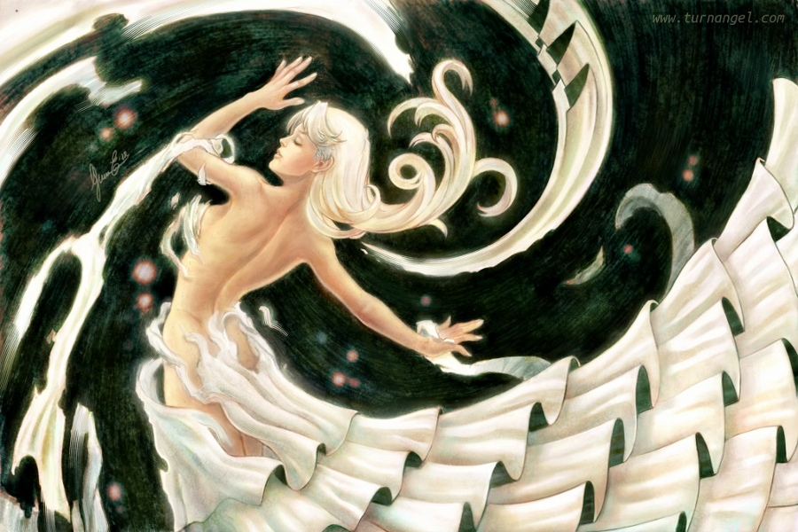

We also had a chance to have a conversation with Enrico Guarnieri from Italy, a wonderful Krita artist and contributor (remember those beautiful Krita splash screens - Ink Girl, Genesis, Butterfly shout- yes, he's the guy!). An interesting interview providing an insight into how he found his vocation: digital painting, his views on Free and Open Source Software Communities and more! 

Enrico is also working with us on the Krita Webshop. Together, we will bring you a lot of new merchandise designs on the webshop in coming months! For now, enjoy reading the interview below! The image below is his krita artwork named "Metamorphosis"

Hi Enrico! Can you tell us something about yourself? Currently I'm a freelance illustrator/concept designer. I started my career as cartoon animator assistant and I’ve a professional EU certification in “comic and 2d animation”. 

**When and how did you end up trying digital painting for the first time? ** These are sweet memories for me... ^^ I experimented for the first time digital painting when I was a kid on the legendary Commodore 64: with a big stylus with a rough sensor I could almost use my crt tv screen as a primitive Cintiq! I was dreaming of buying an “elegant” but TOO expensive for the time b&w mac supplied with a mouse! After some years I switched to an amazing Amiga 500 and its killer graphic applications "Deluxe Paint" and "Disney's Animation Studio". Really, I don't remember how MANY hours I spent experimenting on these software but my youth was gone in no time at all! :-) Then, the last step was a Windows/PC with Photoshop, Fractal Design Painter and a Graphire tablet, later an Intuos. Finally I became an Opencanvas/Artrage user before switching to Linux and free and open source software. 

**What is it that makes you choose digital over the traditional painting? ** Generally, I prefer digital for obvious economic reasons, art materials are very expensive. But I also prefer digital painting for the infinite editing capacity. Still as former watercolorist I'm a bit sad not seeing at the moment a valid alternative for watercolor painting in the free and open source software world. Something similar to the system adopted by Artrage would be cool. Certainly with some tricks it's possible to fake the watercolor appearance with Krita, Mypaint or Gimp as showed in my gallery on my site or deviantArt but the process isn't fun at all, indeed, very tiring. I don't ask for a complete physic simulation, which might be heavy about a computational viewpoint and hard to code, but some specific tools as a “watercolor blending level” and “wet edges” would be a big help. 

**This reminds me that we used to have a watercolor simulation in Krita; real, physics based, but it got lost around Krita 1.6. Same happened with the real, physics based color mixing.** **Moving onwards, How did you first find out about open source communities? What is your opinion about them?** I know Linux and the open source world from the time of Red Hat 5, waiting to jump from Windows to a better operation system in terms of resources management and security. IMHO it's admirable the spirit of sharing that moves the open source communities but... Frequently the lack of money, resources and organization pushes the people to develop/share exclusively what they wish to make and not what is absolutely necessary at the moment for a particular software, project or field. So seeing very complex programs missing fundamental features, a very unbalanced and chaotic development effort or too many “forks” is not uncommon. Even though the situation has improved a lot in recent years, Linus Torvalds too complained about the bad distribution of the available human resources on the different free and open software projects. Fortunately the Krita development is not afflicted by such problems, rather is very fast and well organized! 

**Have you worked for any FOSS project or contributed in some way?** Yes, I've created and donated to community many textures, downloadable from my site [http://www.turnangel.com](http://www.turnangel.com) or my deviantArt gallery [http://ico-dy.deviantart.com](http://ico-dy.deviantart.com) , and a peculiar and big brush set for Mypaint, included in the “08“ pack [http://download.gna.org/mypaint/brushpacks/brushes-08.zip](http://download.gna.org/mypaint/brushpacks/brushes-08.zip). I helped the Krita project a lot more by painting 3 splash screens, doing heavy beta testing, suggesting new features/improvements and promoting the software among other artists. I still remember with horror when I painted "Girl in Blossom" for testing purpose and Krita crashed every 75 seconds... Completing a piece was a big challenge! But look now, the development version is very stable too!

{gallery labels=labels}item166{/gallery}

Thanks Enrico, again, for those lovely splashes! Now, how did you find out about Krita? Some years ago as I wanted to switch to Linux, I ran into the very old Krita 1.6 looking for new painting software.

**What was your first take on it? ** Not such good vibes at that time. I didn't like either the workflow or the tools. And the Windows painting software was so much better in every aspect. It's amazing how Krita evolved in its actual mature shape of 2.x series. Really, the actual version is another planet in terms of usability and quality of the features. 

**That’s what we work for :-). What do you love about Krita? What sets Krita apart from the other tools that you use? ** The developers (!) that hear, follow and make quickly what the artists really need. :-D The high grade of customization of the software, so you can change and organize the interface according to your ideal workflow, the quality and variety of the painting and selection tools and its support of the industry standards. 

**What do you think needs improvement in Krita? Also, anything that you really hate? ** Many aspects could be improved a lot and there are a lot of features that could be added to the brush engines, but most urgent at the moment is improving the performance when working on very big canvases and a better variety and usability of the filters; good enough but not yet at the same level as Photoshop, true benchmark of this field. Actually developers have eliminated every thing that really hate, except for the non-inclusion of the raster brush tip into the preset file. 

**Working on that.. And Sahil Nagpal is working on the filters module for his Summer of Code project! Now, if you had to pick one favorite of all** **your work done in Krita so far, what would it be? What is it that you like about it? ** Giving an answer to this question is very hard for me... I love all my works as my children and at the same time I’m very harsh with them, since filled with imperfections and very distant from the artistic ideal I would reach. Certainly my most recent works (Ink Girl, Healing Heart, Last Trip, Butterfly Shout, Metamorphosis) reflect better my artistic evolution and the actual Krita development state. 

{gallery labels=labels2}item166/favorite{/gallery}

**What brushes did you use? ** I’m very chaotic when painting and I use a lot of customized brushes, particularly pixel brushes and smudge color brushes with the dulling mode active, selected by the spur of the moment; so in the end it’s hard to say exactly how I achieved a certain result. :-D 

Thank you Enrico for taking out time for this interview. It was fun interviewing you and I hope you enjoyed it too. Also, I’d like to thank you for your amazing contributions for Krita. Check out Enrico’s awesome work at his Deviant Account [here](http://ico-dy.deviantart.com) and also his society6 shop [here](http://society6.com/Ico_dY)!
