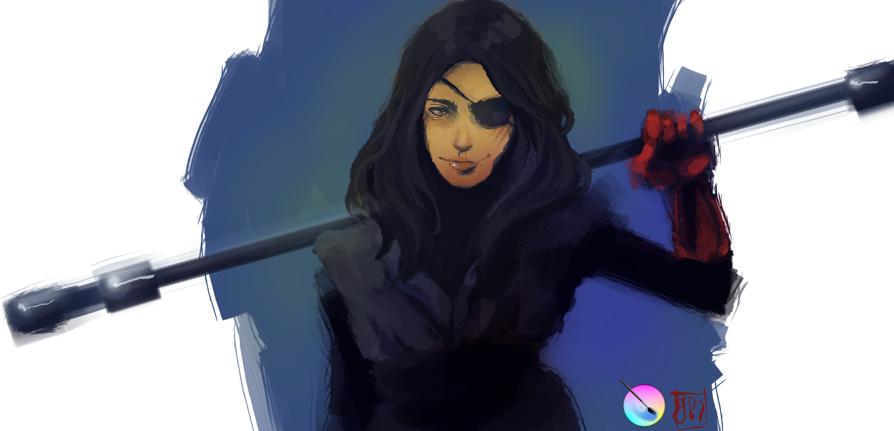

### Do you paint professionally or as a hobby artist?

I don’t know how to answer that. I have always painted, I don’t consider it a hobby, but not a job either. Sometimes it's paid, and most of the time it isn't. But I always enjoy drawing.

### When and how did you end up trying digital painting for the first time?

My first experience with digital painting was 4 years ago, more or less. At the beginning it was strange for me, but immediately I saw the benefits of digital color. Although I still use traditional techniques for drawing, the color is 100% digital.

### What is it that makes you choose digital over traditional painting? Or do you still prefer traditional means, and if so, why?

I can’t choose only one, both have their advantages that are irreplaceable, so I choose both.

### How did you first find out about open source communities? What is your opinion about them?

When I left Windows I started to look for free and open source alternatives for the software that I had been using. Whenever there is a FOSS alternative I will choose it. I think that is necessary to support this kind of projects.

### Have you worked for or contributed to any FOSS project?

No, I have never worked in one, but I try to support the projects that are interesting for me.

### How did you find about Krita?

By accident. I was looking for an image editor and I decided to try Krita; then I realized that it was so much better for drawing and digital painting.

### How was your first take on it?

I liked it so much. It seemed to me so fluid, intuitive, and funny for improvisation. In fact, the best things I've made until now with Krita were improvisations.

### What do you love about Krita?

That it is an intuitive program, and the huge variety of brushes and styles.

### What do you think needs improvement in Krita? Also, something you really hate?

Until now I haven’t seen anything that needs improvement in my little time of using Krita, but I suppose that support for more formats would be good.

### In your opinion, what sets Krita apart from the other tools that you use?

In my case, I wanted a good program for drawing, coloring and also a program that allows image editing. Moreover, that it was open source. And I didn’t find anything better than Krita.
