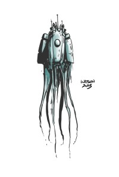
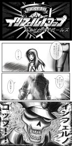

Here we are again! This is our second post to increase your love for Krita. Enjoy it and don't forget that we can resolve your doubts in [Krita Forum](http://forum.kde.org/viewforum.php?f=136) and [#krita](http://krita.org/chat) channel on IRC.Here we are again! This is our second post to increase your love for Krita. Enjoy it and don't forget that we can resolve your doubts in [Krita Forum](http://forum.kde.org/viewforum.php?f=136) and [#krita](http://krita.org/chat) channel on IRC.

Today, we have the pleasure of presenting to you [Yafd](http://yafd.deviantart.com/), he is from EEUU. And here is a little of his art:  
[\[link\]](http://kritawebshopblog.files.wordpress.com/2013/06/tentacle_bot_by_yafd-d63yw7u.jpg)

... Sadly I don't know any method of packaging them if anyone ever wants them (not that I think there'd be anyone interested enough), also the thumbnails for the brushes aren't pretty, they only serve as rough indicators for what the brushes do at best...

**\- What is your favourite feature of Krita?**  
**BRUSHES, PERIOD!** No, really, while MyPaint's brush engine is pretty strong on its own, Krita's own brush engine isn't any slouch either (in fact, I am not even sure if I should be using "slouch" here). I really like it a lot. Apart from that, Krita's UI layout looks even more polished than the last time I remembered it, which is a very big usability improvement in my books.

And the blending modes that come with the brushes are a favorite, too: special mention goes to the Addition mode which I have come to love to... err, abuse the more I learn about it...  Ehem.

Anyway, that's pretty much it. Probably there's more to mention but I'll let time tell...

**\- Why would you recommend Krita?**  
Apart from one of the reasons being a recommendation for users frequenting Linux-based platform, it is one of the digital painting applications that offer the best bang for buck: It's _free,_ and it is a multi-platform application. From what I recall so far, the Windows builds leave a lot more to be desired, not to mention that OS X builds are still out of the question for the time being. But as soon as that time comes; well... I can only say there's no other way to go but up.

Also, I've heard people saying Krita is quite comparable to what Corel Painter is to a Windows user in the Linux platform. I've had plenty of time to get used to Krita (and still have a lot more to know) so I can't really speak much for others' experiences, but overall it doesn't really take much to discover what you can do with it. I've had a friend who's more used towards using the Windows and Mac platforms for digital painting, and this is one of his first attempts at giving Krita on my computer a shot: [\[link\]](https://www.dropbox.com/s/fosm9sauzovigeo/shahirt.png)

Even for a speed-paint, I really admired the fact he can come up with that in a couple of minutes, and also because I have yet to achieve it myself... 

So yes, for me Krita is just as good, if not any better, as any other painting program you can find out there. So people out there, give it a try!

**\- Why would you started on digital painting? Do you still painting on paper?  
**To begin with, drawing has been one of my favorite hobbies, but recently I started to take it more seriously, especially now that I am studying in a field that requires a proficiency of it to a degree.

I've always been impressed with what people can do with computers, and digital painting is one of them. However, my initial attempt on digital painting was far from what you would even pass as okay, I'm more used to traditional media (namedly, paper) during these times. In 2007, I had a very ample amount of time to comprehend digital painting and chose to stick with the mouse as a way to do things.

My first pen tablet, and perhaps the only one I have in possession up to this date; is kaa 4" x 6" Wacom Graphire 4, which was bought in 2008. It should be noted that the Wacom Bamboo series was already available in my local IT markets at this time, seeing it was officially released on May 2007. I chose the Graphire 4 out of a budget constraint; even though the Bamboo is present at that time, the former is a much more attractive option simply because of the price; considering I was a student and bought it out of a given budget to buy my own birthday present 

I took quite some time to adjust myself to it, but managed nevertheless.

As for paper media, I still do it whenever I feel like it. Although most of what I did these days were mostly out of boredom during class hours or when I finished answering my exam questions before the time was up and felt like there was nothing more I could do while waiting to finish  It really is strange we find ourselves working the best on the strangest of occasions...

Thanks to our artists to give to us a little of their time!
