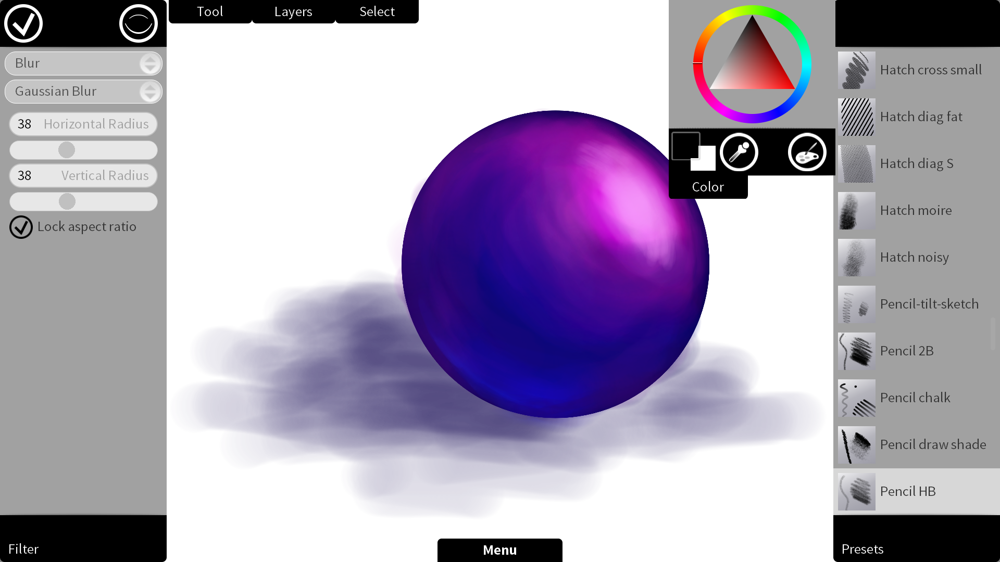

Today, [KO GmbH](http://www.kogmbh.com) has released version 1.0 of Krita Sketch, the touch-friendly version of Krita. Krita Sketch was developed with support from Intel. Krita Sketch is available for [download directly from KO GmbH](http://www.kogmbh.com/download.html) and runs on Windows 7 and Windows 8.

Version 1.0 of Krita Sketch has an updated color theme, a way faster (opengl-enabled) canvas and pinch zoom. Note: Krita Sketch does not support Wacom tablets, but apart from that nearly all the functionality of the desktop version of Krita is available!

 Krita Sketch is being developed by Arjen Hiemstra, Dan Jensen and Boudewijn Rempt in the Calligra project. You can get [the source code here](https://projects.kde.org/projects/calligra/repository/show?rev=krita-sketchgl-rempt).
