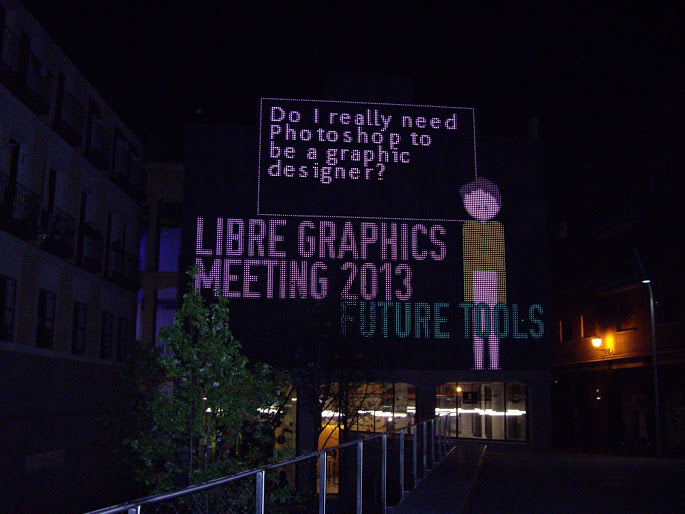
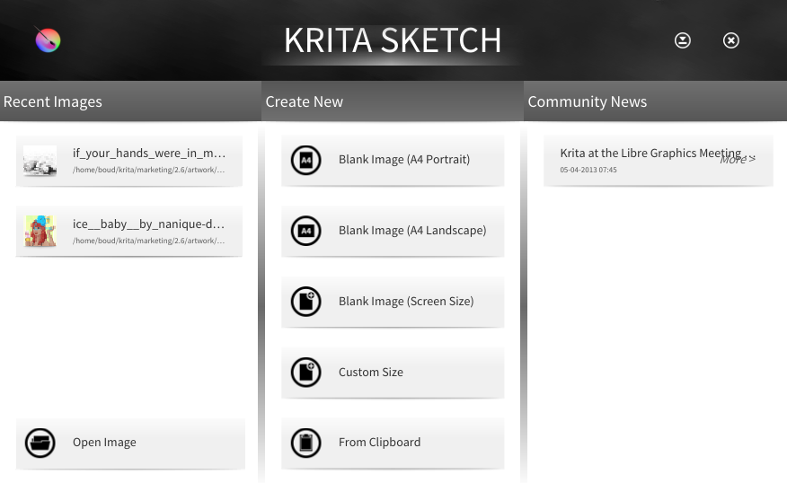

The 2013 Libre Graphics Meeting is over and everyone has returned home and gone back to the drawing board or the keyboard. Krita has been very well represented at this LGM with three artists and a coder, giving three presentations and two awesome workshops!

The Medialab Prado venue was pretty much perfect: hacking space, auditorium, workshop space, open until late, and an endless supply of good coffee. The presentations were life-streamed, but there appear to be no recordings available yet.

_(Image by Timothee Giet)_

So what happened?

First, Timothee Giet [gave his workshop on Krita Sketch](http://timotheegiet.com/blog/anim/back-from-the-future-tools-lgm-2013.html). Unfortunately, what with slow network, it turned out to be quite hard to make sure everyone had Krita Sketch on their systems, so in the end, the workshop became more an "install and get introduced to Krita" workshop, which was pretty cool, too -- since the workshop was early on Thursday, and it meant many people had Krita on their system for the rest of the week!

That evening (or afternoon, for the Spanish among us, the days were long this year, with presentations going until well after Dutch dinner time!), Boudewijn presented the Krita Foundation. As regular readers of Krita news know, the Foundation was created to [support Krita development](http://krita.org/foundation).

This was closely followed by Timothee Giet speaking about Krita Sketch, how the project came to be, the goals, the gui design and his role in the development. This is what Krita Sketch looks like these days, and an update on Intel AppUp is expected soon!

The next day, [Ramon Miranda](http://www.ramonmiranda.com/) gave a lightning talk on the Muses DVD he is preparing. Slated to be ready for [Akademy](http://akademy2013.kde.org/) in Bilbao (Ramon's hometown), the dvd promises to be wonderful, not just teaching Krita, but teaching the fundamentals of digital illustration. Pre-order your copy now!

The pre-order price is just €27.50, including shipping. The DVD is expected to be ready for presentation at Akademy 2013 in Bilboa, Spain, July 13th.

Or read more about in the [bilingual (Spanish/English) Flyer we handed out at LGM](http://www.valdyas.org/~boud/muses_flyer.pdf)!

Also on Thursday, [David Revoy gave his Krita workshop.](http://www.davidrevoy.com/article166/krita-workshop-at-lgm-2013) starting with the basics of calibrating your tablet and creating an ergonomic setup, David continued teaching the fundamentals of underpainting (make sure you use only one, big, round brush, work in grayscale, never use the extrems of value available, switch between eraser and normal all the time, paint values, not symbols and remember this: it's painting that's a hard skill you need to work on, applications are easy to learn), and then coloring and detailing. There were some very pretty things made during this workshop!

The great thing about the Libre Graphics Meeting is, of course, getting together. There are developers, artists, thinkers, users. People are working on magazines, typefaces, music, generative art, illustrations, comics, layout tools and more. And it's a great place for teams to get together and start a cooperation initiatives, like the new [brushpack resource specification](http://libregraphicsworld.org/blog/entry/gimp-krita-mypaint-teams-discuss-common-brushpack-format), or ways Krita could integrate with the [animation application Tupi](http://maefloresta.com/) or how the MyPaint brush engine could be integrated into Krita, Gimp or Tupi.

Let us all meet again, next year!

