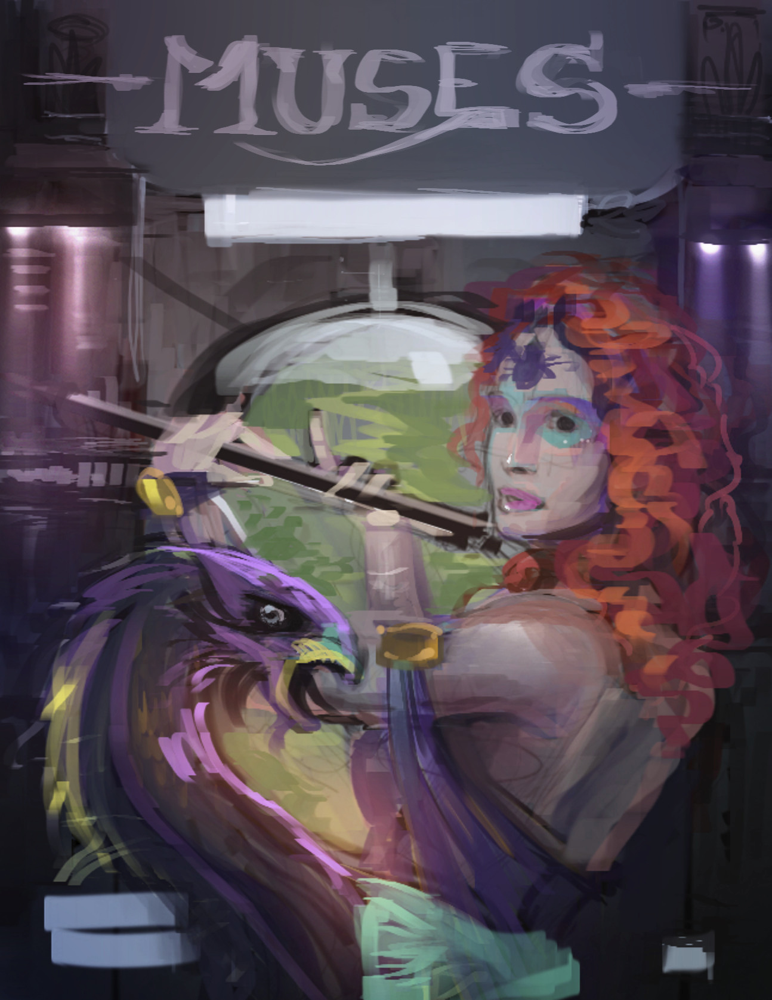

Following the succesful "Comics with Krita" DVD by Timothee Giet (now sold out!), and supported by the [Krita Foundation](http://krita.org/foundation), Ramon Miranda has started working on the second Krita training DVD: _Muses_. Let yourself be inspired by Ramon's Muses, and learn how to paint wonderful and evocative images from a professional artist.

The DVD will have more than three hours of HD video focused on creating digital illustrations from scratch to the final print, including

- An explanation of Krita's gui and the best way to setup Krita for maximum productivity and fun. Ramon will demonstrate a solid and productive workflow.
- Creating interesting new brush presets, working with layers, masks and filters. color in theory and practice and an introduction to styles in art.
- Creating an illustration from scratch: creating the ideas to begin with, sketching, getting into the flow, blocking, shading and values, painting a face, finishing the artwork with color and effects, printing considerations.

"Muses" will come with a full set of brushes and brush presets, icons ready to use with your own presets and much more. The voice over will be in English and Spanish, with unobtrusive pop-over messages for extra clarity.

_Muses -- the color sketch for the projected DVD cover_

You can pre-order the DVD now from the Krita Foundation. If you do not wish to use paypal, contact foundation@krita.org for alternative payment methods. Pre-ordering the DVD will help support Krita development. Currently, Dmitry Kazakov is being sponsored by the Krita Foundation to work on improved mask handling, performance and much more. The contents of the DVD will also be released as Creative Commons.

If you didn't pre-order, get your copy now! The regular price is € 32,50 including shipping.

<table><tbody><tr><td>Muses by Ramon Miranda</td></tr></tbody></table>

Ramon Miranda is an illustrator from Spain who has been using open source tools professionally for a long time. He is well known for his [instruction videos](http://www.youtube.com/user/TheShockito?feature=mhee), his [beautiful art](http://theshock.deviantart.com/) and his work on [Gimp Paint Studio](http://www.ramonmiranda.com/p/gps.html).

If you are at the [Libre Graphics Meeting](http://libregraphicsmeeting.org) in Madrid, you will be able to meet Ramon.
