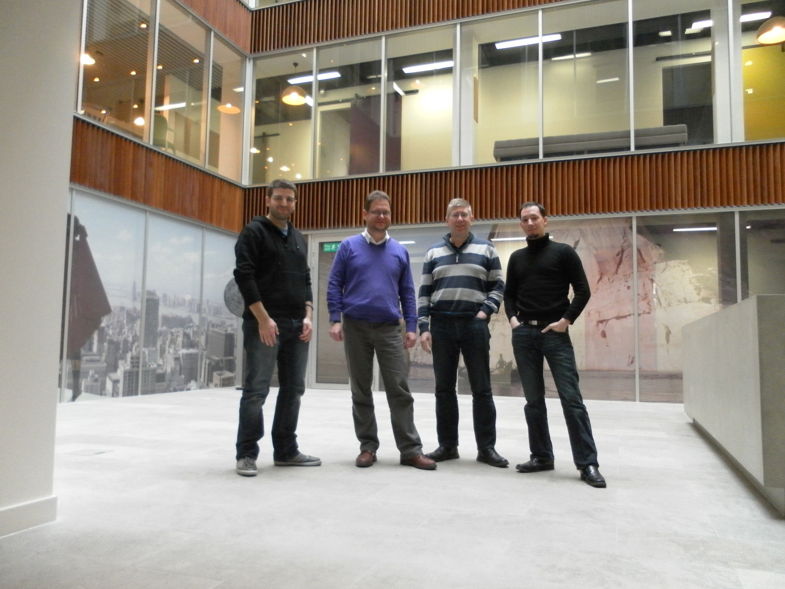
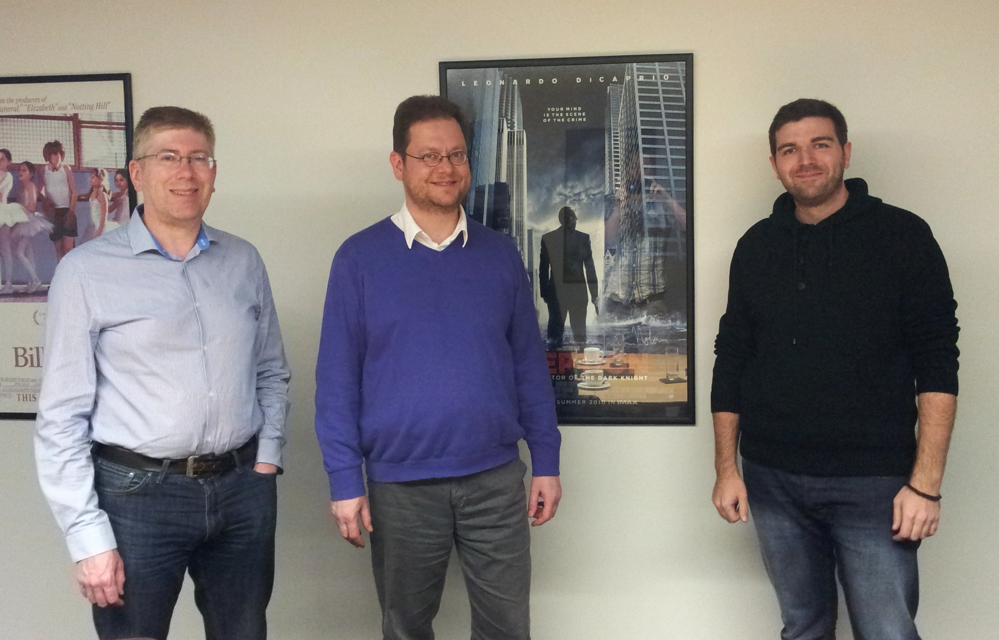
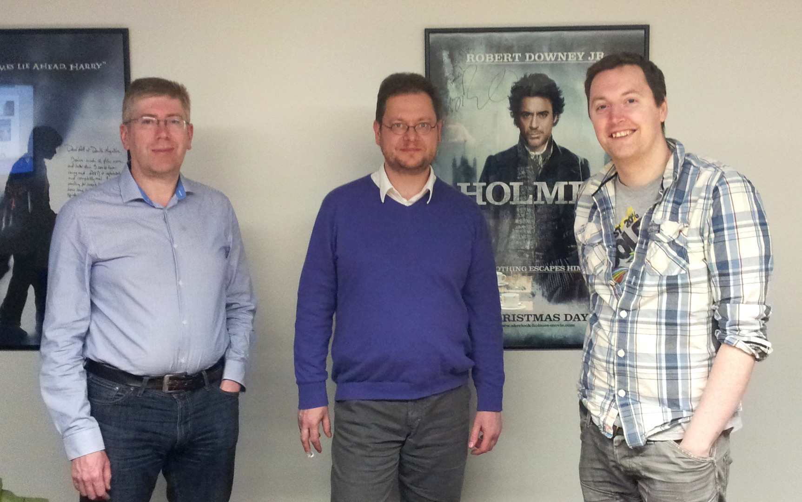

Thursday, 21st March, David Revoy, Boudewijn Rempt and Inge Wallin took a plane to London to visit Double Negative. Double Negative is one of the biggest, if not the biggest, VFX studio in London. We were invited by Simon Legrand, who works as a technical director at Double Negative. Simon has been using Krita for his work in a previous studio on G.I. Joe 2 and other unreleased titles, and he had invited us there, to meet with him and his colleagues from the industry.

On Thursday, we sat down with Simon and looked at ways Krita can be integrated in a VFX pipeline -- we're already doing pretty good, with OpenColorIO and OpenEXR support, but things could be better, still. Deep integration with Nuke, dynamic, file-based layers, an Adobe Bridge like image manager -- which made us think of Gwenview or Dolphin. In the evening, we sat down with Andrew Harvey from Reliance Mediaworks, formerly Digital Domain London where Simon made extensive use of Krita previously.

<table><tbody><tr><td>

<em>David, Boudewijn, Inge and Simon in the Double Negative lobby</em>
</td></tr></tbody></table>

Next day, Inge, as a representative of KO GmbH, started working on prices and support offerings, while Boudewijn started hacking on the file-based layers feature.

In the afternoon, Gavin Graham from Double Negative hosted a meeting in the Double Negative offices. He is a head of 3D at Double Negative. It was an awesome experience to present Krita to him and a room full of artists from different departments -- matte painters, texture painters, concept artists.

David gave live demos on a big screen of the features these people were asking for -- and sure, there were some wishes, like better cloning/healing, improved masking (which Dmitry Kazakov, sponsored by the Krita Foundation is already working on!), but it was great to see how well Krita already supports the needs of the VFX industry!

A great meeting was followed by an impressive tour of the Double Negative offices, room after darkened room full of people totally focused on the next blockbuster movie.

<table><tbody><tr><td>

<em>Inge, Boudewijn and David in the Double Negative Office</em>
</td></tr><tr><td>

<em>Inge, Boudewijn and Gavin in the Double Negative Office</em>
</td></tr></tbody></table>

Finally, on Friday night we went to a night club (first time in my life!) to meet with people from The Foundry. Nuke looks like a prime candidate to integrate with Krita, and now we only have to figure out how to do that...
