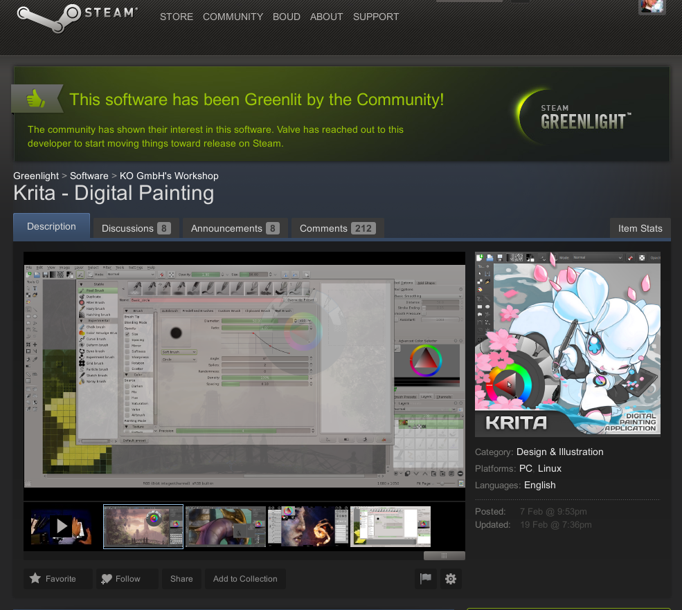

Just twelve days ago, the Krita team at [KO GmbH](http://www.kritastudio.com) submitted a [greenlight application](http://krita.org/item/213-krita-on-steam) on steam... And today we got the news that we're _greenlit_ already! Now the real work is going to start, to make Krita ready for release on Steam!

The Krita on Steam campaign got many thousands of votes from interested users, more than two hundred comments that were almost all very, very positive. And the interest Krita garnered during the greenlight campaign brought us alread a huge number of new users, too! Thanks everyone for the support, for the comments, for the suggestions, for the downloads!

Oh -- and as an aside: two new builds of Krita Desktop to test, which you can download from [kritastudio.com](http://kritastudio.com/desktop.html).  
  
Fixes and enhancements:

- Don't mess up the interface when reloading a document
- Saving custom canvas shortcuts works again
- Open brush presets as images to make the icon editable
- Fix converting the color space of emtpy layers
- Support the svg:exclusion blending mode when loading openraster images
- Fix enabling the add/remove buttons for the favorite presets manager
- Do not pick opacity when picking a color
- Add a (hidden) option to invert the middle-click drag zoom
- Make canvas-only mode work in Krita Gemini
- Make get common colors from an image work on Windows
- Make it possible to use multipe sensors with different curves in one brush preset option (like making opacity react to pressure _and_ rotation of the stylus
- Fix the outline cursor for the experiment brush
- Use a new and nicer icon for the delete layer button
- Fix loading of XFG (GIMP) files on Windows
- Fix merge with layer below
- Do not crash when applying a filter on a mask
- Fix random rotation of brushes
