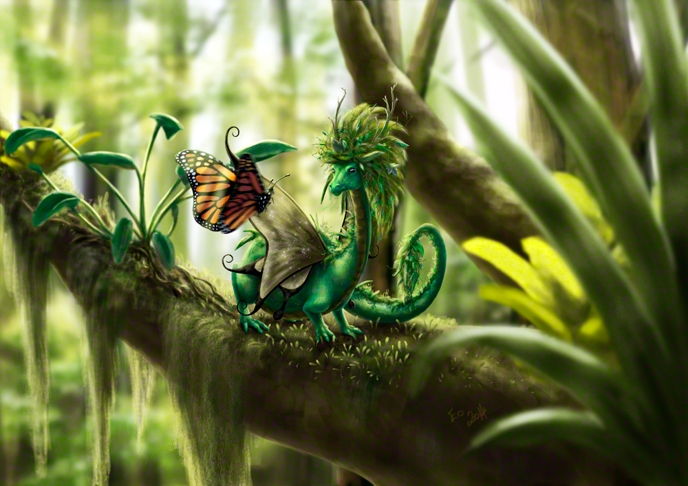

### Would you like to tell us something about yourself?

I'm Andrea, better known as Eo Fenstalker anywhere that it matters. I'm a freelance artist in my 30s living in Melbourne, Australia and I primarily focus on animal and fantasy related artwork under the name Toast Weasel Illustration.

### Do you paint professionally or as a hobby artist?

At this point I'm somewhere in between. I take commissions and sell prints of my work, however being so new back into art I have the trek ahead of me to gain exposure and enough work to comfortably sustain me. I did a lot of art when I was younger, however I was put on an SSRI medication in my early 20s to manage anxiety and it severed my ability to be creative so I did almost nothing from 2001 to 2011. I had given up on the idea of having art back in my life at all until one evening in 2011 I picked up my art materials and launched into doing photorealistic pet and wildlife portraits practically overnight. At this point I was still unable to draw upon imagination for my work but I was earning success in art exhibitions and publications both at home and internationally. While this was great, I was disheartened that I still seemed unable to bring a truly creative element into my work and didn't feel 'whole' as an artist. Krita changed all this for me in early 2014.

### When and how did you end up trying digital painting for the first time?

I first encountered digital art 1997 when I got a free copy of Photoshop 3.0 with the purchase of a scanner. I began to learn how to paint using a mouse at first, and then with a Wacom tablet and even throughout my decade of artistic drought I still, from time to time, picked up Photoshop to play around a little. I still have all my old art files from all that time ago and occasionally enjoy looking back on my old work to see how far I've come, despite the long break.

### What is it that makes you choose digital over traditional painting?

I don't. I still do some traditional work because I enjoy working in different mediums. Digital art can be gratifyingly fast and easy to fix mistakes but I still enjoy the unique challenges that traditional art presents.

### How did you first find out about open source communities? What is your opinion about them?

I learned of open source communities way back when I discovered the internet around 1996. I like the idea of a community of passionate people all pitching in to develop and maintain software though my skills don't lie in this field so I generally can't contribute beyond being openly excited about using the software or doing a little bug reporting. Aside from Krita, the most notable open source program I have used regularly is Blender.

### Have you worked for any FOSS project or contributed in some way?

I try and help find and report bugs as I use Krita. It can sometimes add to the difficulty level of achieving finished work when using pre-release builds, but it's fun in its own way and I enjoy being able to contribute, even though it's in such a minor way. I also happily allow my art to be used in promotional material for Krita.

### How did you find out about Krita?

I was introduced to the program early this year by a friend who was quite excited over it. I was dubious because I'd tried other art programs and was always frustrated by having to learn new a new UI/work flow, to the point that I'd give up and return to Photoshop.

### What was your first take on it?

When I sat down to try it, I started messing about with the standard brushes and sat up with a bolt of excitement because suddenly something felt -better- to use than the old faithful. The UI was a little hard to get a grip on after so long using the same program but the way the brushes handled felt so amazing to me that I persevered and it didn't take long before going back to Photoshop felt really alien.

### What do you love about Krita?

I love how the brushes feel to use and I love how the devs take what artists say they want and turn it into reality. Instead of being a passive user, I feel like I can have some input and it makes me feel like I have a personal tie to the software and its community. I also love the fact that finding Krita fired up my enthusiasm for art to such a point that my creativity came flooding back practically overnight when I found it. Thirteen years after losing the ability, I can now paint entire scenes from imagination the way I used to and I feel 'whole' as an artist again.

### What do you think needs improvement in Krita? Also, anything that you really hate?

Some things take far too long to execute such as many of the filters and some of the brushes at max size. At this point I have a hybrid workflow between Krita and Photoshop where I will pass the file back and forth to accomplish various things that just take too long in Krita. I look forward to the day when I can all but retire Photoshop.

### If you had to pick one favourite of all your work done in Krita so far, what would it be?

It would definitely have to be Little Forest Guardian.

### What is it that you like about it? What brushes did you use in it?

I'm enchanted by the idea of mixing my love of nature with my love of dragons and fantasy. I tried to convey a sense of it being a still from an animated movie using motion and depth of field and feel that I was fairly successful judging by peoples' reactions. I was floored when I had this image made into prints as the colours came out so rich and jewel-like. I honestly cannot remember what brushes I used - it was definitely a large variety as I was (and still am) experimenting heavily with brushes and techniques.

### Would you like to share it with our site visitors?

For sure! It's at the top of this post.

### Anything else you'd like to share?

I have a website with more of my work at [http://www.toastweasel.com](http://www.toastweasel.com "Eo's web site"). It's still incomplete but I hope to have it finished very soon and the majority of my traditional and digital works are there. I will also soon be selling prints via the site, though for now I can be contacted directly for these.

Other places you can find me:

**Facebook:** [https://www.facebook.com/toastweasel](https://www.facebook.com/toastweasel) **Twitter:** [https://twitter.com/ToastWeasel](https://twitter.com/ToastWeasel) **DeviantArt**: [http://toastweasel.deviantart.com/](http://toastweasel.deviantart.com/) **Fur Affinity:** [http://www.furaffinity.net/user/eozarth/](http://www.furaffinity.net/user/eozarth/) **Weasyl:** [https://www.weasyl.com/~eo](https://www.weasyl.com/~eo) **Tumblr:** [http://toast-weasel-illustration.tumblr.com/](http://toast-weasel-illustration.tumblr.com/)
