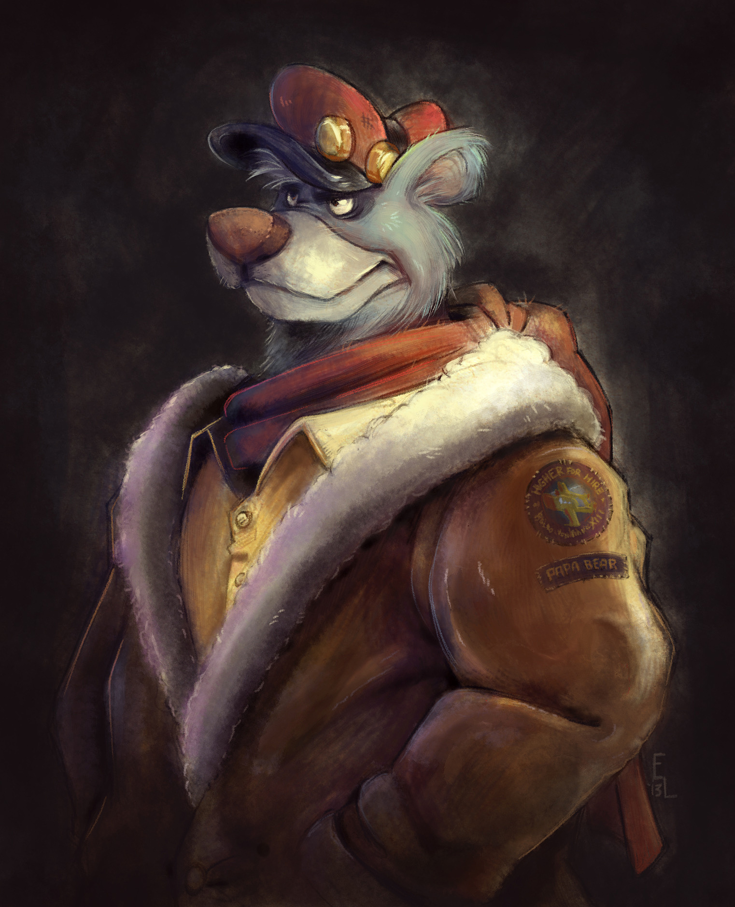
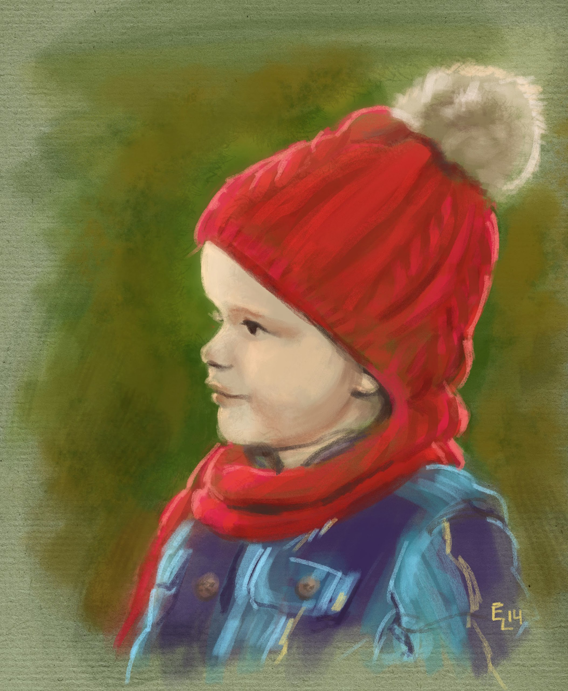
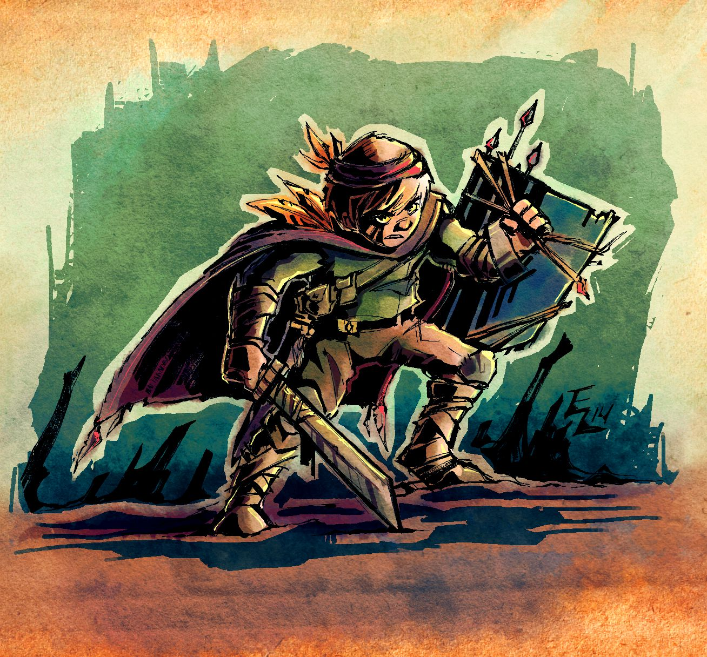
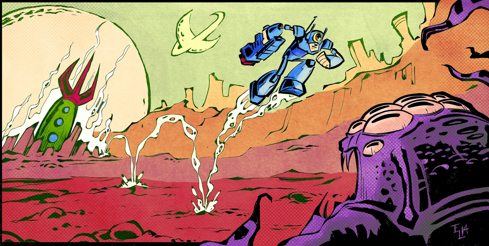

### Would you like to tell us something about yourself?

I am the Animation Director for a post-production facility in the Midwest, Steelehouse Productions. I have been there for over 11 years doing all sorts of things involving art and animation, including 2D hand-drawn animation, 3D animated series, producing comic books, some stop motion, IP development, commercial work... the list goes on. You can go check out the Animation Reel at [www.steelehouse.com](http://www.steelehouse.com) for a taste of what I am talking about. You can also catch a small sampling of my work at [http://eric3dee.deviantart.com](http://eric3dee.deviantart.com)

Concurrently, I am also a husband, a father (2 boys), a musician, a DIY tinkerer, and a puppet-maker among other things.

### Do you paint professionally or as a hobby artist?

Yes. Painting is both a passion of mine, and something I am blessed enough to do for money. When and how did you end up trying digital painting for the first time? I have been painting "tradigitally" ever since I can remember owning a wacom tablet.. possibly 15 years ago? What is it that makes you choose digital over traditional painting?

Computers have always played a large role in my life and interests, and they are a natural fit for me in my art. I am very excited about the ways technology brings new opportunities and efficiencies to art and animation. In many ways it is cheaper, certainly more versatile, and provides an infinite canvas (if you will) of new and exciting ways of expression. At times I do miss the tactile messiness of getting your hands dirty with a traditional medium, but I am always drawn to the seemingly limitlessness of working digitally.

### How did you first find out about open source communities? What is your opinion about them?

I have been aware of open source for a long time now- since the birth of popular programs such as Gimp and Blender. I love the openness of ideas, and how easy it is for users like me to play a role in shaping the development. I love being able to be on the "bleeding edge" of technology through testing and playing with early builds. And above all, I love that it is FREE! Over the years I have come in to contact with many people wanting to get started in digital art and animation, and many have always used cost of entry as an excuse, but nowadays that excuse is simply not valid. Programs such as Krita and Blender are at such a high quality that in some ways they can even trump their commercial competitors. The accessibility of such programs allows for a much larger and faster growth of talent within the industry. I am a big proponent of open source development.

Have you worked for any FOSS project or contributed in some way?

I haven't. I have always played around with many open source programs, but have done very little other than provide feedback and do some bug testing.

### How did you find out about Krita?

A very talented Youtube artist named Sycra posted a short video review about Krita. I was shocked that I hadn't heard of it sooner. His channel is definitely worth checking out: [https://www.youtube.com/user/Sycra](https://www.youtube.com/user/Sycra)

What was your first take on it?

I immediately was drawn in by the familiar interface and the brush smoothing options- somewhat of a mixture of Photoshop and Sai. But to my surprise, the more I played with Krita, the more I fell in love with all sorts of unexpected features- especially the pop-up palette!

### What do you love about Krita?

Krita has an extremely powerful and versatile brush engine. Something that is far superior to Photoshop's (in my opinion). Dynamic brushes, wet brushes, tone brushes and more are very fun to use and lead to all sorts of interesting effects. I also love navigating the canvas in Krita. The OpenGL integration (even on my sub-par tablet graphics card) makes navigation very fluid and the Pop-up palette is the absolute most indispensable tool I didn't know I needed! Photoshop could learn a lot from the Pop-up palette. These are just some of the standouts in Krita's robust toolset.

### What do you think needs improvement in Krita? Also, anything that you really hate?

There is little I dislike about Krita. Mostly in regards to speed on my computer. In Photoshop I can tweak HSV and Levels with Preview updating almost instantaneously, in Krita it is quite a bit slower. There is always room to improve. I would encourage Krita developers to continue to streamline the canvas navigation, as that is one of the best things about using Krita- possibly beefing up the Pop-up palette, or adding more pop-up palettes (for switching layers/opacity, switching to eraser mode etc.) I run Krita on a tablet (Samsung Series 7 Slate- quite similar to the Surface Pro), so the more I can use Krita in full-screen canvas mode, and the less I need to access my keyboard, the better.

What I am interested in seeing is the addition of animation tools to Krita. As a professional animator, I am dying to see this implemented into Krita. The current selection of commercial 2D animation software is severely lacking in their approach- specifically by limiting themselves to a vector-only engine (with the exception of TVPaint which is expensive and has a very hard to navigate interface). Using a Flash-like timeline alongside Krita's killer brush engine would be fantastic, and I am dying to get involve in helping to play a part in shaping it in some way.

Lastly, an OSX build would be fantastic. At work we are almost exclusively mac-based, so until Krita releases a mac build I will have to stick to Artrage and Photoshop ;)

### In your opinion, what sets Krita apart from the other tools that you use?

Krita, in my opinion, simply takes some of the best features of popular paint apps, combines them into a great GUI and improves the heck outta them. As already stated, the brush engine, interface, and navigation tools are simply the best I have found for my worklfow.

### If you had to pick one favourite of all your work done in Krita so far, what would it be?

Probably my Talespin fan art piece of Baloo. It was my first big effort with Krita (admittedly, I have only been using since last fall and haven't had time to do many), and I was very pleased with the end result. I am also very happy with the Tiger speed paint as I got to playing around with the symmetry function.

### What is it that you like about it? What brushes did you use in it?

I used just about every brush I could. There are so many great brushes and variants (Vasco Basquéhas' and Muse's brushsets are a must!), I am still trying to whittle down my absolute favorites into my pop-up palette. Using the dynamic sketch brushes and the halftone brushes give a real modern edge to the "tradigital" approach.

### Would you like to share it with our site visitors?

Attached are a bunch of pieces I have all done completely in Krita.

   
