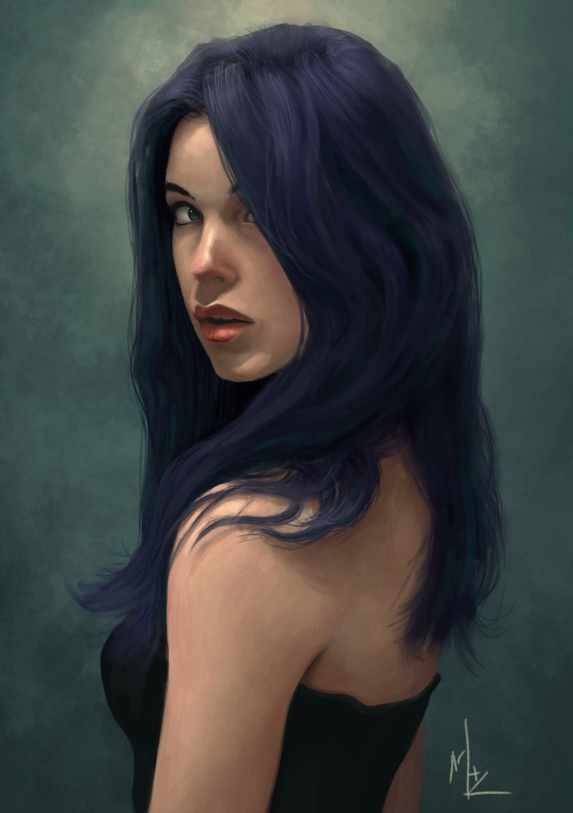

###  Would you like to tell us something about yourself?

I only paint digitally.  Even though I love the way traditional paintings look, I haven't painted traditionally.  A #2 pencil was my first tool for drawing when i was a child, and is still my favourite.  I've tried various pencils, charcoal, and made a horrible mess with graphite dust, but none of them ever worked as well for me as the pencil.

### Do you paint professionally or as a hobby artist?

I paint as a hobby, and only recently did this become an obsession.  I spend most of my time painting when I'm not working or adventuring with the family.  I'm a performance engineer by day.

### When and how did you end up trying digital painting for the first time?

About 5 years ago my family gifted me an intuos3 for Christmas.  I started looking into drawing/painting programs and came across Mypaint. 30 seconds later I was addicted to digital painting.  From there, I just experimented with any drawing software that would run on Linux.

### What is it that makes you choose digital over traditional painting?

So many reasons.  Digital seems effortless in comparison to traditional mediums.  And the whole field of digital painting is still relatively young.  There are so many ideas out there on how to improve upon what we have and new ideas to push the boundaries.  Hardware and software are always improving and becoming more portable.  Who knows what digital painting will have to offer in 5 years.  I just know that i want to be part of it.  Plus, it would be a big investment in time and money to acquire materials and knowledge in traditional mediums.

### How did you first find out about open source communities? What is your opinion about them?

I've been working on Linux since college - about 1998. FOSS is awesome and I am thankful to live in a generation where it is so prevalent.

### Have you worked for any FOSS project or contributed in some way?

I haven't worked for FOSS projects yet, but what a great idea for a New Year's resolution.  I've worked as part of teams that generated open source tools and upstream patches for existing drivers/kernel, but nothing directly.

### How did you find out about Krita?

After I was comfortable with Mypaint, I started to branch out to see what else was available.  Being able to incorporate textures and textured brushes was high on my things to try. Gimp was painful for me to use for painting, so I dropped it.  That's when I came across Krita on some blog that was listing Linux painting software.

### What was your first take on it?

It was a little rough around the edges when in canvas mode, but other than that, worked very well for me.

### What do you love about Krita?

I am still finding new features, brushes, filters, etcetera that I incorporate in my art. My favourite discovery so far: the sketch speedpaint brush

### What do you think needs improvement in Krita? Also, anything that you really hate?

Being a portrait painter, getting a likeness had a lot to do with proportions and measurements. The feature I would like most would be to open my reference and have it automatically zoomed & panned to the same part as the canvas.

As for things I hate, there are none.

### In your opinion, what sets Krita apart from the other tools that you use?

1) The set of features : I don't need any other tools with Krita. It is the best combination of editing and painting tools in one spot.

2) Krita is solid and reliable.  I have crashed Mypaint, Gimp, and Painter and have had images corrupted by it.  Never with Krita.  8000 px square, 600 dpi - no problems.

### If you had to pick one favourite of all your work done in Krita so far, what would it be?

"Surprised to see Me?"

### What is it that you like about it? What brushes did you use in it?

The expression came out really well and while i was worried blue hair may have been overboard, the colors are awesome.  As for brushes, I didn't use many - HB pencil for sketch/measurements, basic block, smudge and sponge for painting..

### Would you like to share it with our site visitors?

Of course! It's the featured image of this post.

### Anything else you'd like to share?

I'd rather paint than maintain a site.  If anyone would like to contact me or see what I'm up to, check out deviantArt: [http://kynlo.deviantart.com](http://kynlo.deviantart.com)
