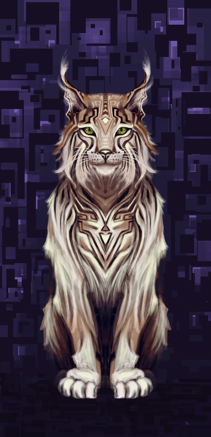

### Would you like to tell us something about yourself?

I’m a digital painter, illustrator, concept artist and game developer, currently living in Dresden, Germany.

In January 2008 I started drawing and painting regularly. I went from fineliner drawings to vector art, pencil drawings, sculpting, papercuts, linocuts, fabric design, oil/acrylic paintings, fabric design, typography until I finally found my preferred medium. In 2010 my apprenticeship at a photographer agency ended and I started to work on my art full-time. The same year my husband and I also successfully crowdfunded the creative commons music album "paniq - Beyond Good and Evil". I created the cover and booklet art and my husband composed the music. In May 2012 we founded our company "duangle" and started another crowdfunding campaign for our game in development "NOWHERE", a hardcore alien life simulator.

### Do you paint professionally or as a hobby artist?

Both, sporadically. I’m not comfortable with either label. Art happens. :-)

### When and how did you end up trying digital painting for the first time?

I wanted to get more out of my monochromatic fineliner drawings. I scanned and vectorized these drawings with Inkscape and added some color with MyPaint. That’s how it started. Since 2013 I enjoy painting mostly digitally.

### What is it that makes you choose digital over traditional painting?

Almost no costs, more freedom.

No need for a studio to paint. No storage problems. Sharing new artworks is easier and you don’t have to scan the pictures first, which really pays off once the paintings get bigger. Nevertheless I hope that someday I will be able to afford to work with oils. I miss a messy working space with paint everywhere. Sadly we are living in a rented apartment and I can’t do what I want with it.

### How did you first find out about open source communities? What is your opinion about them?

My husband is a musician and programmer. He licensed all his work under creative commons. I started to love open source projects, too. I’m very thankful that there are people who work, live for the community and people who support them.

### Have you worked for any FOSS project or contributed in some way?

We, duangle, are currently developing an open source game engine "Liminal" for no-static-assets procedural games, using C and LuaJIT:[https://bitbucket.org/duangle/liminal\_lua/src](https://bitbucket.org/duangle/liminal_lua/src). My husband is doing the programming and I’m an alpha tester. ;-)

### How did you find out about Krita?

A friend mentioned Krita in 2010, claiming that it was the best open source alternative to Photoshop. Had to try it and never stopped working with it. On a sidenode I’ve never worked with commercial art software before, but I’m not eager to either.

### What was the first thing you made with it?

I had a pencil sketch in my sketchbook, scanned it and added some color. The result is on my deviantArt page - "Study No.80": [http://faith303.deviantart.com/art/study-no-80-361827667](http://faith303.deviantart.com/art/study-no-80-361827667).

### What do you love about Krita?

I love to work with a tool that is continuously improving. New features are always such a joy. They give you new ways to explore art. Krita is fun. I can’t put it into better words. Everyone should give it a try :)

### What do you think needs improvement in Krita? Also, anything that you really hate?

The usual problem with software  - I hate it when the program crashes and I forgot to save the current progress. Krita has an auto-save mode but it doesn’t always seem to work. A reminder to everyone: save more often! Then, sometimes I duplicate a layer and can’t move it to the place I want, so I have to delete the duplicated layer and try again. That’s all, I’m happy otherwise.

### In your opinion, what sets Krita apart from the other tools that you use?

More features and possibilities.

### If you had to pick one favourite of all your work done in Krita so far, what would it be?

Not an easy task. I’m the worst critic. One of my favorites is "Keeper of Secrets".

### What is it that you like about it? What brushes did you use in it?

I love wildcats. It was fun to paint the fluffy fur and the lynx eyes.

Can’t remember all the brushes, definitely the block and hard oval opacity detail brush. I try to experiment with all brushes, patterns, textures that can be used in Krita.

### Would you like to share it with our site visitors?

Sure! You can find it on my deviantArt page: [http://faith303.deviantart.com/art/Keeper-of-Secrets-484685409](http://faith303.deviantart.com/art/Keeper-of-Secrets-484685409).

### Anything else you'd like to share?

If you want to see and know more about my art please visit the following links:

Animal Illustrations Calendar 2015: [https://www.etsy.com/listing/203986448/animal-illustrations-by-sylvia-ritter](https://www.etsy.com/listing/203986448/animal-illustrations-by-sylvia-ritter)

Website: [www.sylvia-ritter.com](http://www.sylvia-ritter.com)

Twitter: [https://twitter.com/sylvia\_ritter](https://twitter.com/sylvia_ritter)

Facebook: [https://www.facebook.com/pages/Sylvia-Ritter-Artist/242134975862592](https://www.facebook.com/pages/Sylvia-Ritter-Artist/242134975862592)

Patreon: [http://www.patreon.com/sylviaritter](http://www.patreon.com/sylviaritter)

More information about our indie game "NOWHERE" on [http://www.duangle.com/nowhere](http://www.duangle.com/nowhere).
