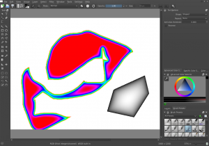
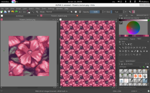
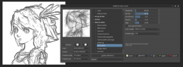
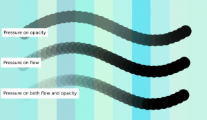

Lots and lots and lots (and lots) of new stuff! We're getting really close to the 2.9 release freeze, which is currently set for December 10th. That means that the current builds are full of fresh code. In other words -- they need testing. Now is the time to report bugs and issues!

### Kickstarter

Let's start with the Kickstarter topics. Boudewijn has started work on loading and saving masks from PSD files, as well as the PSD layer style feature. The dialogs are mocked up, and part of the loading code has been written. But it's a huge amount of work, and we're simply not sure whether we'll make it before the code freeze hits... Right now, Dmitry is working on fixing the rendering of vector objects and then the next step is improving the color smudge brush.

All other items are done... New in this build are:

- \*Non-destructive transformation masks. Only affine transforms, like rotate, resize, skew, move and perspective get real-time feedback. Warp, Liquify and Cage tools do have non-destructive transforms, but are a little expensive on the cpu, so Krita updates them  only every 3 seconds.
- Shaped gradients (and they are really fast, too!)
- Easy mask creation: you can import any kind of image as a mask and save masks as images.

In addition to the kickstarter topics that were already in the previous builds:

- Liquify transform
- Cage transform
- Perspective transform
- Selection transformation
- Improved warp transform anti-aliasing
- Improved thin line quality

Additionally, Dmitry has added a way to split the alpha channel out and edit it separately: combined with the Isolate Layer feature, this allows the user to edit the alpha channel separately and save the resulting layer with color channels having real color data even though alpha is zero. Previously, a fully transparent pixel would be set to black.

Check [http://docs.unity3d.com/Manual/HOWTO-alphamaps.html](http://docs.unity3d.com/Manual/HOWTO-alphamaps.html) on why it's useful, and here's a video by Paul Geraskin showing off the feature:

https://www.youtube.com/watch?v=ZeUStIHWVg0

And check out the transformation mask video as well:

http://www.youtube.com/embed/7m92IHTrL2w

### Features

Windows and OSX users have an extra treat this time: the 2.8.79.23 builds are made from the multi-view branch. There are still bugs and usability niggles, but it's usable now, for real work, too. Here's a screenshot showing how the same image can be open twice, once with autowrap enabled.

Krita's G'Mic plugin is immensely powerful, but was hard to use without any preview... So Lukáš Tvrdý has added just that: you can preview the G'Mic effect in several sizes and on the canvas, too, depending on the speed with which the filter works.

Timothée Giet has implemented a long-standing wish for Krita: the ability to separate the opacity and flow parameters -- and updated all default brush presets to reflect this improvement.

Scott Petrovic not only continued polishing Krita's user interface by checking layout, alignment, use of slider widgets, adding tooltips and so on -- he also updated the [download](https://krita.org/download/krita-desktop/), [store](https://krita.org/support-us/shop/) and [donation](https://krita.org/support-us/donations/) pages for krita.org. (And may we just suggest that the [Muses DVD](https://krita.org/learn/tutorials/) makes an excellend December present, get yours now!)

### Bug Fixes:

- There was a regression in the saving of Paintop presets, or Brush Presets as you know them. Brush Presets would not be registered seperately when created from a previous preset. This has now been fixed.
- Aipek Hyperpen 12000u tablet support has been added.
- Damien de Lemeny fixed the speed sensor for brushes
- Jouni Pentikäinen fixed a regression in the brush editor, where checking items was broken and made it possible to choose whether the background color is set on the image or on the first layer
- Timothée Giet added an option to select between synchronizing the eraser brush size with the current brush preset.

Both Jouni and Damien have applied for and received their KDE committer accounts!

### Downloads

For Linux users, Krita Lime has been been updated. This doesn't include the multi-view feature yet. OpenSUSE users can use the new OBS repositories created by Leinir:

- [http://download.opensuse.org/repositories/home:/leinir:/calligragemini/openSUSE\_13.1/](http://download.opensuse.org/repositories/home:/leinir:/calligragemini/openSUSE_13.1/)
- [http://download.opensuse.org/repositories/home:/leinir:/calligragemini/openSUSE\_13.2/](http://download.opensuse.org/repositories/home:/leinir:/calligragemini/openSUSE_13.2/)
- [http://download.opensuse.org/repositories/home:/leinir:/calligragemini/openSUSE\_Factory/](http://download.opensuse.org/repositories/home:/leinir:/calligragemini/openSUSE_Factory/)

Windows users can choose between an installer and the zip file. You can unzip the zip file anywhere and start Krita by executing bin/krita.exe. We're still working on acquiring a Surface Pro 3 so we can fix the tablet offset issue that happens when desktop scaling is enabled.

- [http://files.kde.org/krita/windows/krita\_x64\_2.8.79.23.zip](http://files.kde.org/krita/windows/krita_x64_2.8.79.23.zip)
- [http://files.kde.org/krita/windows/krita\_x64\_2.8.79.23.msi](http://files.kde.org/krita/windows/krita_x64_2.8.79.23.msi)

OSX users can open the dmg and copy krita.app where they want. Note that OSX still is _not_ supported. There are OSX-specific bugs and some features are missing.

- [http://files.kde.org/krita/osx/krita-2.8.79.23.dmg](http://files.kde.org/krita/osx/krita-2.8.79.23.dmg)
