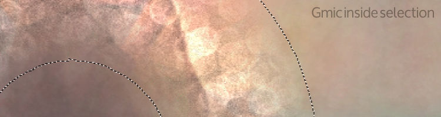
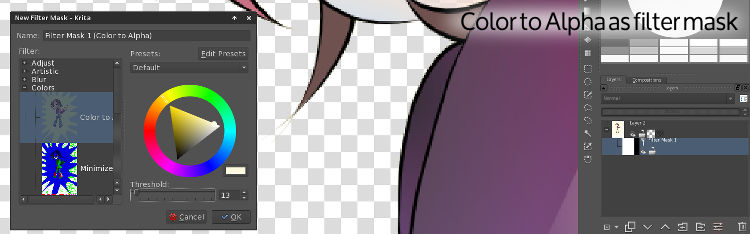
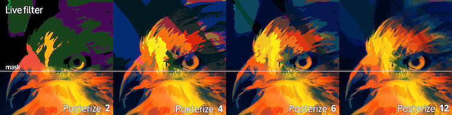
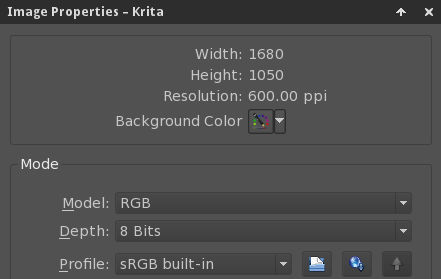
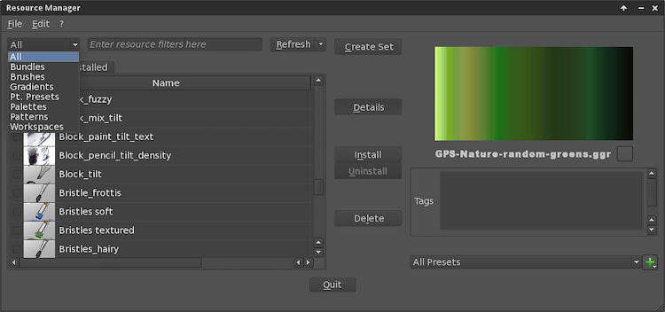

It’s been a busy week at Krita development headquarters. And with so much work being done I feel proud to share all the great stuff that’s happening on the main development branch (Future 2.9).

Before going into specifics I want to mention that there have been a lot of improvements in the code, from styling, cleaning, optimizations, renaming and small performance tweaks to fixing bugs and code leaks. This work is an ongoing process and thanks to your bug reports we spend less time finding them and more time polishing and creating features.

## Week 18 progress

#### This week’s major new additions:

- Support for Selections in Gmic filters (Lukáš Tvrdý)
- Color to alpha filter as adjustment layer (Beast)
- \[NEW\] Posterize filter (Beast)
- Remember last preset used between sessions.(Boudewijn Rempt)
- Improvements on Resource Manager (Victor Lafon)

#### This week’s major Bug fixes:

- FIX [#333142](https://bugs.kde.org/show_bug.cgi?id=333142): Random noise no longer makes Krita crash (Spencer Brown)
- FIX [#325771](http://bugs.kde.org/show_bug.cgi?id=325771) Support for Selections in Gmic filters (Lukáš Tvrdý)
- FIX [#333233](http://bugs.kde.org/show_bug.cgi?id=333233) [#333237](https://bugs.kde.org/show_bug.cgi?id=333237): Add more grid presets and shortcuts for toggle and snap (Bart Kelsey)

### Selections in Gmic filters

Thanks to Lukáš Tvrdý Gmic support has been extended to work with Krita selections. Some of the initial selection glitches were solved this week, making Gmic’s versatile image processing library more comfortable to use.

### Color to alpha now as Adjustment layer.

Due to a bug in rendering we removed this filter from the adjustment layer menu. Beast took the task to fix it. Color to alpha, now with perfect rendering, is back.

### Posterize Filter (NEW)

This popular filter from other software tools is now available on Krita by the coding effort of Beast. The filter works either as a regular filter or in the layer stack as a filter/adjustment filter. We are sure this addition will allow you to get even more varied results.

## Krita Sketch and Gemini

Thanks to Dan Leinir Turthra Jensen and Arjen Hiemstra for their hard work on constantly improving the Sketch and Gemini experience. They have completed a huge number of bug fixes, performance enhancements and general optimizations to make both applications work better than before. The changes and fixes are so numerous that I decided to publish only the most significant. This fixes and improvements include:

- Many fixes for windows compatibility.
- BUG [#333213](http://bugs.kde.org/show_bug.cgi?id=333213) Enable save incremental version after saving a new file.
- BUG [#333468](http://bugs.kde.org/show_bug.cgi?id=333468) Ignore resize events from dialogs for rebuilding the font cache
- BUG [#333421](http://bugs.kde.org/show_bug.cgi?id=333421) Use ppp internally instead of dpi
- Rework the slider’s handle logic to feel more natural.
- Improved the starting speed of Gemini and Sketch.
- Add opened/saved files from desktop to recent files list.

## In previous weeks

Previous weeks count with a number of interesting changes and development.

### Krita and EXR

Dmitry Kazakov has stabilized and improved support for HDR images, specially in the following areas.

- Krita saves layer attributes and order into the EXR file. BUG [#333081](http://bugs.kde.org/show_bug.cgi?id=333081)
- Saving EXR files we now warn you when information of layer types cannot be preserved BUG [#333097](http://bugs.kde.org/show_bug.cgi?id=333097)
- Fix EXR that need a black BG color by adding a canvas color projection. This also adds the hability to see a colored background for regular images. (Image->Properties->Background Color) BUG [#301443](http://bugs.kde.org/show_bug.cgi?id=301443)
- Fixed loading EXR with certain alpha values CCBUG [#301443](http://bugs.kde.org/show_bug.cgi?id=301443)

Other bugs fixed: BUG [#333421](http://bugs.kde.org/show_bug.cgi?id=333421)

### Resource Manager

Victor Lafon is working hard to implement the Resource Manager, a central place to manage all Krita assets: presets, brush tips, gradients, textures, palettes. When it’s done it will make it much easier to organize all assets.

### Previous weeks' fixes and additions

- BUG [#333233](http://bugs.kde.org/show_bug.cgi?id=333233) BUG [#333237](http://bugs.kde.org/show_bug.cgi?id=333237) Add more grid presets and shortcuts for toggle and snap (Bart Kelsey)
- Properly fix the outline for invert selection (Dmitry Kazakov)
- Clean up the layout of the filter settings pages (Iván Yossi)
- Sven Langkamp: add import for PSD layer groups CCBUG [#289857](http://bugs.kde.org/show_bug.cgi?id=289857)
- Sven Langkamp: save tags with special characters properly BUG [#332708](http://bugs.kde.org/show_bug.cgi?id=332708)
