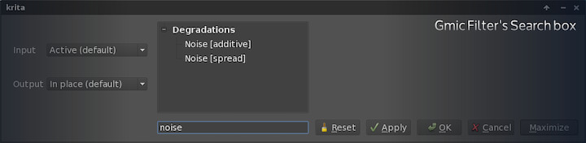

Big changes are made through small steps, and this week we made a lot of them. The team worked hard to unify tag management, standardize color rendering across all tools, fix interface bugs and optimize some filters. The majority of bugs and fixes are worked in the main development branch, but the bigger and experimental ones are made inside separate branches.

Branches work is not included automatically into the main development branch. Before sending it the branch developer and brave users work with it, test it and help optimize it before adding it to the main branch.

## Week 19 progress

#### This week’s new features:

- Implement support for more types of palettes. (Boudewijn Rempt)
- Search filter for [G'MIC](http://gmic.sourceforge.net/) plugin filters. (Lukáš Tvrdý)
- Improved handling of tags and resources names. (Boudewijn Rempt)
- Remove hardcoded margins from filter dialog, use normal buttonbox for ok/cancel. This change allows the buttons to accommodate in any order depending on the windows manager rules (Ok/Cancel, Cancel/Ok). (Friedrich W. H. Kossebau)

#### This week’s main Bug fixes:

- FIX [#334437](https://bugs.kde.org/show_bug.cgi?id=334437): Fix dimensions of autobrushes. (Boudewijn Rempt)
- FIX [#334450](https://bugs.kde.org/show_bug.cgi?id=334450): Fix generating md5 sum for task set resources. (Boudewijn Rempt)
- FIX [#333326](https://bugs.kde.org/show_bug.cgi?id=333326): Ask user for a file when a File Layer doesn’t exist. (Dmitry Kazakov)
- FIX [#333234](https://bugs.kde.org/show_bug.cgi?id=333234): Fix painting Grid on lower zoom levels. (Dmitry Kazakov)
- FIX [#333080](https://bugs.kde.org/show_bug.cgi?id=333080): Ensure channel flags are cleared when set to all-ones. (Dmitry Kazakov)
- FIX [#332130](https://bugs.kde.org/show_bug.cgi?id=332130): Fix using a transaction in the Filter Op. (Dmitry Kazakov)
- FIX [#333485](https://bugs.kde.org/show_bug.cgi?id=333485): Brush settings blending mode selection with a single click. Also its possible to click and drag to select a mode. (Spencer Brown)
- FIX [#334078](https://bugs.kde.org/show_bug.cgi?id=334078): Swap Units when swapping width/height orientation. (Boudewijn Rempt)
- FIX [#331043](https://bugs.kde.org/show_bug.cgi?id=331043): Fix Transform Tool arrows on mirrored canvas. (Koushik S)
- FIX [#334255](https://bugs.kde.org/show_bug.cgi?id=334255): Port KisPaintopPreset to the proper KoResource API. (Boudewijn Rempt)
- FIX [#325771](https://bugs.kde.org/show_bug.cgi?id=325771): Fix glitches when bitblting gmic result on moved layer with selection. (Dmitry Kazakov)

### Implement support for more palette types

We now support RIFF\_PAL palettes, paintshop pro palettes and Photoshop ACO palettes.

ACO (Adobe Color Palette) is the native Format of Photoshop which support rgb, cmyk, hsv, lab and gray, at 16 bits/channel. A nice addition to default gimp palettes, indeed!

### Search filter box in Gmic

Gmic offers around 250 different filters to use. Finding them by space memory is a bit slow when you know exactly what you want. The new search box allows to easily find the filter by its name. 

## Krita Sketch and Gemini

- Make tooltip work nicely with touch on Win 8. (Arjen Hiemstra)
- Correct a typo in the minimize button tooltip. (Arjen Hiemstra)
- Add tooltips to WelcomePage and MenuPanel. (Arjen Hiemstra)
- Add tooltip functionality to Button. (Arjen Hiemstra)
- FIX [#331341](https://bugs.kde.org/show_bug.cgi?id=331341): Drop down the panel from the handle instead of moving the handle. (Arjen Hiemstra)
- Add support for adding an offset to items added to MouseTracker. (Arjen Hiemstra)
- FIX [#333779](https://bugs.kde.org/show_bug.cgi?id=333779): Set the URL for new images to "New Image.kra". (Arjen Hiemstra)
- Keep the views presets constantly in sync. (Dan Leinir Turthra Jensen)

## Code cleanup and optimizations

- Open the QBuffer before writing into it. (Boudewijn Rempt)
- Rename Axis Center into Axes Center. (Dmitry Kazakov)
- Fix loading aco profiles. (Boudewijn Rempt)
- Fix KisDlgFilter to always show the name of the currently selected filter. (Friedrich W. H. Kossebau)
- Make current filter gettable in KisFilterSelectorWidget. (Friedrich W. H. Kossebau)
- Add ":" after all labels in the filter settings UI. (Friedrich W. H. Kossebau)
- Refactoring and fixing resource manager code bugs about creation, install and uninstall. (Victor Lafon)
- Convert AppData to 0.6 format, to avoid translation clutter: Matthias Klumpp krita/krita.appdata.xml
- Remove spurious export clause. (Boudewijn Rempt)
- Add a proper option for enable/disable GMic. (Arjen Hiemstra)
- Fix KisPatternTest. (Boudewijn Rempt)

## Branches work

A developer can focus on a major new feature without worrying about making Krita unusable by using branches. This week in branches we had some interesting work.

### 2.8

2.8 stable received a couple of new features and bug fixes:

- FIX [#334078](https://bugs.kde.org/show_bug.cgi?id=334078): Swap Units when swapping width/height orientation. (Boudewijn Rempt)
- Remember last preset used between sessions.(Boudewijn Rempt)
- Search filter for Gmic plugin filters. (Lukáš Tvrdý)

### animator-plugin-somsubhra

Advancement in layer handling for animation data and fixes to interface loading and preferences.

### krita-testing-kazakov

Exciting work from Dmitry in this branch. Color rendering massive improvements and standarization across all Krita components, fixing bugs in color selection, popup palette colors, specific color selector and adding support in palette docker for color managed rendering.

### calligra-resource\_md5-rempt

Boudewijn is preparing the tag system for growing and extending. The current code, now in master, makes the system more robust and versatile allowing the resources to be recognized even if they change location.
