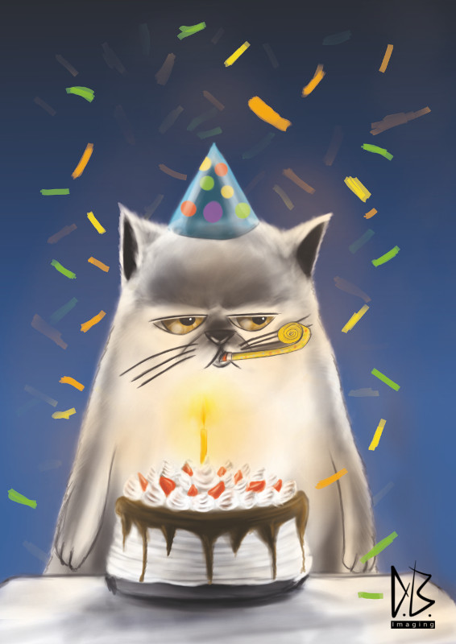

Hello, my name is Danas, better known publicly by my nickname Danas Anis. I am a multimedia design artist working at Bstudija print design and manufacturing studio. It is a studio founded by my friend from college Virginijus Starkevicius. We are based in Kaunas, Lithuania. While Bstudija heavily focus on print design I am more of a multimedia-type guy and quite often have to do a lot with video shooting, video cutting and many kinds of art adoptions to design projects. Which leads me to work on projects involving not only video or photography, but also some concept art and illustrations.

This resulted in me trying do some digital painting.

I got involved in doing software reviews and was blessed to review Project Dogwaffle digital painting and animation software. A very unique tool if you ask me. It also happened that I also began my migration to the Linux operating system, which led me to look for various replacements for my usual tools. And so my experimentation and search began. Because of my review of Project Dogwaffle I began to hit some illustrating projects.

Due to my long-lasting interest in Linux software I 'd known about Krita from the days when it was more of a general purpose image manipulation application. During the years the development team of Krita decided on a road to make Krita into perfect digital painting software. Knowing that I didn't hesitate to check out Krita once I accidentally came across a project that required a full featured application for painting.

At first I started with Gimp Paint Studio and won a position to work on a comic book as a prize in a competition. But because Gimp lacked support for the CMYK color mode I needed to find a suitable tool that would work on Linux, because I really enjoy Linux the desktop. Linux as a desktop is simply tailored for designers and artists in my opinion. So wanting to stay on my favorite desktop, which affects my workflow, I really needed to find the right Linux tool to do the job.

After great research I learned that Krita is kind of a pioneer digital painting application that supports CMYK natively. The choice was obvious. To adapt to Krita wasn't a problem, actually. I loved Krita's interface during my first encounter with this application before it became a digital painting application. So with confidence I installed it and did not regret it. The reviews of Krita in various articles were not telling lies. Krita was becoming truly amazing digital painting software with an amazing brush engine. And that adorable circle widget for favorite brushes and recently used colors and a color wheel triangle is just too amazing not to fall in love with.

My colleagues at the studio were surprised that I would go with open-source tools for big projects, but on the other hand they knew I like to blow against the wind and do things differently. We were all curious how things would turn out, if I'd go back to industry standard tools or not. Krita proved to be a very good choice!

It's a pity that print design isn't well-supported in Linux. There isn't a big choice of software to do print.Basically only Scribus supports CMYK the right way, when it comes to graphic design. I wish Inkscape had true support for CMYK, because that is most likely to be thebest pick for vector graphics. But its CMYK support is half baked, which is a killer thing. And here comes Krita with good CMYK color support, which makes me wonder how it works with vector shapes I will do experiments with that once I finish my current big project in Krita.

Seeing how successfully I am using Krita for my big project, we decided to do some experiments on behalf of the Bstudija studio. I don't really remember what triggered us to do it. But at the studio our team decided to come up with a character for greeting cards that we would sell for clients or at the post office. My colleague Virginijus and I worked on creating a strong conception of a character. We wrote down some figure points for the character and did a lot of sketching. Whatever we did, we eventually came out at a kitten every time. And then we thought, why not a cat? Cats are loved by most people and a cat is a figure with almost limitless forms of expression. And so our thinking resulted in the idea of a grumpy cat that would have a base shape like a kind of upside-down bucket. The cat would always be shown from the front and would embody various specialties and situations, every time with a similar grumpy cat face, only different scenarios around it.

 With Krita to draw and paint, this conception was a real pleasure. With very fine collections of brushes available to be downloaded from such great artist like David Revoy, Cazu and others, it is easy to find favorite brushes and adapt them to one's own unique way of working, thanks to very nice features found in the brush engine configuration panel. The way the Krita brush engine is designed is incredible. And it's fascinating to think that it is available to the masses.

Krita is really making it. It goes in the right direction, beating many commercial tools. I'm also very excited about how well Krita works with large-scale canvas projects. We did some testing at the studio to see how Photoshop would work on A3 300DPI versus Krita on A3 300DPI. It turned out that Krita behaved a lot better on my computer than Photoshop did. Of course we have to take into account that one application was run on Linux and the other on Windows. Also, from those two Krita is the only one to have a very advanced brush engine.

However, unfortunately I still have difficulty working on A3 600DPI or with 24bit color depth. Yet, A3 300DPI is working like a charm. So all the drawing of the Kitten is made in this resolution and never once did I have an issue painting with Krita at this size. No lag, most brushes work pretty fast. It is great to be able to work on detail at times. With Krita I can just focus on making art.

I really love Krita for its very flexible interface; you can't expect less from a KDE-based application. The brush engine is phenomenal. To compare, I think Krita is as unique as Project Dogwaffle. They are very different, but both have the same level of uniqueness. There are so many nice features in layers, modifying effects. A very big shining star for Krita is its ability to work in CMYK color mode, which is a must for professional print work. It is exciting to finish a painting and once printed see what you expected. This is vital for any application that is serious about graphics and being used in production.

Still, there are some wishes I have for Krita. I really miss the I-Warp tool. In industry, when you are working on a project for a client, you have to be speedy. And when doing illustrations sometimes one needs to do some fast fixes, like push something with the I-warp tool. To repaint it takes a lot more time. There are some interesting similar tools to do a very close effect, however it is not close enough to the quality of I-warp. It would be a huge time saver. Why repaint those portions of your painting when you could simply push, squeeze, and modify with only one stroke instead of several?

Another thing that seems to be common to most open source tools is moving layers. I don't know why, but the move tool is very slow on my computers. Luckily there is a transform tool out there to help. One more thing would be moving layer instances with drag-and-drop in the layer instancer. This procedure is also a bit slow compared to other tools. Even so, Krita's development is going in a a very exciting direction which looks so bright and promising.

I say Krita should be a number one tool considered to any digital painter, whether one is a beginner or an advanced professional. So now when I'm faced with a project where I need to paint something and know it will have to be printed, Krita is my number one choice. Especially when it is a real pleasure to paint in it. And that is how Bstudija came to use open source tools like Krita to accomplish some projects.

 

More about Bstudija [www.bstudija.lt](http://www.bstudija.lt/)

More about Danas [www.danas-imaging.com](http://www.danas-imaging.com/)
