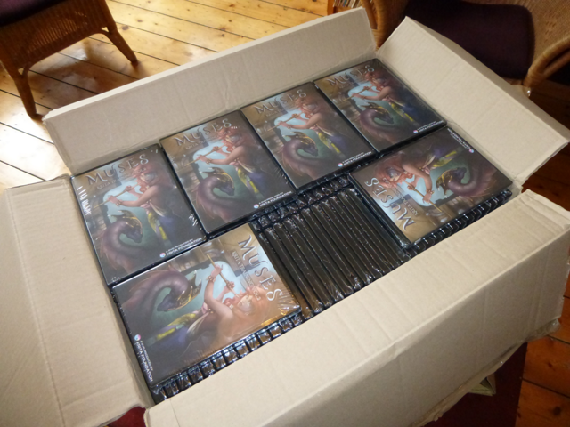

After quite a bit of delay, we can now announce the final release of the Muses Krita Training DVD by Ramon Miranda! Today UPS dropped two big boxes full of lovely DVD's!

And that means that tonight I'll be busy pasting address on envelopes to send out all the pre-ordered DVD's. Thanks guys, thanks so much for supporting Krita and for being so patient!

And, of course, there are plenty of DVD's left to order, so if you didn't pre-order, get your copy now! The regular price is € 32,50 including shipping.

Watch the trailer:

\[embed\]https://www.youtube.com/watch?v=BAnfnpMQ4jU\[/embed\]

Or checkout the contents, nearly five hours of video:

### Part I -- 110 minutes

Chapter 1. Understanding the UI Chapter 2. Workspace and Dockers Chapter 3. Toolbox Chapter 4. Navigation Chapter 5. File Handling Chapter 6. Setting The prefs

### Part II -- 60 minutes

Chapter 7. Brushes & presets Chapter 8. Layers Chapter 9. Blending Modes

### Part III -- 118 minutes

Chapter 10. Sketching Techniques. Chapter 11. Blocking Chapter 12. Color Chapter 13. Styles Chapter 14. Printing
