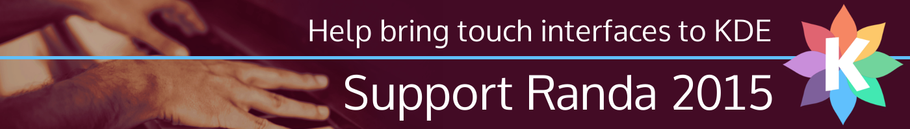

Krita is a part of the [KDE Community](https://www.kde.org/fundraisers/kdesprints2015/). Without KDE, Krita wouldn't exist, and KDE still supports Krita in many different ways. KDE is a world-wide community for people and projects who create free software. That ranges from applications like Krita, Digikam, Kdenlive to education software like GCompris to desktop and mobile phone software.

Krita not only uses the foundations developed by KDE and its developers all around the world, KDE hosts the website, the forums, everything needed for development. And the people working on all this need to meet from time to time to discuss future directions, to make decisions about technology and to work together on all the software that KDE communities create. As with Krita, most of the work on KDE is done by volunteers!

KDE wants to support those volunteers with travel grants and accomodation support, and for that, KDE is raising funds right now. Getting developers, artists, documentation writers, users all together in one place to work on creating awesome free software! And there is a big sprint coming up soon: the Randa Meetings. From the 6th to the 13th of September more than 50 people will meet in Randa, Switzerland to work, discuss, decide, document, write, eat and sleep under one and the same roof.

It's a very effective meeting: in 2011 the KDE Frameworks 5 project was started, rejuvenating and modernizing the KDE development platform. Krita is currently being ported to Frameworks. Last year, Kdenlive received special attention, reinvigorating the project as part of the KDE community. Krita artist Timothee Giet worked on GCompris, another new KDE project. This year, the focus is on bringing KDE software to touch devices, tablets, phones, laptops with touch screen.

Let's help KDE bring people together!

