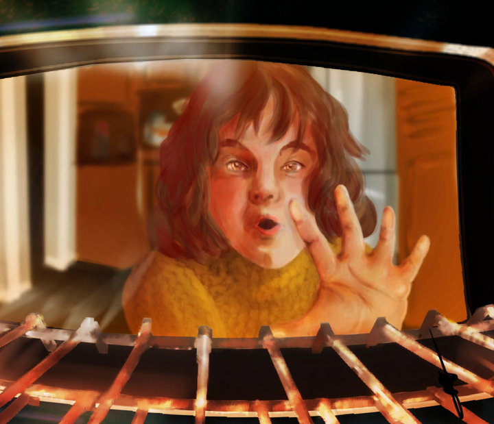

You're all invited to join [John's monthly drawing challenge](https://forum.kde.org/viewtopic.php?f=277&t=129626&p=346656#p346656) again. It's fun, it's friendly and helps with the all-important goal of keeping drawing. This month's theme is "Complementary".

Here's last month winner!

\[caption id="attachment\_2658" align="alignnone" width="720"\] Waiting, by Elenav\[/caption\]
