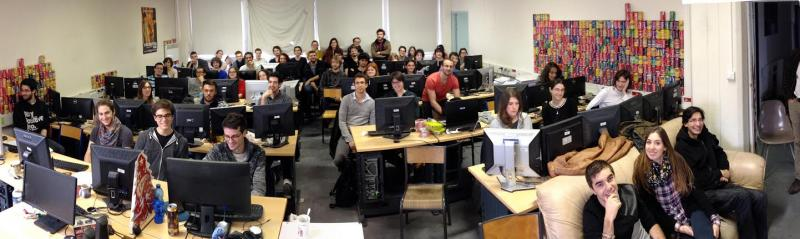
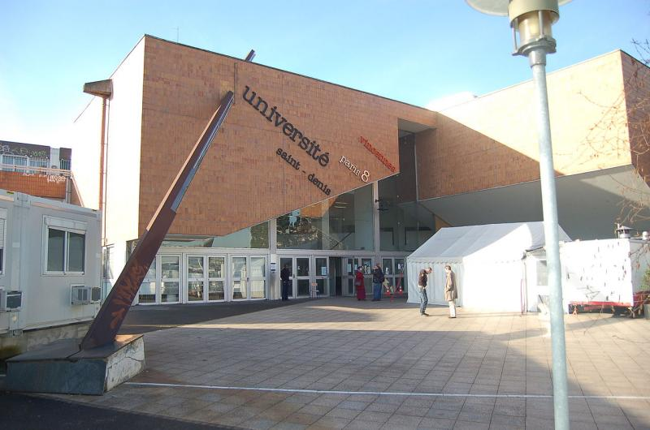

 The ATI (Art and Technology of Image) department at [University Paris 8](http://www.univ-paris8.fr/en/ "English page of University 8 Paris") is switching to Krita this year. This department has the double aim to train students both to use graphic software (2D,3D,VFX and Compositing) and to code their own (Python, C#, C++). Until recently the classes used only Adobe Photoshop, but because of inadequate support from the company the department decided to replace that.

Last November. François "Coyhot" Grassard (teacher of Compositing at ATI, also well-known Blender/Natron user) invited David Revoy to do a general presentation of Krita 2.8 and ease the switch. The four-hour-long demo covered almost all of the interface and key functionality of Krita 2.8. The single viewport/canvas mode of 2.8 and the lack of perspective transformation were a bit frustrating, but fortunately these features have already been included in the upcoming 2.9.

The most appreciated features were the long list of Blending modes, the Wrap around ‘W’ texture modes, the possibilities of doing complex compositing with the layer stack (e.g. clone layers) and of course the opportunity to study the code and tweak it.  In a three-week intensive project, the "Master 1" students work with not only Krita, but also Blender and Natron (a French open-source alternative to Nuke). A demo of Blender/Natron integration by François Grassard can be downloaded here: [https://natron.inria.fr/natron-1-0-0-stable-released/](https://natron.inria.fr/natron-1-0-0-stable-released/)

According to François, "we don't want to let ourselves be pushed around and make choices that go against our beliefs. This freedom of choice is exactly the advantage that a public institution has over a private school." All other animation schools in France, fellow members of RECA (the network of French schools of animation), are watching ATI avidly to see how this new methodology works out.
