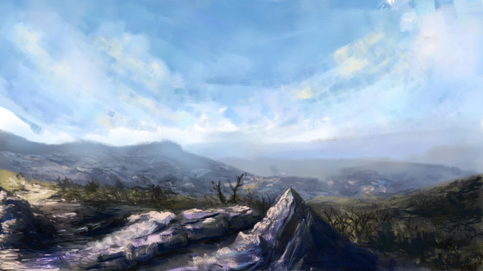

### Would you like to tell us something about yourself?

Hi, my name is Abbigail Ward. I am a published illustrator and fine art student.

### Do you paint professionally or as a hobby artist?

I have been drawing as a hobby since I was little but just started doing professional art work in the past couple of years. My first published book [Monster Parade, written by Gregory Moss,](http://mossfamilybooks.com/ "Moss Family Books") came out in January, so that's exciting! Besides that I have been doing small projects like character portraits and album covers.

### When and how did you end up trying digital painting for the first time?

I first started digital painting around 9 years ago when my mother bought me a small Wacom tablet for Christmas. I loved that tablet, still have it in fact! Though I use a different tablet now. If I remember correctly, I believe it was digital art on [elfwood.com](http://elfwood.com "Elfwood Fantasy and Sci fi Art") that first made me want to try digital painting. I've always loved fantasy art.

### What is it that makes you choose digital over traditional painting?

I wouldn't say that I choose digital over traditional. I am actually going to college for fine arts at the moment and I love both. I will say that I find digital to be a better fit for my illustration work. It's cheaper and faster and tends to translate better for printing. I also like the experimenting that I can do painting digitally. If I learn how to do something traditionally, I like to see if I can imitate that same technique on the computer. For instance I made a tutorial on how to make a drawing that looks like a pencil drawing. That was fun.

### How did you first find out about open source communities? What is your opinion about them?

I can't say exactly how I first heard of them. But I think they are wonderful! While I have used some FOSS for a few years now, I am still new to learning about the communities themselves. I wish I could do more to contribute, myself, but I don't know what I could do.

### Have you worked for any FOSS project or contributed in some way?

I haven't contributed to any FOSS projects though I do try to spread the word about the programs I use and have started trying to make tutorials on how I make my art using them.

### How did you find out about Krita?

I found out about Krita through [David Revoy](http://davidrevoy.com "David Revoy's illustration portfolio") and looking for alternatives to Corel Painter.

### What was your first impression?

Since it was a few years ago it was slow for me since I was using Krita on an old Windows laptop. Even then I loved it.

### What do you love about Krita?

I feel like Krita is the closest fit to what I want in a program. It lets me imitate traditional media or have a more digital look without having to switch programs. A lot of the new features released in 2.9 make it even more efficient.

### What do you think needs improvement in Krita? Also, anything that you really hate?

Hrm, most of what I would want to see improved has already been listed as future goals. The main improvement I would want to see would probably be the text box feature. That way I could edit the text without having to go to a different program.

### In your opinion, what sets Krita apart from the other tools that you use?

Krita really is more focused to creating images from scratch without being chained to imitating traditional media as close to possible. I've tried quite a few programs, but Krita is the program that works the best for me, maybe because I like both traditional and digital media.

### If you had to pick one favourite of all your work done in Krita so far, what would it be?

I can't really pick a favourite picture. But I have plenty of pictures made with Krita in [my gallery](http://lady-dragonrose.deviantart.com/gallery/ "Gallery on deviantart"). I think if I had to choose one picture to share it might be  "[Mountains](http://lady-dragonrose.deviantart.com/art/Mountains-511480154 "Mountains (on deviantart)")" since it's my newest finished work.

### What brushes did you use in it?

For that one I used mostly the bristle, knife/flat brushes, and added a canvas texture.

### Would you like to share it with our site visitors?

Anyone is free to use it since I uploaded it with a Creative Commons license.

### Anything else you'd like to share?

Thanks for being awesome!
