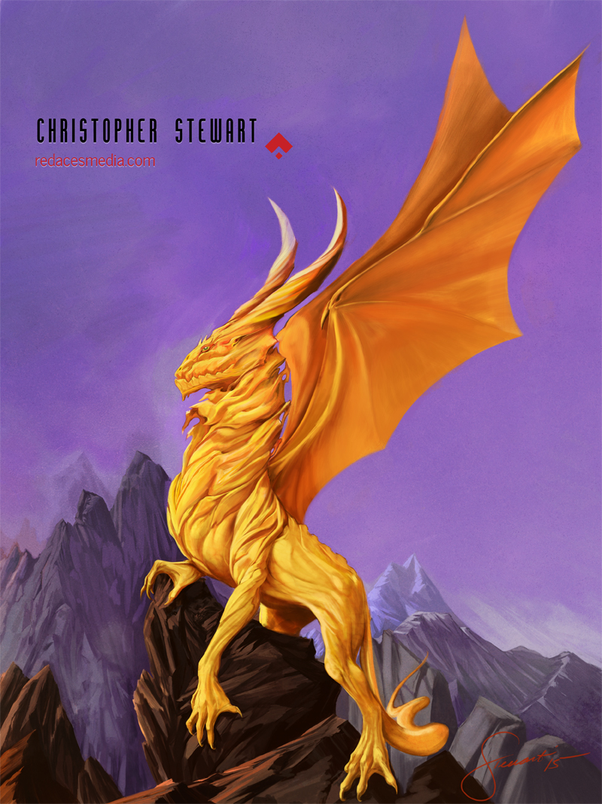

### 

### Could you tell us something about yourself?

My name is Christopher, and I am an illustrator living in Northern California. When I'm not in a 2d mindset I like to sculpt with Zbrush and Maya. Some of my interests include Antarctica, Hapkido and racing planes of the 1930s.

### Do you paint professionally, as a hobby artist, or both?

I have been working professionally for quite some time. I have worked for clients such as Ubisoft, Shaquille O'Neal and Universal Studios. I'm always looking for new and interesting work.

### What genre(s) do you work in?

SF, Fantasy, and Comic Book/ Sequential art. This is where the foundation of my work lies – these genres have always been an inspiration to me ever since I was a kid.

### Whose work inspires you most -- who are your role models as an artist?

Wow, what a tough question! So many great artists out there.. Brom- definitely, N.C. Wyeth, George Perez, and Alphose Mucha. Recently I have revisited the background stylists of Disney with their immersive environments.

### How and when did you get to try digital painting for the first time?

About 9 years ago. Until then my work was predominantly traditional. I wanted to try new mediums, and I thought digital painting would be a great area to explore.

### What makes you choose digital over traditional painting?

Time and space.

Alterations and color adjustments can be done quickly for a given digital piece.

The physicality of traditional medium has different challenges, and usually the solution will take longer to accomplish with traditional mediums in general.

Digital painting doesn't take up a lot of space, a few decent sized stretched canvases..

### How did you find out about Krita?

I had tried Painter X and CS and they were unsatisfying, so I was looking for a paint program. Krita was recommended by a long-time friend who liked the program, and I was hooked.

### What was your first impression?

It was very intuitive. It had a UI that I had very few difficulties with.

### What do you love about Krita?

I really really liked the responsiveness of the brushes. With other applications I was experiencing a “flatness” from the tablet I use to the results I wanted on screen, Krita's brushes just feel more supple. The ability to customize the interface and brushes was also a huge plus.

### What do you think needs improvement in Krita? Is there anything that really annoys you?

I haven't been using Krita very long (less than 6 months) but I would like to be able to save and import/export color history as a file within an open Krita document.

### What sets Krita apart from the other tools that you use?

When a company makes an application as powerful as Krita available for free, it’s a statement about how confident they are that artists will love it. And judging from the enthusiastic and knowledgeable people in the forums, they not only love it they want others to be able to love it and use it too. Developing and experienced artists need to evaluate new tools easily. Access to those tools should never be so prohibitively costly as to turn them away. Krita doesn’t get in the way of talent being explored, it supports it.

### What techniques and brushes do you prefer to use?

I use a lot of the default brushes especially the Bristle brushes, a semi transparent texture to add to a plein air look as a final layer. I use some of David Revoy's brushes, specifically the Splatter brushes. I recently made a new custom brush that I tried out on my most recent illustration.

### Where can people see more of your work?

My website is [redacesmedia.com](http://redacesmedia.com). You can reach me there!

### Anything else you'd like to share?

Thank you so much for the interview and a special thanks to the developers and community that make Krita work!
