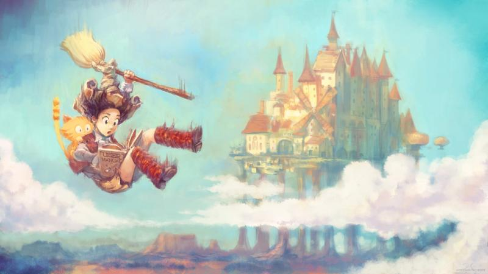

### Could you tell us something about yourself?

I'm a 33-year-old French CG artist. I worked for many industries: traditional-painting, illustration, concept-art, teaching. Maybe you've already come across some of my artwork while browsing the web, for example my work on open movies (Sintel, Tears of Steel, Cosmos Laundromat) or on various board games  (Philip Jose Farmer's 'The maker of universes', Lutinfernal, BobbySitter) or book series (Fedeylin, Club of Magic Horse) and artworks like [Alice in Wonderland](http://www.davidrevoy.com/article36/alice-in-wonderland) or [Yin Yang of World Hunger](http://www.davidrevoy.com/article43/yin-and-yang-of-world-hunger). Something I think specific about me is that I rarely accept ready-made ideas, I work to build my own opinions. This process leads me to reject many things accepted as normal by my contemporaries: TV, proprietary software, politics, religion... I despair when I hear someone saying "I do this or this because everyone does it". I like independence, cats and deep blue color.

### Do you paint professionally, as a hobby artist, or both?

I'm a happy artist doing both. Nowadays I work mainly on my own web comic, [Pepper&Carrot](http://www.peppercarrot.com/). An open web comic done with Krita and supported by the readers. Managing everything on this project is hard and challenging, but extremely rewarding on a personal level. Pepper&Carrot is the project of my dreams.

### What genre(s) do you work in?

I've worked in many genres, but currently I'm sticking to a homemade fantasy world for a general audience.

### Whose work inspires you most -- who are your role models as an artist?

I do not really have a role model, but I'm deeply impressed by artists able to melt the limits between industries, as [Yoshitaka Amano](http://en.wikipedia.org/wiki/Yoshitaka_Amano) did between concept art, illustration and painting.

### How did you get to try digital painting for the first time?

My first real digital-painting contact was with Deluxe Paint II on MS-DOS in 1992. As a kid in the nineties, I was very lucky to have a computer at home. Fortunately, my parents and siblings were afraid of the home computer and I had it all to myself. For the younger generation reading this, just imagine: no internet, Windows 3.1, VGA graphics (640x480px, 256 colors).

### What makes you choose digital over traditional painting?

I left the school system and my parents' home at 18 years old. I was too much of a rebel to follow any type of studies and eager to start my own life far from any influence. I first worked as a street portraitist in Avignon then. Outside the tourist season I started to do traditional painting. What I remember was the stock -the physical size of it- over 100 canvases take up a lot of room in a small apartment. I also had long drying times for commissions in oil, and when something wasn't accepted by a client, I had to start over...

I discovered modern digital painting thanks to my first internet connection around 2000 and the first forums about it. I was amazed: brilliant colors, rich gradients, a lot of fantasy artworks. Before 2000, you had to pay for a book or go to exhibitions to see new artworks. And suddenly many artists were on the internet, and you could see thousands of artworks daily. Forums where starting to open everywhere and CG artist shared tips, tutorials, work-in-progress threads. The internet of CG artist was new, full of hope and full of humanity...

I bought a tablet to start to paint digitally during this period. I didn't know many things about software, so my first years of digital painting were made with Photoshop Elements (bundled with the tablet). With digital painting, I could experiment with many themes I could never have sold on canvas. Then I met online publishers interested in my digital art and started to work more and more as a digital painter with an official Photoshop licence, Corel Painter, etcetera. In 2003 I ended my career as a traditional painter when a client decided to buy my whole stock of canvas.

### How did you find out about Krita?

I first heard about Krita on forum news, around 2007. Krita was a Linux-only program at this time and I was still a Windows user then (I moved to using Gnu/Linux full-time in 2009). I remember I spent time to try to install it and didn't succeed. I had a dual-boot with Linux-Mint 4.0 and I was already enthusiastic about open-source technologies, especially Blender.

My first contact with drawing in Krita was in 2009 when I was preparing my work as art director on the Sintel project and studied all the open source painting applications on Linux (Gimp, Gimp-painter fork, Mypaint, Qaquarelle, Gogh, Krita, Drawpiles, and even the web-based paint-chat ones). I really wanted to use _only_ open source on GNU/Linux for the concept art. This crazy idea was a big turn in my career, and more when I decided to stick to it after the Sintel project.

I started my first years of 100% GNU/Linux using a mix of Gimp-painter 2.6, Mypaint and Alchemy. I published many tutorials and open DVDs about it: Chaos&Evolutions or Blend&Paint to document all the new tips I found. But Gimp-painter 2.6 was harder and harder to install because all GNU/Linux distributions were pushing Gimp 2.8 as default, and the two versions couldn't live side by side. I wasn't happy with Gimp 2.8. It was impossible to paint with it when they released it, and the Gimp-painter features I liked were not merged into the official release. Mypaint on the other side was transitioning in pain to newer technologies and the main developer left the project... I remember I felt stuck for a while, asking myself if my rebel move to only GNU/Linux was worth it. Nothing was really evolving positively about digital painting on GNU/Linux at this time.

Then I decided to start following Krita actively and invest as much time as I could in it. Krita wasn't popular at all back in the day: 2.2/2.3 wasn't ready, not for production, and the first years that I used it I started out by accepting the various regressions. I adapted, bug-reported, helped other artists build it, showed the features of new releases, communicated about it and the most important: kept painting with it. It was a good choice. I was convinced by three factors:

1. the project vision, clearly set up to be a digital-painting application.
2. the massive energy, passion and time put on it by Boudewijn Rempt, Dmitry Kazakov, Lukáš Tvrdý, Sven Langkamp and many other developers.
3. the friendly community.

### What was your first impression?

It was in 2009, and it was impossible to paint smoothly on a 1000x1000px canvas. Krita already had a lot of features: CMYK, rich brush engines, a single windows interface, selections, transform tool, etcetera... but most of those were half working or broken when you wanted to make real use of it. The project was missing users, beta-testers. I'm proud to have already reported over 200 bugs to the Krita bug tracker since then. Nowadays, I'm sort of part of the Krita team, I even made my first official commit last week.

### What do you love about Krita?

This will sound geeky, but probably my favourite feature is the command-line exporter.

~$ krita in.kra --export-filename out.png

This feature is a central key to speed-up my workflow, I included this command in bash scripts to batch transform Krita files to low-res JPGs, hi-res PNG, and so on. It allows me to keep only a single source file in my work folder ; all derived versions (internet version, publisher version) are auto-generated when the .kra source file is changed. This way I'm never afraid that I have to export everything again when I do a single change on a painting source file, or when one of the 16 languages of Pepper&Carrot gets an update. I just do it, save, and everything else, generation, watermarking, ftp upload and so on are automatised.

Check the [Source files of Pepper&Carrot](http://www.peppercarrot.com/en/static6/sources) if you are curious to see what automatised export output looks like. I wish the command-line export could do a bit more, for example adding the possibility to export top-level groups to multiple files.

### What do you think needs improvement in Krita? Is there anything that really annoys you?

Stability needs improvement.

I invite all Krita users who wants to help making Krita more stable to report their bugs, and not expect _someone else will do it for them_ or expect _the developers will see it_.

But there is one big issue in this process ; the bug-report website is not user friendly at all and not visual. It has many limited features (formatting, inserting pictures or videos). If the Krita project wants to keep trusting the userbase only to do volunteer beta-testing at a professional level, I think the project will need to make the life of the beta-testers easier.

It make me remember how the Mypaint project was also affected by this with the [old bug-tracker](http://gna.org/bugs/?group=mypaint). When the project moved the bug tracker to [Github](https://github.com/mypaint/mypaint/issues) the amount of new issues reported just went insane. Much discussion happens on it now; avatars of users, formatting with title/bold/italic, inserting pictures make it way more friendly and human. Look at this type of [bug-report with image and all](https://github.com/mypaint/mypaint/issues/320): it's a lot more adapted to how artists, the general audience or visually driven persons might want to report a bug. And I'm also pretty sure it would help developers to better see and solve the issues.

### What sets Krita apart from the other tools that you use?

Krita (and digital-painting apps in general, or digital sculpting) are really a different thing from other software. Krita really needs to be realtime between me and the computer. Painting is a realtime experience and, when I paint, I can really feel when Krita doesn't follow the rhythm. I think that's why everyone is so happy to see the Krita team working on the performance topic in the [kickstarter campaign](https://www.kickstarter.com/projects/krita/krita-free-paint-app-lets-make-it-faster-than-phot).

### If you had to pick one favourite of all your work done in Krita so far, what would it be, and why?

It would be the [the latest episode](http://www.peppercarrot.com/en/article273/episode-7-the-wish) of Pepper&Carrot. As an artist constantly evolving and changing, the latest piece is probably the one telling more things about where I am right now. Older artworks like [the portrait of Charles Darwin](http://www.davidrevoy.com/article145/portrait-of-charles-darwin) or [Lecture](http://www.davidrevoy.com/article137/lectures) tell different stories, more near to where I was in 2012.

### What techniques and brushes did you use in it?

I used my [brush kit on it](http://www.davidrevoy.com/article248/krita-brushes-v6), and tried to paint directly what I had in mind using almost no extra layers. I painted it flat as I would do for a production concept-art speed painting. Then I refined on the top the level of details and constrained myself to not smooth the result too much.

### Where can people see more of your work?

Probably on my portfolio [www.davidrevoy.com](http://www.davidrevoy.com).

### Anything else you'd like to share?

I invite you to network with me on [twitter](https://twitter.com/davidrevoy), [google+](https://plus.google.com/u/0/+DavidRevoy/posts), or [deviantArt](http://deevad.deviantart.com/) if you want to chat about Krita or follow my new artwork, tutorials and resources. I also started a [Youtube channel](https://www.youtube.com/user/DeevadRevoy/videos) with video tutorials about Krita. Do not hesitate to comment and also share your tips or suggestions in the comments, I read them all and often reply. I'm also often connected to the IRC #krita channel on freenode. I'm using the nickname 'deevad'. See you there!
