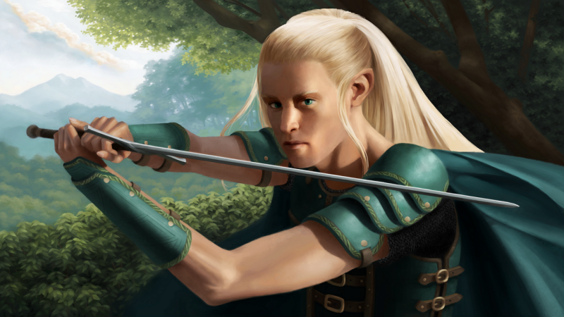

###  Would you like to tell us something about yourself?

My name is Elésiane Huve, I'm a freelance illustrator living in the south of France. I usually publish my artworks under the nickname Aliciane. I'm specialized in illustrations related to Fantasy or History.

### Do you paint professionally or as a hobby artist?

I paint professionally. I started to work as a full time illustrator in November 2014. I've originally pursued studies in a completely different field. However, as I was dedicating most of my time to painting, I came to the conclusion that being an illustrator was a more fitting choice of career for me. Therefore, I'm completely self-taught.

### When and how did you end up trying digital painting for the first time?

I think it was in 2005 or so. I was writing a novel and I wanted to illustrate it. I started by using coloured pencils as I wasn't familiar with painting at that time. But I felt quite limited by the small number of pencils I had. Instead of buying more of them, I decided to buy a graphic tablet since I thought this single investment would offer me unlimited possibilities; and it did, especially since this first tablet lasted for about 7 years!

### What is it that makes you choose digital over traditional painting?

As I said before, I think that the first benefit of digital painting is the ratio between the offered possibilities and the required investment. With only a small and cheap graphic tablet, you can do virtually anything without limitations. You do not have to buy new paint, new pencils or to consume sheets of paper. As I cannot "waste" any material, I feel free to experiment a lot more with digital painting.

It is also impossible to mess up since you can save as many steps of your work as you want and go back to a previous version if you need it. You can also branch and try several ideas derived from the same step. I think that especially when you begin, this is a very comforting feeling that allows you to try crazier ideas.

Finally, digital painting does not require space or storage if you already own a computer.

### How did you first find out about open source communities? What is your opinion about them?

When I started digital art in fact. As I didn't have the money to invest in proprietary software, I looked for an alternative and I discovered Gimp. I have been very positively surprised to discover that software made by volunteers was just as good as closed software; I was able to apply any tutorial made for Photoshop to my work without any difficulty.

More generally speaking, I think open source communities have a great potential in both development and support. They have a human face, and I like the fact that anyone can get involved and participate in one way or another. Open source software is created by and for its community.

Nowadays, I try to use as many FOSS as possible. I have recently fully migrated to Linux which gives me an amazing work environment.

### How did you find out about Krita?

I think it was through David Revoy or Ramon Miranda. I'm following those two artists and they started to post about Krita and release resources for it around the same time period. Therefore I told myself I should give it a try; it stayed that way a couple of months before I eventually ended up trying (and adopting!) it.

### What was your first impression?

My very first impression was: "Where is the brush tool?!"

At that time the icon was a wavy line and I must admit that it wasn't intuitive at all for me, I thought this was the Bézier curve tool ! It took me quite a while to find it. Thankfully in the latest versions the icon is a lovely brush icon :)

### What do you love about Krita?

Most of all, I love the brush engine, the default presets are really comfortable to work with. I used to blend a lot, but with Krita I can make my transitions with little to no blending at all, thus achieving a way more painterly result. The brushes have a more traditional feeling which is exactly what I'm looking for.

I also love to be able to mirror the canvas quickly by a simple shortcut. Generally speaking, I love Krita's shortcuts. I can do almost everything I need by combining a modifier key and pen pressure (rotating the canvas, changing the brush size, constraint proportions, ...).

Finally, the assistant tools are awesome. Perspective work is just so comfortable in Krita. The ellipse assistant in particular is a life saver. I haven't yet tested the brand new vanishing point and parallel line assistants, but I will very soon put them to good use !

### What do you think needs improvement in Krita? Also, anything that you really hate?

Hate is a very strong word, I don't think any issue deserves such a harsh feeling from me! If I had to nitpick, there are a few very minor things that annoy me or break my work flow.

I love to use the stabilizer when I'm doing line work, and more specifically perspective work; it really improves the quality of my strokes and allows me to swift long and elegant lines. However, the stabilizer feature doesn't seem to be compatible with the ellipse assistant. When it is activated, the stroke does not follow the assistant. Therefore, each time I want to draw an ellipse, I have to deactivate the feature and reactivate it right after.

I also had the habit of using the shade selector for displaying equally spaced grayscale values, but it became difficult in the latest version. I think that in fact I'd like to use the shade selector to display a custom fixed color selection, but it wouldn't be quite the same feature any more.

Finally, I would find it convenient to have the possibility to enter directly a specific value when I change a parameter such as a layer's opacity or a brush's size. I'd also like a customizable sharpen filter.

Well, as you can see, this is really nitpicking! Everything major was in fact solved in the recently released beta version, such as the ability to open several files in the same session using tabs or sub-windows.

### In your opinion, what sets Krita apart from the other tools that you use?\*

Mainly the fact that Krita is really designed for the digital painting process. For instance, in my opinion, MyPaint is too minimal for being used in every step of my process; on the contrary, Gimp isn't fully oriented toward digital painting, it is a more generalist software which has a lot of features dedicated to photo editing.

Krita is digital painting software, and I think that's the reason why as a painter I find it so comfortable.

### If you had to pick one favourite of all your work done in Krita so far, what would it be?

I think it would be "The Swordmaster".

### What is it that you like about it? What brushes did you use in it?

It is by far the most ambitious piece I made in a long time. Before painting it, I spent a couple of months reviewing my fundamentals, learning theoretical principles and painting studies. This piece is the conclusion of this learning period and thus reminds me of my progress.

I tend to use a very small number of brushes. My three main brushes are variations of the "Bristles Wet" default preset. This preset gives a result I find very close to traditional oil painting rendering, which is what I'm looking for. It has a slight tapering effect, leaves a subtle texture and blends very nicely. So I have a basic version that I use practically for everything, a soft textured version I use for the softer transitions (on the face for instance) and a hard version I paint the small details with (such as the leaves).

### Would you like to share it with our site visitors?

It's at the top of this post.

### Anything else you'd like to share?

If you're interested in seeing more of my work, you can visit my online portfolio at [http://www.aliciane.portfoliobox.me/](http://www.aliciane.portfoliobox.me/)

I'm looking forward to see what new amazing features you'll add to Krita in the future!
