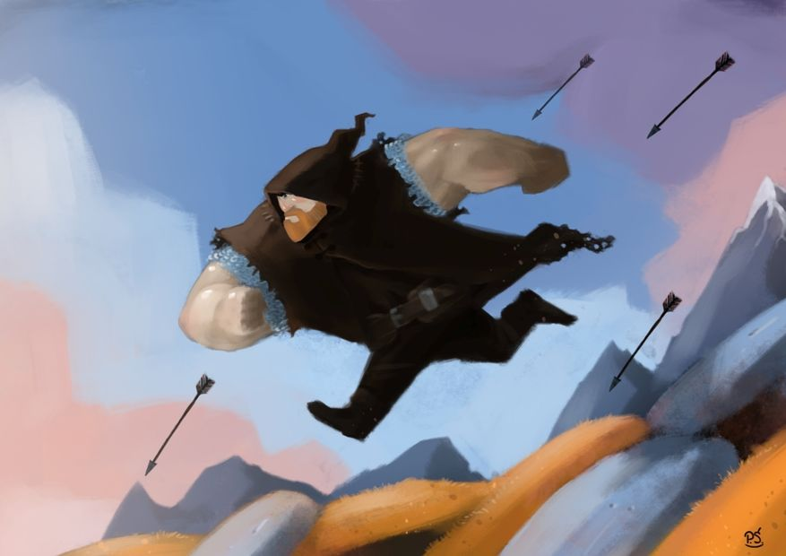
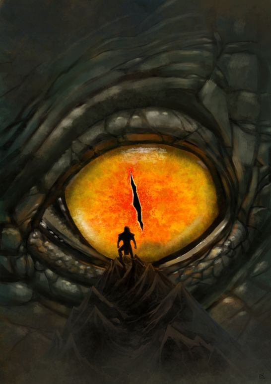
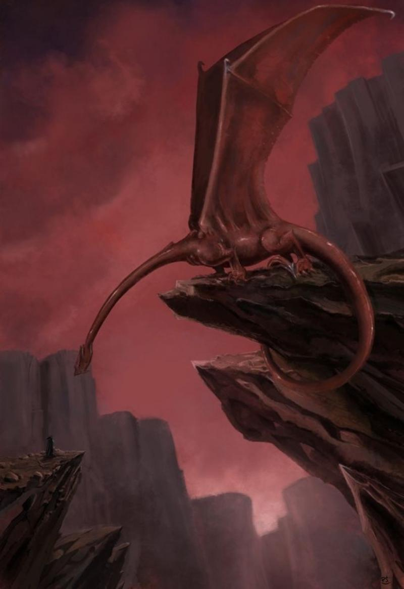

### Could you tell us something about yourself?

My name is Przemek Świszcz. I also publish as Graphos. I’m a drawer and a graphic artist. I do comic strips and illustrations and create in 3D as well.

### Do you paint professionally, as a hobby artist, or both?

I draw professionally but it is also my hobby. And fortunately, I can bring it together.

### What genre(s) do you work in?

I’m interested mostly in fantasy, science fiction and humorous topics. 

### Whose work inspires you most -- who are your role models as an artist?

Among the many excellent artists, my favorite creators are Grzegorz Rosiński, Janusz Christa, Simon Bisley and Don Rosa. However, not only comics artists but also many others are inspiration for me.

### How and when did you get to try digital painting for the first time?

This is connected with computer games. I'm a gamer myself so I combined these two hobbies. That’s the reason why I draw such forms as concept art. I decided to try my hand at digital.

### What makes you choose digital over traditional painting?

I still use some traditional techniques like watercolor, acrylic and drawing ink. But digital gives endless possibilities and enables editing. Most of all, it is very handy. I have all works on the computer immediately, there is no need to scan and process. This is especially important with regard to comic books.

### How did you find out about Krita?

I found out about Krita when I bought a graphic tablet and I was looking for an appropriate drawing tool. I read lots of positive opinions about this program on the Internet forum [www.blender.pl](http://www.blender.pl "Polish Blender forum"), so I decided to try.

### What was your first impression?

My first impression of this program was "Wow, it is really good, very handy and intuitive".

### What do you love about Krita?

I like the fact that Krita is free and being updated and added to all the time, It’s a great and professional tool to create comic strips.

### What do you think needs improvement in Krita? Is there anything that really annoys you?

Krita is already a really good computer program. Some errors and crashes appears from time to time but with every new version it’s getting better. I think that tools to create animation could be a great novelty. I’m looking forward to the next version of Krita.

### What sets Krita apart from the other tools that you use?

I can already do most of my work with Krita. I use other programs occasionally because some of them have useful options for processing drawings and photos.

### If you had to pick one favourite of all your work done in Krita so far, what would it be, and why?

 That could be the drawing with the dragon and dwarf or fantasy illustrations in cartoon style with the brawny man. It gives me lots of fun, both drawing it and finding out new possibilities of Krita.

### What techniques and brushes did you use in it?

I mainly used draft pencils and draft brushes which turn out to be my favourite tools in Krita.

### Where can people see more of your work?

The majority of my works you can find here: [http://drawcrowd.com/graphos/projects]( http://drawcrowd.com/graphos/projects "Gallery of Graphos' work")

### Anything else you'd like to share?

Thank you for inviting me. I hope that Krita will acquire more and more users because it is worth it, keep it up :)
