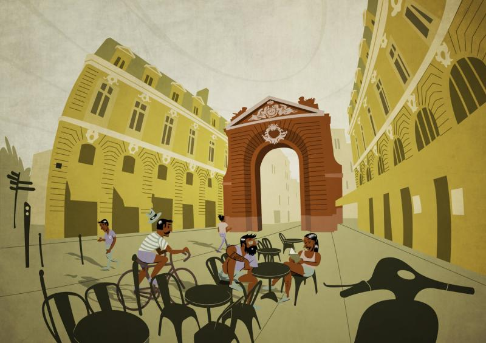
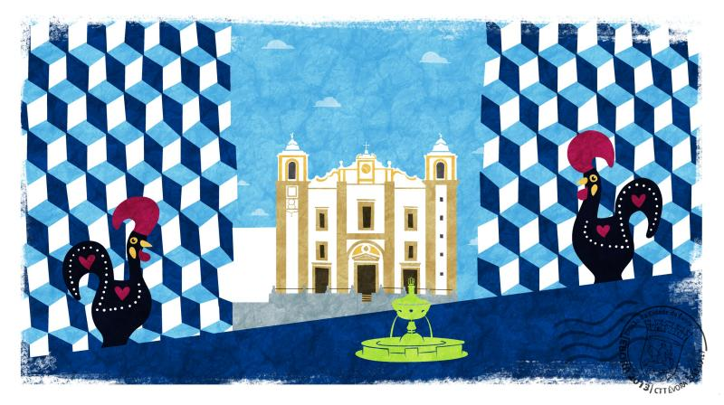

### 

### Could you tell us something about yourself?

I’m Livio Fania. I’m Italian Illustrator living in France.

### Do you paint professionally, as a hobby artist, or both?

I paint professionally.

### What genre(s) do you work in?

I make illustrations for press, posters and children books. My universe is made by geometrical shapes, stylized characters and flashy colors.

### Whose work inspires you most -- who are your role models as an artist?

I like the work of João Fazenda, Riccardo Guasco and Nick Iluzada among many others.

### What makes you choose digital over traditional painting?

I did not take a definite choice. Even if I work mainly digitally, I still have a lot of fun using traditional tools such as colored pencils, brush pens and watercolors. Besides, in the 90% of cases I draw by hand, I scan, and just at the end of the process I grab my graphic tablet stylus.

I do not think that working digitally means to be faster. On the contrary, I can work more quickly by hand, especially in the first sketching phases. What digital art allows is CONTROL all over the process. If you keep your layer stack well organized, you can always edit your art without losing the original version, and this is very useful when your client asks for changes. If you work with traditional tools and you drop your ink in the wrong place, you can’t press Ctrl+z.

### How did you find out about Krita?

I discovered Krita through a video conference posted on David Revoy’s blog. Even if I don’t particularly like his universe, I think he is probably the most influential artist using FLOSS tools, and I’m very grateful to him for sharing his knowledge with the community. Previously, I used to work with MyPaint, mainly for its minimalist interface which was perfect for the small laptop I had. Then I discovered that Krita was more versatile and better developed, so I took some time to learn it and now I could not do without it.

### What was your first impression?

At first I thought it was not the right tool for me. Actually, most digital artists use Krita for its painting features, like blending modes and textured brushes, which allow to obtain realistic light effects. Personally, I think that realism can be very boring and that is why I paint in a stylized way with uniform tints. Besides, I like to bound my range of possibilities in a set of limited elements: palettes of 5-8 colors and 2-3 brushes. So at the beginning I felt like Krita had too many options for me. But little by little I adapted the GUI to my workflow. Now I really think everybody can find their own way to use Krita, no matter the painting style they use.

### What do you love about Krita?

Two elements I really love: 1) The favourite presets docker which pops up with right click. It contains everything you need to keep painting and it is a pleasure to control everything with a glance. 2) The Composition tab, which allows to completely change the color palette or experiment with new effects without losing the original version of a drawing.

### What do you think needs improvement in Krita? Is there anything that really annoys you?

I think that selections are not intuitive at all and could be improved. When dealing with complex selections, it is time-consuming to check the selecting mode in the option tab (replace, intersect, subtract) and proceed accordingly. Especially considering that by default the selecting mode is the same you had when you used the tool last time (but in the meantime you probably forgot it). I think it would be much better if every time a selection tool is taken, it would be be in "normal" mode by default, and then one can switch to a different modes by pressing Ctrl/Shift.

### What sets Krita apart from the other tools that you use?

Krita is by far the most complete digital painting tool developed on Linux. It is widely customizable (interface, workspaces, shortcuts, tabs) and it offers a very powerful brush engine, even compared to proprietary applications. Also, a very important aspect is the that the Krita foundation has a solid organization and develops it in a continuous way thanks to donations, Kickstarter campaigns etcetera. This is particularly important in the open source community, where we have sometimes well designed projects which disappear because they are not supported properly.

### If you had to pick one favourite of all your work done in Krita so far, what would it be, and why?

 The musicians in the field.

### What techniques and brushes did you use in it?

As i said, I like to have limited presets. In this illustration I mostly used the "pastel\_texture\_thin" brush which is part of the default set of brushes in Krita. I love its texture and the fact that it is pressure sensitive. Also, I applied a global bitmap texture on an overlay layer.

### Where can people see more of your work?

[www.liviofania.com](http://www.liviofania.com "Livio Fania") [https://www.facebook.com/livio.fania.art](https://www.facebook.com/livio.fania.art "Livio Fania's Facebook art page")

### Anything else you'd like to share?

Yes, I would like to add that I also release all my illustrations under a Creative Commons license, so you can Download my portfolio, copy it and use it for non-commercial purposes.
