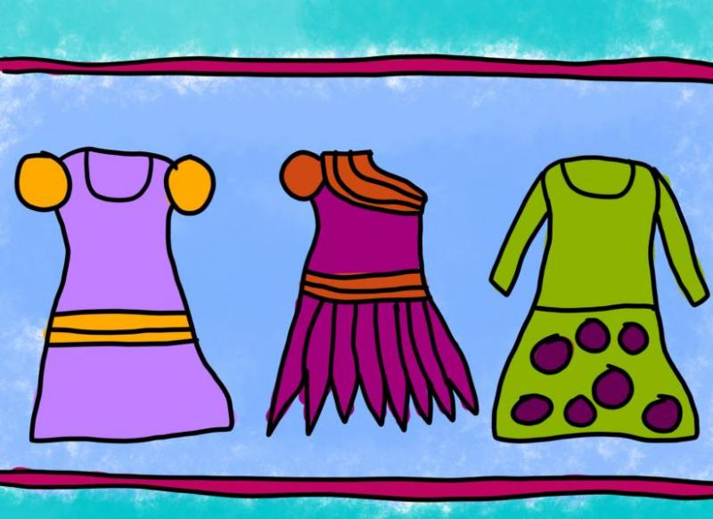

### Could you tell us something about yourself?

Hello, I am a young woman who is passionate about colorful art and details. My addiction to details is a dominant feature in my artwork.

### Do you paint professionally, as a hobby artist, or both?

Well, I see drawing as a hobby only. That's because I need a clear "border" between working life and free time. I admit it.

### What genre(s) do you work in?

I would say that my art style is unique. It's difficult for me to describe my style. I would say that my artwork is most closely to naive art. Naive art's characteristics are colorful, detailed and simplistic. It also ignores the rules of perspective.

### Whose work inspires you most -- who are your role models as an artist?

I have many influences. My most important sources of inspiration are naive and folk art paintings, simplistic cartoons and books about art techniques. I've never had formal art training because I see drawing as a hobby only.

### How and when did you get to try digital painting for the first time?

I bought my Wacom graphics tablet in late 2014. I wanted to try something different and that was the reason I started digital painting at that time.

### What makes you choose digital over traditional painting?

Digital painting is inexpensive to me because of this forgiving nature. You cannot mess up a picture in digital art because you can start over and over. I love digital painting for this reason.

### How did you find out about Krita?

I painted my very first digital artwork with GIMP. But soon, GIMP was too complicated for digital painting for me. I searched for free GIMP alternatives. After hours of searching, I found Krita and I downloaded it.

### What was your first impression?

"It looks and feels very professional but it is for free. WOW!" I thought.

### What do you love about Krita?

I love Krita because it is professional in the look and feel but it is for free. I also like the large amount of digital painting brushes in Krita.

### What do you think needs improvement in Krita? Is there anything that really annoys you?

I like Krita very much but the perspective grid tools could be easier to handle. That's all.

### What sets Krita apart from the other tools that you use?

Krita is better for digital painting than other tools. Other software is more focused on image manipulation. And I don't use closed source painting programs because they are very expensive.

### If you had to pick one favourite of all your work done in Krita so far, what would it be, and why?

One of my most favorite Krita paintings is "Three Little Dresses". This digital painting shows my addiction to naive and colorful art very well. It is also focused on details.

### What techniques and brushes did you use in it?

I have used three kinds of brushes: basic tip, sponge texture and circle filling. I use these brushes most frequently in my digital paintings.

### Where can people see more of your work?

I have a few social network accounts for publishing my best artworks. But my most important account is on DeviantArt. Here is the link to my art on DeviantArt: [www.serenitywing.deviantart.com](http://www.serenitywing.deviantart.com)

### Anything else you'd like to share?

Thank you for the great efforts on the development of Krita!
