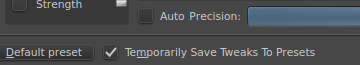
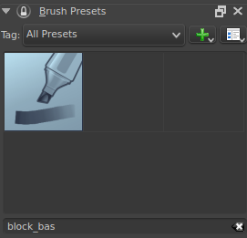
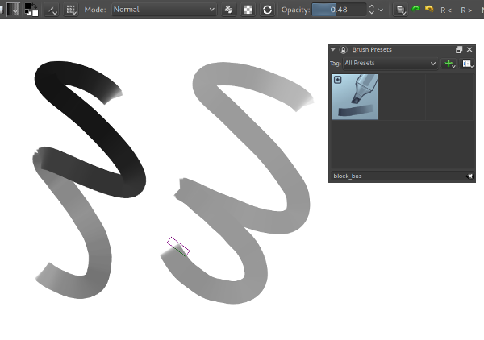
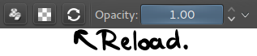
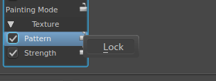
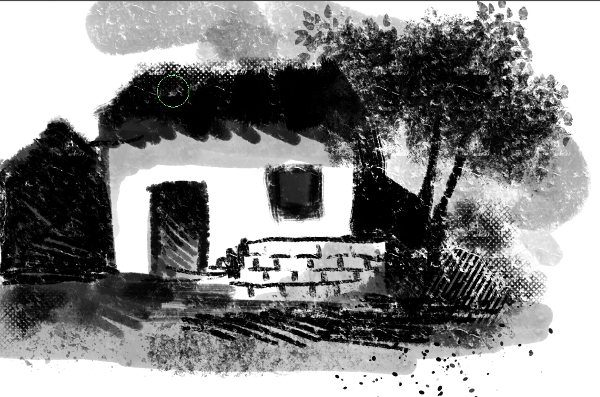
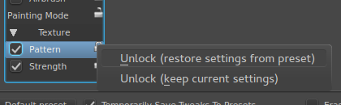
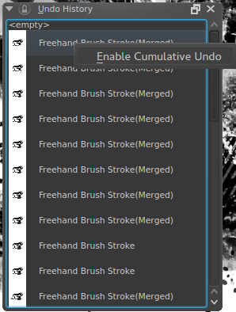
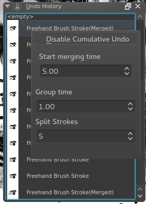

One of the 2014 Google Summer of Code projects for Krita is going to be in the next release, Krita 2.9. It's a bit complicated, so here's a short tutorial in using Mohit's Dirty Presets, Locked Brush Settings and Cumulative Undo projects!

## 1\. Dirty Presets

This is a feature a lot of people asked for: It allows Krita to remember small changes made to a preset during a session, without it saving over the original. You activate it in the brush settings window, by ticking 'Temporarily Save Tweaks To Presets'.

Then, select a preset.

Now, if you tweak a setting, like, say, opacity, Krita will make the preset 'dirty'. You can identify dirty presets by the little plus-icon on the preset icon.

To get the original settings back, press the reload button.

To retain these settings, just save the preset.

## 2\. Locked Brush Settings.

Another often requested feature, this allows you to lock to opacity, or brush-tip, or even texture.

You activate it by right-clicking the lock besides a setting. Then, select 'lock'.

Now, the setting will not be reloaded every time you select a new preset.

This can be used, for example, to keep the same texture over all presets.

You can unlock them by right-clicking the lock-icon again.

 There's two options here.

Unlock (Drop Locked)

This will get rid of the settings of the locked parameter and take that of the active brush preset. So if your brush had no texture on, using this option will revert it to having no texture.

Unlock (Keep Locked)

This will keep the settings of the parameter even though it's unlocked.

Finally, the last one.

## 3\. Cumulative undo.

Cumulative undo allows you to have undos merge together. This can be useful if you're the type to make a lot of tiny strokes, or to save memory.

Cumulative undo is activated via the Undo History Docker. Right-click an undo-state to enable it.

Afterwards, you can tweak it's settings by right-clicking the undo-state again.

Start merging time

The amount of seconds required to consider a group of strokes mergable. So if this is set to five, at the least five seconds must have passed for Krita to consider these strokes mergable.

Group time

The amount of time it needs between strokes for Krita to consider the next stroke to be part of a new group. So if it's set to 1, Krita will put strokes that were made more than 1 second after the first into a new merged group.

Split strokes.

The minimum amount of last strokes that stay undoable without being merged. So if you have this set to 3, and make five strokes, only the two oldest ones will be merged.

Disable this by right-clicking an undo-state and disabling it. After this, you can start undoing large sets of strokes! The merged items will be represented with 'merged' behind their name in the undo history.
