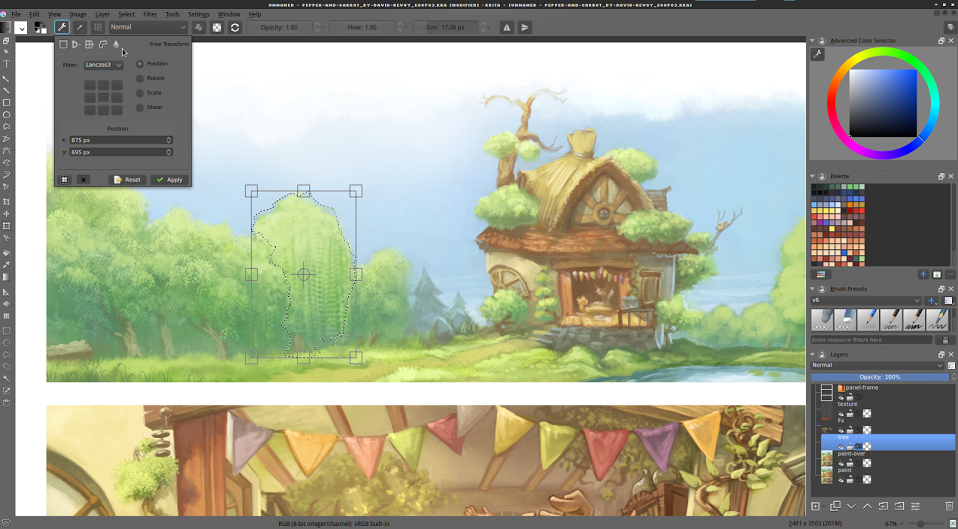

After a month of bugfixing, we give you Krita 2.9.6! With lots of bugfixes, but bugfixes aren't the only thing in 2.9.6, we also have a few new features!

The biggest change is that we now have _selection modifiers_! They are configured as follows:

- Shift+click: add to selection.
- Alt+click: subtract from selection.
- Shift+alt+click: intersect selection
- Ctrl+click: replace selection (for when you have set the
- selection mode to something else but replace).

These don't work with the path tool yet, and aren't configurable, but we're going to work on that. Check out the [manual page](https://userbase.kde.org/Krita/Manual/Tools/RectangleSelect) for the selection tools for more information on how this relates to _constraint_ and _from center_ for the rectangle and ellipse select.

Also new: Continuous transform and crop!

<iframe src="https://www.youtube.com/embed/QTIO-Nk3CuA" width="560" height="315" frameborder="0" allowfullscreen="allowfullscreen"></iframe>

Now, when you applied a transform or crop, and directly afterwards click on the canvas, Krita will recall the previous transform or crop, and allow you to adjust that instead! If you press 'esc' when in this 'continuous mode', Krita will forget the continuous transform, and allow you to start a new one.

The final of the big new features must be that the tool-options can now be put into the toolbar:

By default it's still a docker, but you can configure it in _settings->configure Krita->general_. You can also easily summon this menu with the '\\' key!

And Thorsten Zachmann has improved the speed of all the color adjustment filters, often by a factor of four or more.

Full list of features new to 2.9.6:

- Add possibility to continue a Crop Tool action
- Speed up of color balance, desaturate, dodge, hsv adjustment, index color per-channel and posterize filters.
- Activate Cut/Copy Sharp actions in the menu
- Implemented continuation of the transform with clicking on canvas
- new default workspace
- Add new shortcuts ('\\' opens the tool options, f5 opens the brush editor, f7 opens the preset selector.)
- Show the tool options in a popup (toggle this on or off in the general preferences, needs restarting Krita)
- Add three new default shortcuts (Create group layer = Ctrl+G, Merge Selected layer = Ctrl+Alt+E, Scale image to new size = Alt+Ctrl+I )
- Add an 'hide pop-up on mouseclick option' to advanced color selector.
- Make brush 'speed' sensor work properly
- Allow preview for "Image Background Color and Transparency" dialog.
- Selection modifier patch is finally in! (shift=add, alt=subtract, shift+alt=intersect, ctrl=replace. Path tool doesn't work yet, and they can't be configured yet)

Bugfixes new to 2.9.6

- BUG:346932 Fix crash when saving a pattern to a \*.kra
- Make Group Layer return correct extent and exact bounds when in pass-through mode
- Make fixes to pass-through mode.
- Added an optional optimization to slider spin box
- BUG:348599 Fix node activating on the wrong image
- BUG:349792 Fix deleting a color in the palette docker
- BUG:349823 Fix scale to image size while adding a file layer
- Fixed wrapping issue for all dial widgets in Layer Styles dialog
- Fix calculation of y-res when loading .kra files
- BUG:349598 Prevent a divide by zero
- BUG:347800 Reset cursor when canvas is extended to avoid cursor getting stuck in "pointing hand" mode
- BUG:348730 Fix tool options visibility by default
- BUG:349446 Fix issue where changing theme doesn't update user config
- BUG:348451 Fix internal brush name of LJF smoke.
- BUG:349424 Set documents created from clipboard to modified
- BUG:349451 Make more robust: check pointers before use
- Use our own code to save the merged image for kra and ora (is faster)
- BUG:313296 Fix Hairy brush not to paint black over transparent pixels in Soak Ink mode
- Fix PVS warning in hairy brush
- (gmic) Try to workaround the problem with busy cursor
- BUG:348750 Don't limit the allowed dock areas
- BUG:348795 Fix uninitialized m\_maxPresets
- BUG:349346 (gmic) If there is selection, do not synchronize image size
- BUG:348887 Disable autoscroll for the fill-tool as well.
- BUG:348914 Rename the fill layers.

**Downloads**

- Linux:
    - Distributions are expected to create packages for their bleeding edge repositories.
    - Ubuntu and derivatives can use Krita Lime, as usual: [https://launchpad.net/~dimula73/+archive/ubuntu/krita](https://launchpad.net/%7Edimula73/+archive/ubuntu/krita).
    - OpenSUSE users can use the KDE:Extra repo: [http://download.opensuse.org/repositories/KDE:/Extra/](http://download.opensuse.org/repositories/KDE:/Extra/) or Leinir's OBS repositories which have Krita built with support for Vc (which makes painting faster):
        - [http://download.opensuse.org/repositories/home:/leinir:/calligragemini/openSUSE\_13.1/](http://download.opensuse.org/repositories/home:/leinir:/calligragemini/openSUSE_13.1/)
        - [http://download.opensuse.org/repositories/home:/leinir:/calligragemini/openSUSE\_13.2/](http://download.opensuse.org/repositories/home:/leinir:/calligragemini/openSUSE_13.2/)
        - [http://download.opensuse.org/repositories/home:/leinir:/calligragemini/openSUSE\_Factory/](http://download.opensuse.org/repositories/home:/leinir:/calligragemini/openSUSE_Factory/)
- Windows and OSX
    - The [download page](https://krita.org/download/krita-desktop/ "Krita Desktop") has been updated, so check out the new builds. If you don't want to use the MSI installer, go to [files.kde.org](http://files.kde.org/krita) for the portable zip-file based version of Krita for Windows.
    - You can also get the latest version of [Krita on Steam](http://store.steampowered.com/app/280680), using the "Desktop29" option in the Beta channel! Steam users get updates automatically.
