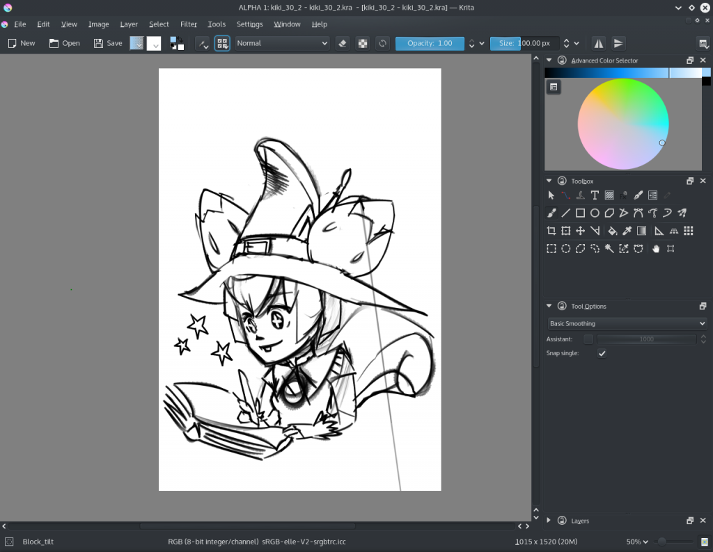

Lots of things are happening! Let's start with the most important part: Krita is no longer part of the Calligra source code. Krita 2.9 will still be developed inside Calligra, and we expect to do several more releases of Krita 2.9 with bug fixes and performance improvements. In fact, we expect to be releasing Krita 2.9 regularly until Krita 3.0 is done.

Krita 3.0 is now being developed at [projects.kde.org/projects/krita](https://projects.kde.org/projects/krita). Clone the source code with:

git clone git://anongit.kde.org/krita

and push to

 git@git.kde.org:krita

The next step will be setting up phabricator, reviewboard, the repo viewer, the github mirror, the translation system and so on.

In the meantime, Krita 2.9.8 is building, and we hope to have a release ready by Monday. It's a bit delayed, because of the Qt World Summit taking up some time.

### Kickstarter

Coding on all the kickstarter features is going on apace: the Level of Detail performance feature is nearly done, and Ubuntu Linux users can test it already by [installing the krita-lod-unstable packages from the Krita Lime repository](https://launchpad.net/~dimula73/+archive/ubuntu/krita). We're working on Windows packages as well. Having reached this point, Dmitry is now working on the animation feature, following up on the work Jouni did during the Google Summer of Code. It's mostly  improving and polishing the user interface now, possibly followed by a performance optimization phase.

### Qt5 Port

\[caption id="attachment\_2452" align="alignnone" width="1024"\] October Kiki, by Wolthera\[/caption\]

Krita 3.0, that is to say, the Qt5 port of Krita has come far enough that it's possible to actually do some drawing and sketching with it. The Qt5 developers, especially Shawn Rutledge did a real good job on improving Qt's support for tablets, but... There are bugs in the XCB library that need fixing. This means that tablet handling on Linux isn't perfect yet, and we haven't done a lot of testing on Windows yet. And the porting caused a lot of regressions, small bugs, visual issues, performance regressions... All of those need fixing over the next couple of months!
