

 

<iframe src="https://www.youtube.com/embed/mTKXnMHE8Co" width="420" height="315" frameborder="0" allowfullscreen="allowfullscreen"></iframe>

 (This video has subtitles in english)

 

Okay, so I've wanted to do a tutorial for transform masks for a while now, and this is sorta ending up to be a flower-drawing tutorial. _**Do note that this tutorial requires you to use Krita 2.9.4 at MINIMUM.**_ It has a certain speed-up that allows you to work with transform masks reliably!

I like drawing flowers because they are a bit of an unappreciated subject, yet allow for a lot of practice in terms of rendering. Also, you can explore cool tricks in Krita with them.

Today's flower is the Azalea flower. These flowers are usually pink to red and appear in clusters, the clusters allow me to exercise with transform masks!

I got an image from Wikipedia for reference, mostly because it's public domain, and as an artist I find it important to respect other artists. You can copy it and, if you already have a canvas, **edit->paste as new image** or **new->from clipboard**.

Then, if you didn't have a new canvas make one. I made an a5 300dpi canvas. This is not very big, but we're only practicing. I also have the background colour set to a yellow-greyish colour (#CAC5B3), partly because it reminds me of paper, and partly because bright screen white can strain the eyes and make it difficult to focus on values and colours while painting. Also, due to the lack of strain on the eyes, you'll find yourself soothed a bit. Other artists use #c0c0c0, or even more different values.

So, if you go to **window->tile**, you will find that now your reference image and your working canvas are side by side. The reason I am using this instead of the docker is because I am lazy and don't feel like saving the wikipedia image. We're not going to touch the image much. [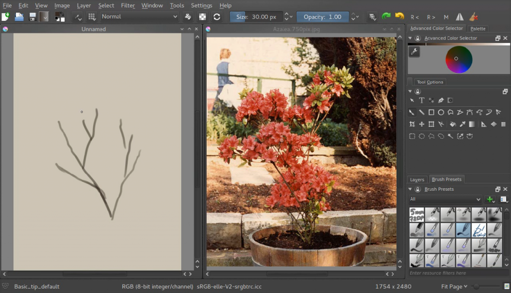](https://krita.org/wp-content/uploads/2015/05/azelea_01_trunk.png)

## Let's get to drawing!

 

First we make a bunch of branches. I picked a slightly darker colour here than usual, because I know that I'll be painting over these branches with the lighter colours later on. Look at the reference how branches are formed.

[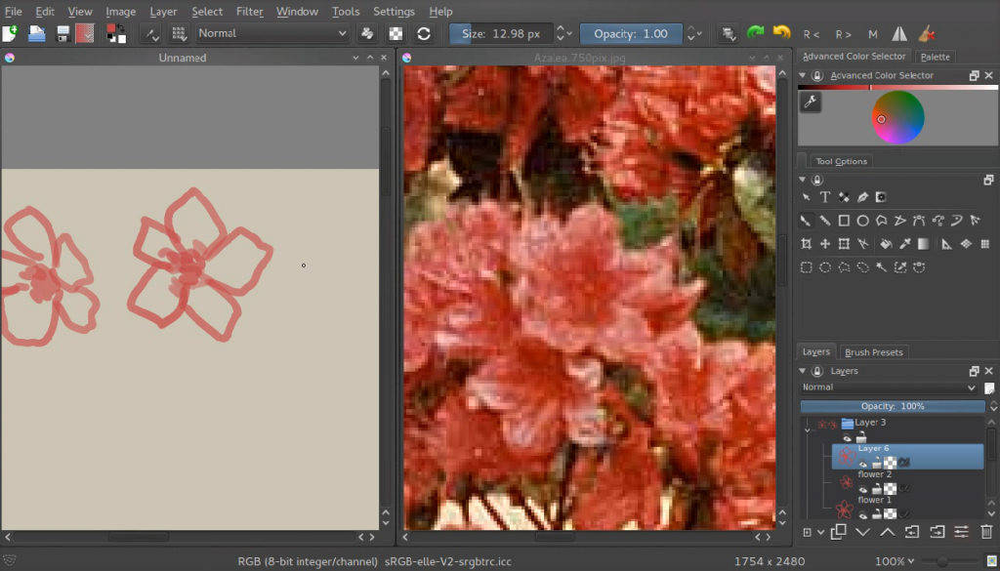](https://krita.org/wp-content/uploads/2015/05/azelea_02_drawing-flowers.png)

Then we make an approximation of a single flower on a layer. We make a few of these, all on separate layers. We also do not colour pick the red, but we guess at it. This is good practice, so we can learn to analyse a colour as well as how to use our colour selector. If we'd only pick colours, it would be difficult to understand the relationship between them, so it's best to attempt matching them by eye.

 

[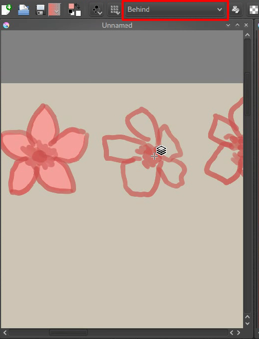](https://krita.org/wp-content/uploads/2015/05/azelea_03_filling-flowers.png)

I chose to make the flower shape opaque quickly by using the 'behind' blending mode. This'll mean Krita is painting the new pixels behind the old ones. Very useful for quickly filling up shapes, just don't forget to go back to 'normal' once you're done.

[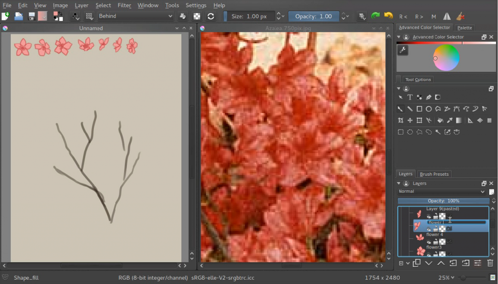](https://krita.org/wp-content/uploads/2015/05/azelea_04_finished-setup.png)

Now, we'll put the flowers in the upper left corner, and group them. You can group by making a group layer, and selecting the flower layers in your docker with ctrl+click and dragging them into the group. The reason why we're putting them in the upper left corner is because we'll be selecting them a lot, and Krita allows you to select layers with 'R'+Click on the canvas quickly. Just hold 'R' and click the pixels belonging to the layer you want, and Krita will select the layer in the layer docker.

[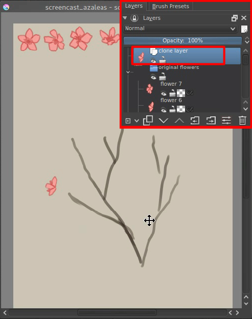](https://krita.org/wp-content/uploads/2015/05/azelea_05_clonelayer.png)

## Clone Layers

Now, we will make clusters. What we'll be doing is that we select a given flower and then make a new clone layer. A clone layer is a layer that is literally a clone of the original. They can't be edited themselves, but edit the original and the clone layer will follow suit. Clone Layers, and File layers, are our greatest friends when it comes to transform masks, and you'll see why in a moment.

[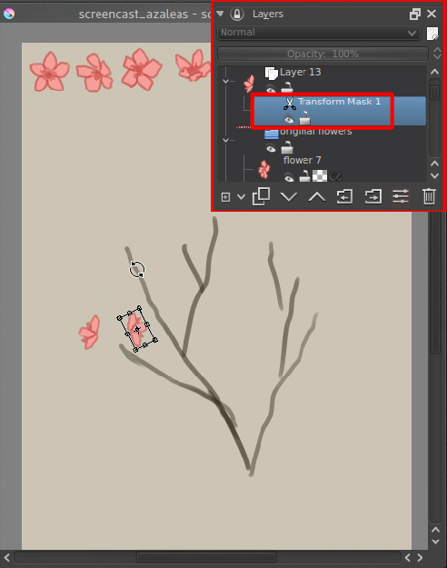](https://krita.org/wp-content/uploads/2015/05/azelea_06_transformmask.png)

You'll quickly notice that our flowers are not good enough for a cluster: we need far more angles on the profile for example. if only there was a way to transform them... but we can't do that with clone layers. Or can we?

## Enter Transform Masks!

Transform Masks are a really powerful feature introduced in 2.9. They are in fact so powerful, that when you first use them, you can't even begin to grasp where to use them.

Transform masks allow us to do a transform operation onto a layer, any given layer, and have it be completely dynamic! This includes our clone layer flowers!

How to use them:

Right click the layer you want to do the transform on, and add a 'transform mask'.

A transform mask should now have been added. You can recognise them by the little 'scissor' icon.

Now, with the transform mask selected, select the transform tool, and rotate our clone layer. Apply the transform. You know you're successful when you can hide the transform mask, and the layer goes back to its original state!

You can even go and edit your transform! Just activate the transform tool again while on a transform mask, and you will see the original transform so you can edit it. If you go to a different transform operation however, you will reset the transform completely, so watch out.

 

[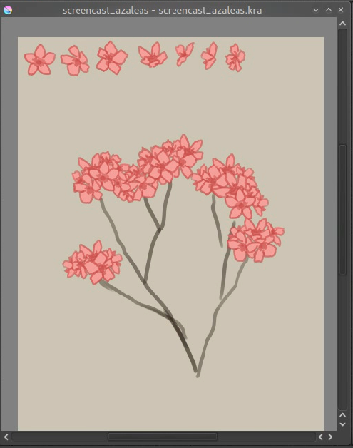](https://krita.org/wp-content/uploads/2015/05/azelea_07_clusters.png)

We'll be only using affine transformations in this tutorial (which are the regular and perspective transform), but this can also be done with warp, cage and liquify, which'll have a bit of a delay (3 seconds to be precise). This is to prevent your computer from being over-occupied with these more complex transforms, so you can keep on painting.

We continue on making our clusters till we have a nice arrangement.

 

[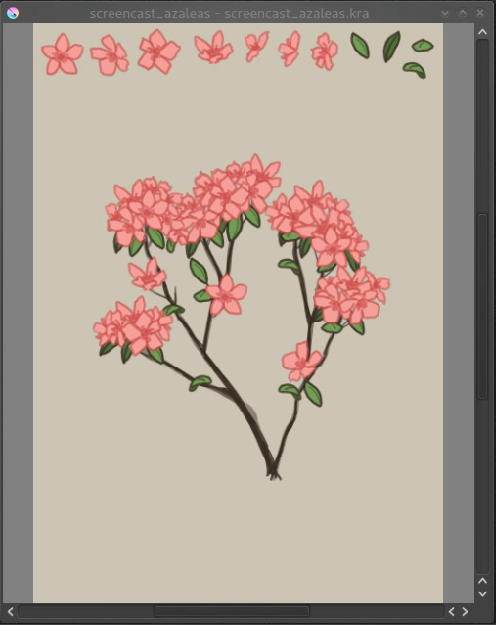](https://krita.org/wp-content/uploads/2015/05/azelea_08_leaves.png)

Now do the same thing for the leaves.

[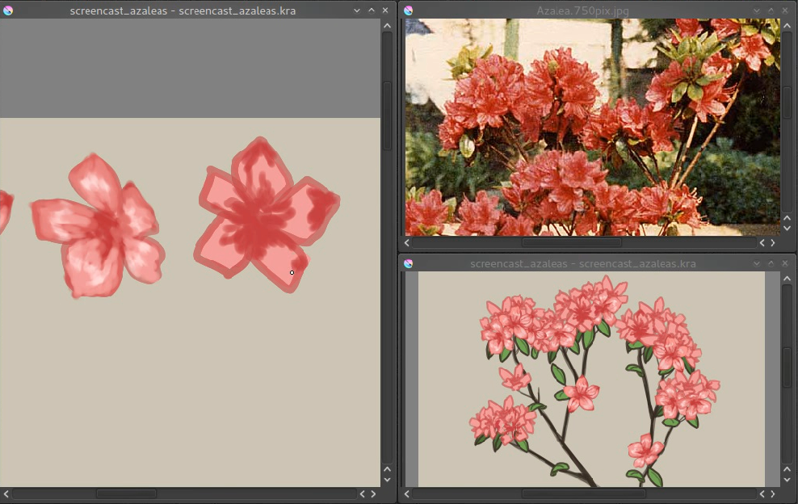](https://krita.org/wp-content/uploads/2015/05/azelea_09_paintingoriginals.png)

Now, if you select the original paint layers and draw on them, you can see that all clone masks are immediately updated!

Above you can see there's been a new view added so we can focus on painting the flower and at the same time see how it'll look. You can make a new view by going **window->new view** and selecting the name of your current canvas (save first!). Views can be rotated and mirrored differently.

Now continue painting the original flowers and leaves, and we'll move over to adding extra shadow to make it seem more lifelike!

[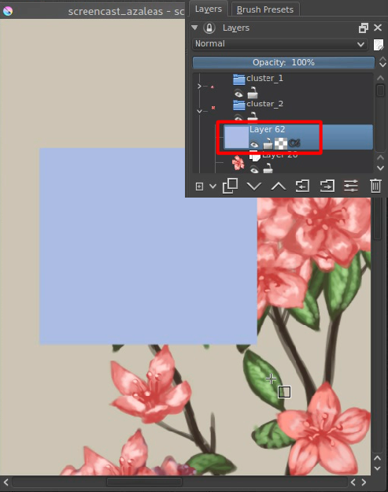](https://krita.org/wp-content/uploads/2015/05/azelea_10_alphainheritance_1.png)

## Alpha Inheritance

We're now going to use Alpha Inheritance. Alpha inheritance is an ill-understood concept, because a lot of programs use 'clipping masks' instead, which clip the layer's alpha using only the alpha of the first next layer.

Alpha inheritance, however, uses all layers in a stack, so all the layers in the group that haven't got alpha inheritance active themselves, or all the layers in the stack when the layer isn't in a group. Because most people have an opaque layer at the bottom of their layer stack, alpha inheritance doesn't seem to do much.

But for us, alpha inheritance is useful, because we can use all clone-layers in a cluster (if you grouped them), transformed or not, for clipping. Just draw a light blue square over all the flowers in a given cluster.

[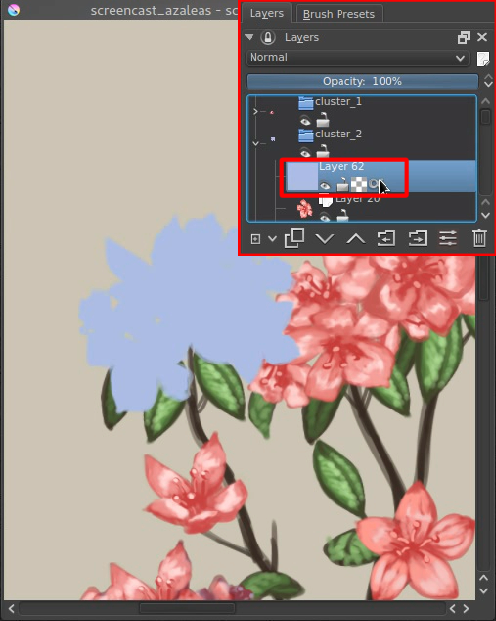](https://krita.org/wp-content/uploads/2015/05/azelea_11_alphainheritance_2.png)

Then press the last icon in the layer stack, the alpha-inherit button, to activate alpha-inheritance.

[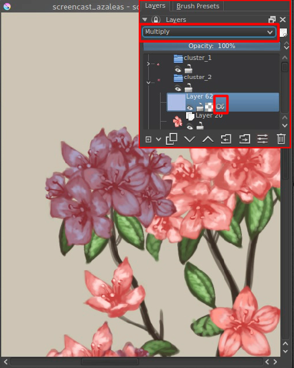](https://krita.org/wp-content/uploads/2015/05/azelea_12_alphainheritance_3.png)

Set the layer to multiply then, so it'll look like everything's darker blue.

[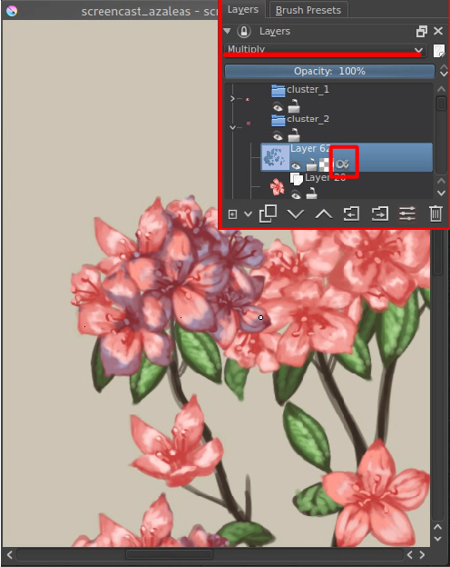](https://krita.org/wp-content/uploads/2015/05/azelea_13_alphainheritance_4.png)

Then, with multiply and alpha inheritance on, use an eraser to remove the areas where there should be no shadow.

[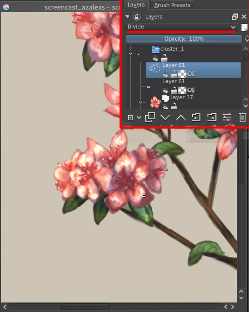](https://krita.org/wp-content/uploads/2015/05/azelea_14_alphainheritance_5.png)

For the highlights use exactly the same method, AND exactly the same colour, but instead set the layer to 'Divide' (you can find this amongst the 'Arithmetic' blending modes). Using Divide has exactly the opposite effect as using multiply with the same colour. The benefit of this is that you can easily set up a complementary harmony in your shadows and highlights using these two.

[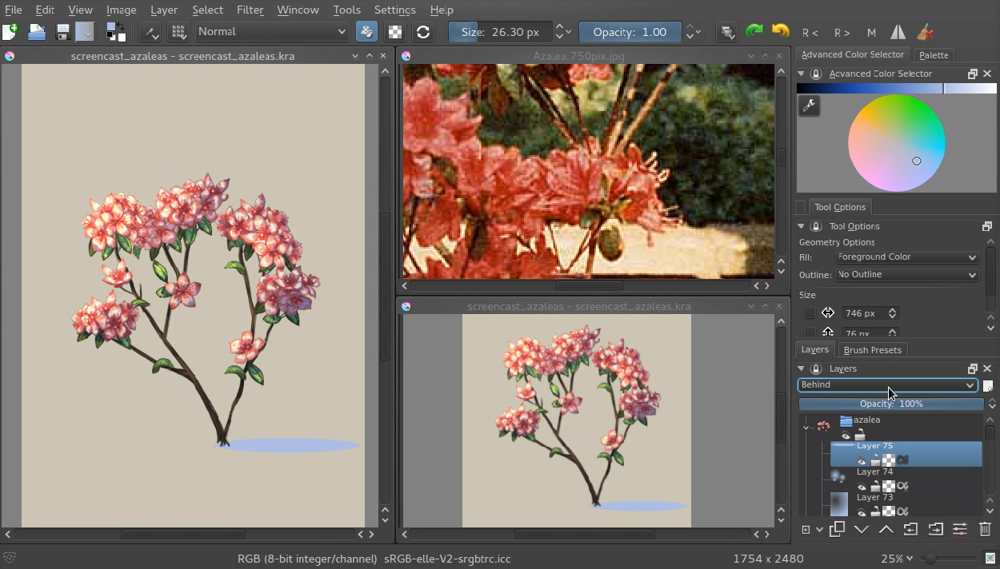](https://krita.org/wp-content/uploads/2015/05/azelea_15_alphainheritance_6.png)

Do this with all clusters and leaves, and maybe on the whole plant (you will first need to stick it into a group layer given the background is opaque) and you're done!

Transform masks can be used on paint layers, vector layers, group layers, clone layers and even file layers. I hope this tutorial has given you a nice idea on how to use them, and hope to see much more use of the transform masks in the future!

You can get the file I made [here](https://share.kde.org/public.php?service=files&t=48c601aaf17271d7ca516c44cbe8590e) to examine it further! (**Caution: It will freeze up Krita if your version is below 2.9.4. The speed-ups in 2.9.4 are due to this file.**)
