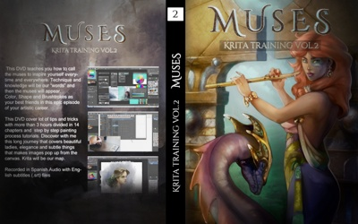
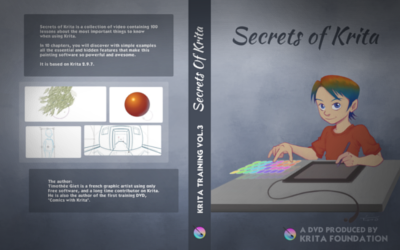

While Timothee Giet is working on the next Krita training video series -- and it'll all be about animation! -- we're cutting the price of our existing training videos!

**Digital downloads**

_[Muses](https://krita.org/en/item/muses/)_, still one of the best introduction to digital painting in general, and to Krita in particular, is now available for only €14,95!

**Muses Download**

Now just **€14,95**, from €24,95

And _[Secrets of Krita](https://krita.org/en/item/secrets-of-krita-the-third-krita-training-dvd/)_, full of in-depth hints, tricks and tips on how to get the most out of Krita is now also... only €14,95!

**Secrets of Krita - Download ** Now just **€14,95**, from €29,95

You can also get these downloads from [our gumroad shop!](https://gumroad.com/krita#)

**DVD's**

We still have actual DVD's, neatly printed with atractive covers available for you to order, too:

**Secrets of Krita - DVD** Now just **€14,95**, from €29,95, including shipping

**Muses DVD** Now just **€14,95**, from €24,95, including shipping

**USB-Card**

Or you can get both training dvd's and the latest version of Krita for Windows, OSX and Linux on a cool credit-card sized USB stick, showing off spring Kiki.

**USB-stick up-to-date** Now just **€24,95**, from €39,95, including shipping
