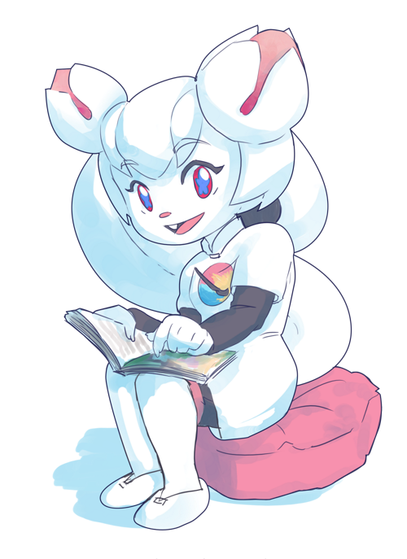
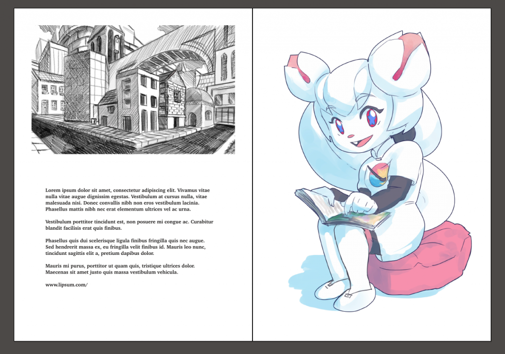

The Krita Foundation is going to publish a glossy, shiny book of art created with Krita! This book will be sent out to the seventy Kickstarter backers who selected the artbook as their reward, and it will be available from the Krita shop. We'll also try and make sure it's available through online bookshops! It's the very first time the Krita Foundation will publish a book, and we're really excited about it.

And we're sure you will be excited, too. it's kind of a historic moment, after all, so who wouldn't want to be in on the very first Krita Art book? Space is going to be limited, though, so we're going to assemble a jury of seasoned Krita artists to vet all submissions and make the final selection.

But first, we need you to submit your artwork for publication!

The book will be printed professionally, either hard-cover or soft-cover (that depends on the final page count). The dimensions are 200 x 280 mm. There will be a glossy color page and a black & white page available for every artist. The black & white page contains information about you, whatever you want to tell the world. And there will be room for a black & white illustration as well.

Here's a mock-up of what we intend:

If you want to be in on it, send your submission to foundation@krita.org.  We need the following:

- Your color art work at the full resolution. Keep in mind that this is print, so screen resolution sized images won't look good. The printer wants a minimum resolution of 150dpi but our experience is that 300dpi looks better. Keep at least 3mm bleed on the outside of your picture (making the submission size 206x286 mm) and add cutting marks if you know how (if you don't know how, we do, and will add them).
- An optional black & white artwork. This needs to be even higher resolution (600dpi) since the black and white pages are printed at a higher resolution. It doesn't need to be the same physical size, since your info goes on that page as well. We can resize images for layout purposes, anyway.
- Information about you: a short bio, contact details -- whatever you want to tell about yourself, about half a page so there's room for the B&W artwork. There is _no_ real-names rule: you can call yourself what you want.

The artwork needs to conform to a few rules:

- There is no set topic: just show off what you think you do best! But...
- No gore or pornography. Nudity is fine, flashing swords are fine, people being strangled by their own guts, no.
- No fan-art or characters copyrighted by others than you. We don't want the publicity of being sued by Nintendisnami and their ilk.
- Made using Krita: you can use other tools, too, but Krita has to be used for most of the work.

**The deadline for submissions is November 1st!**

**Send your submission to foundation@krita.org**

Save

Save

Save

Save
